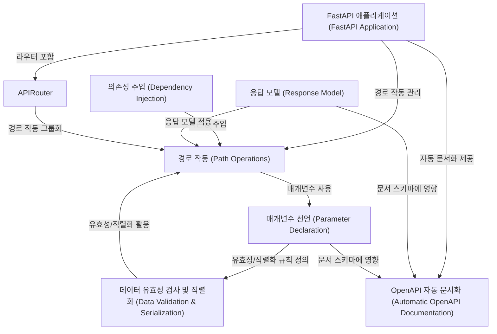

# fastapi 개요

**FastAPI**는 파이썬 타입 힌트를 기반으로 API를 구축하는 현대적이고 빠른 웹 프레임워크입니다.
주요 특징은 높은 **성능**, 빠른 개발 속도, 쉬운 학습 곡선, 자동 **데이터 유효성 검사** 및 **직렬화**, 그리고 **OpenAPI** 기반의 자동 *대화형 문서* 생성입니다.
의존성 주입 시스템을 통해 코드 재사용성을 높이고, `APIRouter`를 사용하여 대규모 애플리케이션을 효율적으로 구조화할 수 있습니다.

*   **Source Repository:** [https://github.com/fastapi/fastapi.git](https://github.com/fastapi/fastapi.git)
 
 

