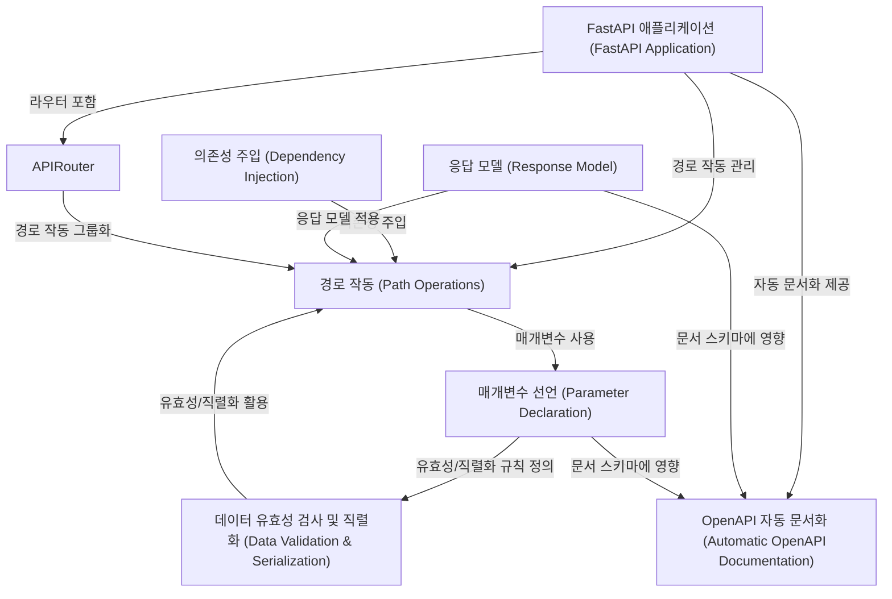
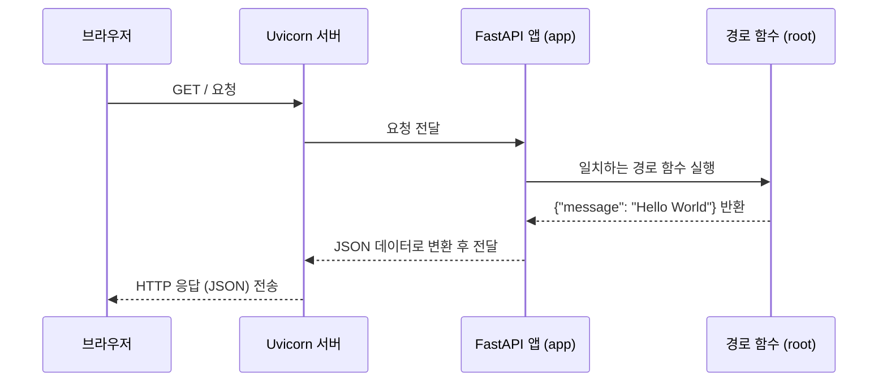

## fastapi 개요

**FastAPI**는 파이썬 타입 힌트를 기반으로 API를 구축하는 현대적이고 빠른 웹 프레임워크입니다.
주요 특징은 높은 **성능**, 빠른 개발 속도, 쉬운 학습 곡선, 자동 **데이터 유효성 검사** 및 **직렬화**, 그리고 **OpenAPI** 기반의 자동 *대화형 문서* 생성입니다.
의존성 주입 시스템을 통해 코드 재사용성을 높이고, `APIRouter`를 사용하여 대규모 애플리케이션을 효율적으로 구조화할 수 있습니다.


*   **Source Repository:** [https://github.com/fastapi/fastapi.git](https://github.com/fastapi/fastapi.git)
<br>
<br>



##  1장: FastAPI 애플리케이션 (FastAPI Application)
*   FastAPI를 사용한 웹 개발 여정에 오신 것을 환영합니다! 웹 애플리케이션, 특히 API를 구축할 때 가장 먼저 필요한 것은 무엇일까요? 바로 모든 것을 관리하고 연결하는 **중심 지점**입니다. 마치 큰 건물을 지을 때 모든 부서와 서비스를 총괄하는 중앙 관리실이 필요한 것과 같습니다.

*   여러분이 "Hello World"와 같이 간단한 메시지를 웹 브라우저에 표시하는 아주 기본적인 웹 API를 만들고 싶다고 상상해 보세요. 이를 위해서는 들어오는 웹 요청을 받아서, "Hello World"라는 응답을 돌려줄 무언가가 필요합니다. FastAPI에서는 이 역할을 하는 핵심 요소가 바로 `FastAPI` 애플리케이션 객체입니다.

### 1.1 FastAPI 애플리케이션이란 무엇인가요?

*   `FastAPI` 애플리케이션은 여러분이 만들 웹 애플리케이션의 **심장**과 같습니다. 모든 웹 요청이 가장 먼저 도착하는 곳이며, 어떤 요청을 어떻게 처리할지 결정하는 중앙 허브 역할을 합니다. 여러분의 API에 필요한 모든 설정, 경로(URL 주소), 그리고 추가 기능(미들웨어)들이 이 애플리케이션 객체를 통해 구성됩니다.

*   이것을 건물의 중앙 관리실에 비유해 봅시다:
    *   **방문객(웹 요청)**: 건물을 찾아옵니다 (웹 서버로 요청이 들어옵니다).
    *   **중앙 관리실 (FastAPI 애플리케이션)**: 방문객을 맞이하고, 방문 목적(요청 경로)에 따라 담당 부서(경로 처리 함수)로 안내합니다.
    *   **담당 부서 (경로 처리 함수)**: 방문객의 요청을 처리하고 결과를 알려줍니다.
    *   **중앙 관리실 (FastAPI 애플리케이션)**: 처리 결과를 방문객에게 전달합니다 (HTTP 응답).

### 1.2 첫 FastAPI 애플리케이션 만들기

이제 직접 코드를 작성하며 FastAPI 애플리케이션을 만들어 봅시다. 아주 간단한 "Hello World" API를 만드는 것이 목표입니다.

1.  **FastAPI 가져오기**: 
    *   먼저, `fastapi` 라이브러리에서 `FastAPI` 클래스를 가져와야.

    ```python
    from fastapi import FastAPI
    ```

    *   `from fastapi import FastAPI`는 `fastapi` 패키지 안에서 `FastAPI`라는 도구(클래스)를 사용하겠다고 선언하는 것입니다.

2.  **FastAPI 인스턴스 생성**: 
    *   가져온 `FastAPI` 클래스를 사용하여 실제 애플리케이션 객체(인스턴스)를 만듭니다. 관례적으로 이 객체의 이름은 `app`으로 지정합니다.

    ```python
    app = FastAPI()
    ```

    *   `app = FastAPI()`는 `FastAPI`라는 설계도를 바탕으로 실제 동작하는 애플리케이션 `app`을 만드는 과정입니다. 이제 `app`이 우리 API의 중앙 관리실 역할을 할 준비가 되었습니다.

3.  **경로 정의 (간단 맛보기)**: 
    *   아직 자세히 배우진 않았지만, 가장 기본적인 경로(`/`)로 요청이 오면 특정 함수를 실행하도록 `app`에 알려줘야 합니다. 
    *   `@app.get("/")` 부분이 이 역할을 합니다. 

    ```python
    @app.get("/")
    async def root():
        return {"message": "Hello World"}
    ```

    *   `@app.get("/")`: 
        *   누군가 우리 웹사이트의 가장 기본 주소 (`/`)로 GET 요청을 보내면, 바로 아래에 있는 함수를 실행하라는 지시입니다.
    *   `async def root():`: 
        *   요청을 처리할 함수의 이름은 `root`이고, 비동기 방식(`async`)으로 동작합니다. (지금은 `async`를 몰라도 괜찮습니다!)
    *   `return {"message": "Hello World"}`: 
        *   이 함수는 파이썬 딕셔너리 형태의 데이터를 반환합니다. 
        *   FastAPI는 이 딕셔너리를 자동으로 JSON 형식으로 변환하여 응답해 줍니다.

4.  **전체 코드 (`main.py`)**: 위 단계들을 합쳐 `main.py`라는 파일을 만듭니다.

    ```python
    # main.py
    from fastapi import FastAPI

    # FastAPI 애플리케이션 인스턴스 생성
    app = FastAPI()

    # 루트 경로 ("/")에 대한 GET 요청 처리
    @app.get("/")
    async def root():
        # 딕셔너리를 반환하면 자동으로 JSON 응답으로 변환됨
        return {"message": "Hello World"}
    ```

    이 파일이 우리 API의 가장 기본적인 설계도이자 실행 파일이 됩니다.

### 1.3 애플리케이션 실행하기
이제 만든 코드를 실행하여 실제 웹 서버를 띄워봅시다. 터미널을 열고 `main.py` 파일이 있는 디렉토리에서 다음 명령어를 입력하세요.

```bash
fastapi dev main.py
```

*   `fastapi dev`: 
    *   FastAPI 개발 서버를 실행하는 명령어입니다. 코드가 변경되면 자동으로 서버를 재시작해 편리합니다.
*   `main.py`: 
    *   실행할 파이썬 파일 이름입니다. 
    *   FastAPI는 이 파일 안에서 `app = FastAPI()`로 만들어진 객체를 찾아 실행합니다.

성공적으로 실행되면 터미널에 다음과 유사한 메시지가 나타납니다.

```
INFO:     Uvicorn running on http://127.0.0.1:8000 (Press CTRL+C to quit)
INFO:     Started reloader process [...]
INFO:     Started server process [...]
INFO:     Waiting for application startup.
INFO:     Application startup complete.
```

*   이제 웹 브라우저를 열고 주소창에 `http://127.0.0.1:8000` 또는 `http://localhost:8000` 을 입력해 보세요. 다음과 같은 JSON 응답을 화면에서 확인할 수 있습니다.

```json
{"message":"Hello World"}
```

### 1.4 내부 동작 방식 (간단히 살펴보기)

여러분이 브라우저에서 `http://127.0.0.1:8000`을 요청했을 때 내부적으로 어떤 일이 일어났을까요?

1.  **요청 수신**: 
    *   웹 서버(Uvicorn)가 브라우저로부터 `/` 경로에 대한 GET 요청을 받습니다.
2.  **애플리케이션 전달**: 
    *   Uvicorn은 이 요청을 우리가 만든 `FastAPI` 애플리케이션 객체 (`app`)에게 전달합니다.
3.  **경로 탐색**: 
    *   `app` 객체는 자신이 알고 있는 경로 목록 (우리가 `@app.get("/")`으로 등록한 정보)을 확인하여 `/` 경로와 GET 메소드에 해당하는 처리 함수 (`root` 함수)를 찾습니다.
4.  **함수 실행**:
    *   `app`은 찾은 `root` 함수를 실행합니다.
5.  **결과 처리**: 
    *   `root` 함수는 `{"message": "Hello World"}` 딕셔너리를 반환합니다. `app` 객체는 이 파이썬 딕셔너리를 웹에서 표준적으로 사용하는 JSON 형식의 데이터로 변환합니다.
6.  **응답 전송**: 
    *   `app` 객체는 변환된 JSON 데이터를 Uvicorn에게 돌려주고, Uvicorn은 이를 최종 HTTP 응답으로 만들어 브라우저에게 전송합니다.


### 1.5 내부 동작 과정 다이아그램으로 표현
<br>



### 1.6 코드 내부 엿보기
FastAPI는 내부적으로 Starlette이라는 강력한 웹 도구를 기반으로 만들어졌습니다. 우리가 `from fastapi import FastAPI`를 할 때, 실제로는 잘 만들어진 파이썬 클래스를 가져오는 것입니다.

```python
# fastapi/__init__.py 파일의 일부 (간략화됨)
from .applications import FastAPI as FastAPI # applications.py 파일에서 FastAPI 클래스를 가져옴
# ... 다른 중요한 도구들도 가져옴 ...
```

*   그리고 `app = FastAPI()` 코드는 이 `FastAPI` 클래스의 인스턴스(실체)를 생성하는 과정입니다.

```python
# fastapi/applications.py 파일의 일부 (개념 설명용)
class FastAPI:
    def __init__(self):
        # 애플리케이션 초기화 시 필요한 여러 설정들을 준비합니다.
        # (예: 경로 목록 저장 공간, 미들웨어 관리 등)
        self.router = APIRouter() # 경로 관리를 위한 라우터 준비
        # ... 기타 등등 ...

    # @app.get(...) 같은 데코레이터를 처리하는 로직 포함
    # 요청을 받아서 적절한 함수를 실행하고 응답을 만드는 로직 포함
    # ...
```

*   지금 당장 이 코드의 세부 내용을 모두 이해할 필요는 없습니다. 중요한 것은 `FastAPI` 애플리케이션 객체 (`app`)가 우리 API의 모든 것을 관리하는 중심점이라는 사실입니다. 앞으로 우리는 이 `app` 객체에 다양한 경로와 기능을 추가하며 API를 확장해 나갈 것입니다.

### 1.7 마무리
이번 장에서는 FastAPI 애플리케이션의 가장 핵심적인 개념인 `FastAPI` 애플리케이션 객체에 대해 배웠습니다. 이 객체가 어떻게 API의 중앙 관리자 역할을 하는지, 그리고 어떻게 간단한 코드로 첫 API를 만들고 실행하는지 살펴보았습니다.

*   `from fastapi import FastAPI`로 FastAPI 기능을 가져옵니다.
*   `app = FastAPI()`로 애플리케이션 인스턴스를 생성합니다. 이 `app` 객체가 모든 것의 시작점입니다.
*   `fastapi dev main.py` 명령어로 개발 서버를 실행할 수 있습니다.

이제 기본적인 애플리케이션 틀을 만들었으니, 다음 단계는 이 애플리케이션에 실제 API 엔드포인트, 즉 **경로**를 정의하는 방법을 배우는 것입니다.
