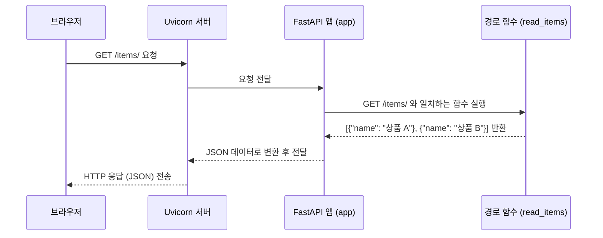

> 이 튜토리얼은 AI가 생성했습니다! 자세한 내용은 [AI 코드베이스 지식 빌더](https://github.com/The-Pocket/Tutorial-Codebase-Knowledge)를 참조하세요.


## 2장: 경로 작업 (Path Operations)

*   1장에서는 FastAPI 애플리케이션의 심장인 `FastAPI` 객체를 만들고 실행하는 방법을 배웠습니다. 마치 건물의 중앙 관리실을 세운 것과 같죠. 하지만 관리실만으로는 방문객(사용자)에게 실제 서비스를 제공할 수 없습니다. 방문객의 요청을 처리할 구체적인 창구가 필요합니다.

*   API 세계에서는 이러한 '서비스 창구'를 **경로 작업 (Path Operation)** 이라고 부릅니다. 사용자가 특정 URL 주소(경로)로 특정 방식(HTTP 메소드)의 요청을 보냈을 때, 이를 받아서 처리하고 응답을 돌려주는 역할을 하는 함수입니다.

### 2.1 경로 작업이란 무엇인가요?

*   여러분이 온라인 쇼핑몰 API를 만든다고 상상해 봅시다. 사용자가 웹사이트나 앱에서 "상품 목록 보기" 버튼을 누르면, 서버는 `/items/` 라는 주소로 "데이터를 가져오겠다(GET)"는 요청을 보낼 것입니다. FastAPI에서는 이 `/items/` 경로에 대한 GET 요청을 처리하는 특정 함수를 미리 정의해 두어야 합니다. 이것이 바로 경로 작업입니다.

*   **경로 (Path):** 
    *   API 내에서 특정 자원이나 기능을 가리키는 URL의 일부입니다. 
    *   예를 들어 `/users/`, `/items/`, `/orders/` 등이 있습니다. 건물의 특정 부서 주소(예: '1층 민원실', '2층 상담실')와 같습니다.
*   **작동 (Operation):** 
    *   해당 경로에 대해 수행할 작업을 나타내는 **HTTP 메소드**입니다. 
        *   `GET`: 데이터를 **조회**할 때 사용합니다. (예: 상품 목록 보기)
        *   `POST`: 새로운 데이터를 **생성**할 때 사용합니다. (예: 새 상품 등록)
        *   `PUT`: 기존 데이터를 **수정**할 때 사용합니다. (예: 상품 정보 업데이트)
        *   `DELETE`: 데이터를 **삭제**할 때 사용합니다. (예: 상품 삭제)
        *   이 외에도 `OPTIONS`, `HEAD`, `PATCH`, `TRACE` 등이 있습니다. 이는 마치 창구에서 제공하는 서비스 종류('조회 요청', '신규 등록', '정보 변경', '삭제 요청')와 같습니다.
*   **경로 작업 함수 (Path Operation Function):** 
    *   특정 경로와 작동(HTTP 메소드)에 대한 요청이 들어왔을 때 실제로 실행되는 파이썬 함수입니다. 
    *   이 함수가 실제 비즈니스 로직을 처리하고 결과를 반환합니다. 
    *   창구에서 실제 업무를 처리하는 직원과 같습니다.
*   **경로 작업 데코레이터 (Path Operation Decorator):** 
    *   `@app.get()`, `@app.post()` 와 같이 함수 위에 붙어서, 해당 함수가 어떤 경로와 작동을 담당하는지 FastAPI에게 알려주는 특별한 표식입니다. 
    *   마치 창구 위에 붙어있는 '상품 목록 문의 (GET /items/)' 같은 안내판과 같습니다.

### 2.2 첫 경로 작업 정의하기
Chapter 1: FastAPI 애플리케이션 (FastAPI Application)에서 이미 루트 경로(`/`)에 대한 간단한 경로 작업을 정의했었습니다. 이번에는 조금 더 나아가, 상품 목록을 반환하는 `/items/` 경로를 추가해 봅시다.

1.  **FastAPI 앱 가져오기 및 생성**: 
    *   이전 장과 동일하게 `FastAPI` 애플리케이션 인스턴스를 만듭니다.

    ```python
    # main.py
    from fastapi import FastAPI

    app = FastAPI()
    ```

2.  **루트 경로 정의**: 
    *   가장 기본이 되는 경로 `/` 에 대한 `GET` 요청을 처리하는 함수를 정의합니다. 
    *   `@app.get("/")` 데코레이터가 이 역할을 합니다.

    ```python
    # main.py (이어서)

    @app.get("/")  # "/" 경로에 대한 GET 요청을 처리
    async def read_root():
        return {"message": "환영합니다!"} # 딕셔너리를 반환하면 JSON 응답이 됩니다.
    ```

    *   `@app.get("/")`: 
        *   `/` 주소로 `GET` 방식의 요청이 오면 바로 아래 `read_root` 함수를 실행하라는 지시입니다.
    *   `async def read_root():`: 
        *   `read_root` 라는 이름의 비동기 함수를 정의합니다. (지금은 `async` 키워드를 크게 신경 쓰지 않아도 괜찮습니다.)
    *   `return {"message": "환영합니다!"}`: 
        *   "message"라는 키와 "환영합니다!"라는 값을 가진 딕셔너리를 반환합니다.

3.  **새로운 경로 정의 (`/items/`)**: 
    *   이제 `/items/` 경로에 대한 `GET` 요청을 처리하는 새로운 경로 작업 함수를 추가합니다.

    ```python
    # main.py (이어서)

    @app.get("/items/") # "/items/" 경로에 대한 GET 요청을 처리
    async def read_items():
        # 실제 애플리케이션에서는 데이터베이스에서 상품 목록을 조회하겠지만,
        # 여기서는 간단한 예시를 위해 고정된 리스트를 반환합니다.
        return [{"name": "상품 A"}, {"name": "상품 B"}]
    ```

    *   `@app.get("/items/")`: 
        *   `/items/` 주소로 `GET` 요청이 오면 `read_items` 함수를 실행합니다.
    *   `async def read_items():`: 
        *   `read_items` 라는 이름의 함수를 정의합니다.
    *   `return [{"name": "상품 A"}, {"name": "상품 B"}]`: 
        *   상품 이름이 담긴 딕셔너리 두 개를 포함하는 리스트를 반환합니다. 
        *   FastAPI는 이 리스트와 딕셔너리를 JSON 형식으로 자동 변환해줍니다.

4.  **전체 코드 (`main.py`)**: 
    *   위 코드들을 합친 최종 `main.py` 파일입니다.

    ```python
    # main.py
    from fastapi import FastAPI

    # FastAPI 애플리케이션 인스턴스 생성
    app = FastAPI()

    # 루트 경로 ("/")에 대한 GET 요청 처리
    @app.get("/")
    async def read_root():
        return {"message": "환영합니다!"}

    # "/items/" 경로에 대한 GET 요청 처리
    @app.get("/items/")
    async def read_items():
        # 간단한 상품 목록 예시 반환
        return [{"name": "상품 A"}, {"name": "상품 B"}]
    ```

### 2.4 애플리케이션 실행 및 확인
이제 코드를 실행해 봅시다. 터미널에서 `main.py` 파일이 있는 디렉토리로 이동한 후 다음 명령어를 입력하세요.

```bash
fastapi dev main.py
```

*   서버가 성공적으로 실행되면 터미널에 `http://127.0.0.1:8000` 주소가 표시될 것입니다.

*   이제 웹 브라우저를 열고 다음 두 주소로 각각 접속해 보세요.

1.  **`http://127.0.0.1:8000/`**
    *   브라우저 화면에 다음과 같은 JSON 응답이 보일 것입니다.
        ```json
        {"message":"환영합니다!"}
        ```
    *   이는 `@app.get("/")` 데코레이터가 붙은 `read_root` 함수가 실행된 결과입니다.

2.  **`http://127.0.0.1:8000/items/`**
    *   브라우저 화면에 다음과 같은 JSON 응답이 보일 것입니다.
        ```json
        [{"name":"상품 A"},{"name":"상품 B"}]
        ```
    *   이는 `@app.get("/items/")` 데코레이터가 붙은 `read_items` 함수가 실행된 결과입니다.

여러분은 이제 FastAPI 애플리케이션에 두 개의 다른 경로 작업(서비스 창구)을 성공적으로 정의했습니다!

### 2.5 내부 동작 방식 (간단히 살펴보기)

브라우저에서 `http://127.0.0.1:8000/items/` 를 요청했을 때 어떤 일이 일어났을까요?

1.  **요청 수신**: 
    * 웹 서버(Uvicorn)가 브라우저로부터 `/items/` 경로에 대한 `GET` 요청을 받습니다.
2.  **애플리케이션 전달**: 
    *   Uvicorn은 이 요청을 `FastAPI` 애플리케이션 객체 (`app`)에게 전달합니다.
3.  **경로 탐색**: 
    *   `app` 객체는 자신이 알고 있는 경로 작업 목록 (우리가 `@app.get("/")`과 `@app.get("/items/")`로 등록한 정보)을 확인합니다. 
    *   요청된 경로 `/items/` 와 HTTP 메소드 `GET` 에 해당하는 함수(`read_items`)를 찾습니다.
4.  **함수 실행**: 
    *   `app`은 찾은 `read_items` 함수를 실행합니다.
5.  **결과 처리**: 
    *   `read_items` 함수는 파이썬 리스트 `[{"name": "상품 A"}, {"name": "상품 B"}]` 를 반환합니다. 
    *   `app` 객체는 이 파이썬 데이터를 JSON 형식의 데이터로 변환합니다.
6.  **응답 전송**: 
    *   `app` 객체는 변환된 JSON 데이터를 Uvicorn에게 돌려주고, Uvicorn은 이를 최종 HTTP 응답으로 만들어 브라우저에게 전송합니다.


### 2.6 내부 동작 과정 다이어그램으로 표현하기
<br>



### 2.7 코드 내부 엿보기 
우리가 사용한 `@app.get("/items/")` 는 어떻게 동작하는 걸까요? 
*   `app`은 우리가 만든 `FastAPI` 클래스의 인스턴스입니다. 
*   이 클래스 안에는 `get`, `post`, `put`, `delete` 등 HTTP 메소드에 해당하는 이름의 메소드(함수)들이 정의되어 있습니다.

```python
# fastapi/applications.py 파일의 일부 (개념 설명용)

class FastAPI:
    # ... (생략) ...

    def get(self, path: str, ...): # @app.get() 에 해당
        def decorator(func):
            # 이 함수(func)를 'path' 경로의 GET 요청 처리기로 등록하는 로직
            self.add_api_route(path, func, methods=["GET"], ...)
            return func
        return decorator

    def post(self, path: str, ...): # @app.post() 에 해당
        # ... (GET과 유사하게 POST 요청 처리기 등록) ...

    def add_api_route(self, path: str, endpoint: Callable, *, methods: List[str], ...):
        # 실제 경로와 함수를 내부 라우터(경로 관리자)에 저장하는 곳
        self.router.add_api_route(path, endpoint=endpoint, methods=methods, ...)

    # ... (기타 여러 메소드들) ...
```

*   `@app.get("/items/")` 와 같은 데코레이터를 사용하면, FastAPI는 내부적으로 `app.get` 메소드를 호출합니다. 
*   이 메소드는 `/items/` 라는 경로와 `GET` 이라는 HTTP 메소드, 그리고 그 아래에 정의된 함수(`read_items`)를 서로 연결해서 내부의 '경로 목록'(라우터)에 저장해 둡니다.
*   나중에 실제 요청이 들어오면, FastAPI는 이 저장된 목록을 보고 알맞은 함수를 찾아 실행하는 것입니다.

지금 당장 이 내부 코드를 완벽히 이해할 필요는 없습니다. 중요한 것은 **`@app.작동("경로")`** 형태의 데코레이터를 사용하여 API 엔드포인트를 쉽고 명확하게 정의할 수 있다는 점입니다.

### 2.8 마무리
이번 장에서는 FastAPI에서 API의 핵심 구성 요소인 **경로 작업 (Path Operations)** 을 정의하는 방법을 학습.

*   **경로 작업**은 특정 URL 경로와 HTTP 메소드 조합에 대한 요청을 처리하는 함수입니다.
*   `@app.get()`, `@app.post()` 와 같은 **데코레이터**를 사용하여 경로 작업 함수를 FastAPI 애플리케이션에 등록합니다.
*   경로 작업 함수는 파이썬 딕셔너리나 리스트 등을 반환할 수 있으며, FastAPI는 이를 자동으로 JSON 응답으로 변환해줍니다.

이제 우리는 `/` 와 `/items/` 라는 두 개의 고정된 경로를 만들었습니다. 하지만 실제 API에서는 `/items/1/` 이나 `/users/alice/` 처럼 경로 자체에 동적인 값을 포함해야 하는 경우가 많습니다. 예를 들어, 특정 ID를 가진 상품 하나의 정보만 가져오고 싶을 수 있겠죠.

다음 장에서는 이렇게 URL 경로에 변수를 포함하는 방법, 즉 **경로 매개변수**를 선언하는 방법을 배울 것입니다.
