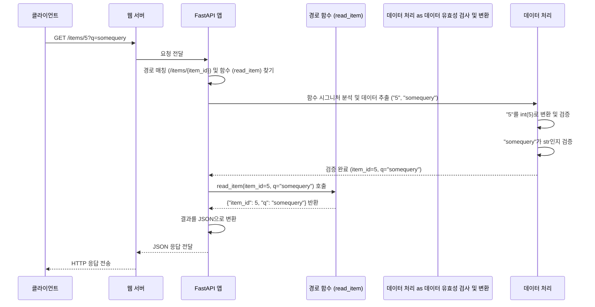

> 이 튜토리얼은 AI가 생성했습니다! 자세한 내용은 [AI 코드베이스 지식 빌더](https://github.com/The-Pocket/Tutorial-Codebase-Knowledge)를 참조하세요.


## 3장: 매개변수 선언 (Parameter Declaration)

*   이전 Chapter 2: 경로 작업 (Path Operations)에서는 특정 URL 경로(`/`, `/items/`)로 요청이 왔을 때 미리 정해진 응답을 돌려주는 방법을 배웠습니다. 마치 식당 메뉴판에서 고정된 메뉴('오늘의 메뉴', '기본 반찬')를 보여주는 것과 같았죠.

*   하지만 실제 서비스에서는 사용자가 원하는 **구체적인 정보**를 요청하는 경우가 훨씬 많습니다. 예를 들어, 온라인 쇼핑몰에서 '상품 5번'의 상세 정보를 보거나, '가격이 10000원 이하인 상품'만 검색하고 싶을 수 있습니다. 이렇게 사용자가 요청 시 함께 보내는 **변하는 값**들을 API가 받아서 처리할 수 있어야 합니다.

*   이번 장에서는 FastAPI가 사용자의 요청으로부터 이런 동적인 데이터를 어떻게 받고 처리하는지, 즉 **매개변수(Parameter)**를 선언하는 방법을 배웁니다. 마치 서비스 창구에서 고객의 요청에 필요한 정보를 적는 '신청서 양식'을 만드는 것과 같습니다. FastAPI는 이 '양식'(매개변수 선언)을 보고 사용자가 어떤 정보를, 어떤 형식으로 보내야 하는지 자동으로 파악하고 처리해 줍니다.

### 3.1 매개변수란 무엇인가요?

매개변수는 클라이언트(웹 브라우저, 앱 등)가 서버 API에 요청을 보낼 때 함께 전달하는 추가 정보입니다. 이 정보는 요청의 세부 내용을 지정하는 데 사용됩니다. FastAPI에서는 여러 종류의 매개변수를 다룰 수 있습니다.

*   **경로 매개변수 (Path Parameter):** 
    *   URL 경로 자체에 포함된 변수입니다. 
    *   예를 들어 `/items/5` 에서 `5` 가 경로 매개변수입니다. 
    *   특정 자원을 직접 지정할 때 주로 사용됩니다. ('5번 상품 창구로 가세요'처럼 경로에 정보가 담겨 있습니다.)
*   **쿼리 매개변수 (Query Parameter):** 
    *   URL 경로 뒤에 `?` 와 함께 오는 `key=value` 쌍입니다. 
    *   예를 들어 `/items/?skip=0&limit=10` 에서 `skip=0` 과 `limit=10` 이 쿼리 매개변수입니다. 
    *   주로 정렬, 필터링, 페이징 등 부가적인 옵션을 전달할 때 사용됩니다. ('상품 목록을 보여주세요, 단, 처음 10개만요.' 처럼 추가 요청사항을 전달합니다.)
*   **요청 본문 (Request Body):** 
    *   `POST`, `PUT`, `PATCH` 요청 시 HTTP 요청의 본문(body)에 담겨 전달되는 데이터입니다. 
    *   주로 생성하거나 수정할 데이터를 전달할 때 사용되며, 보통 JSON 형식입니다. (새 상품 등록을 위한 '상품 정보 신청서'를 제출하는 것과 같습니다.)
*   **헤더 (Header), 쿠키 (Cookie):** 
    *   HTTP 요청의 헤더나 쿠키에 담겨 전달되는 정보입니다. 
    *   주로 인증 정보나 메타데이터를 전달하는 데 사용됩니다.

FastAPI에서는 이러한 매개변수들을 **경로 작업 함수의 매개변수**로 선언하여 매우 쉽고 직관적으로 다룰 수 있습니다. 파이썬의 **타입 힌트(Type Hint)** 를 사용하는 것이 핵심입니다!

### 3.2 경로 매개변수 (Path Parameters)

가장 먼저, URL 경로에 포함된 값을 받는 방법을 알아봅시다. 특정 ID를 가진 아이템 하나만 조회하는 API를 만들어 보겠습니다.

1.  **경로에 변수 포함**: 
    *   경로 작업 데코레이터의 경로 문자열 안에 중괄호 `{}` 를 사용하여 변수 이름을 지정합니다.
    *   예를 들어 `@app.get("/items/{item_id}")` 처럼요.
2.  **함수 매개변수로 선언**: 
    *   경로 작업 함수의 매개변수로 **경로 문자열에 사용된 변수 이름과 동일한 이름**의 매개변수를 선언. 
    *   파이썬 타입 힌트를 사용하여 기대하는 데이터 타입을 명시합니다.

```python
# main.py
from fastapi import FastAPI

app = FastAPI()

# 경로에 {item_id} 변수 포함
@app.get("/items/{item_id}")
# 함수 매개변수로 item_id를 선언하고, 타입을 int로 지정
async def read_item(item_id: int):
    # 받은 item_id를 그대로 반환
    return {"item_id": item_id}
```

*   `@app.get("/items/{item_id}")`: 
    *   `/items/` 다음에 오는 값을 `item_id` 라는 변수로 받겠다는 의미입니다.
*   `async def read_item(item_id: int)`: 
    *   `read_item` 함수는 `item_id` 라는 매개변수를 받습니다. 여기서 중요한 것은 매개변수 이름(`item_id`)이 경로의 변수 이름(`{item_id}`)과 **정확히 일치**해야 한다는 것입니다. 
    *   `: int` 는 이 `item_id`가 정수(integer) 타입이어야 함을 FastAPI에게 알려줍니다.

이제 서버를 실행하고 (`fastapi dev main.py`) 웹 브라우저에서 `http://127.0.0.1:8000/items/5` 로 접속해 보세요. 다음과 같은 응답을 볼 수 있습니다.

```json
{"item_id": 5}
```

*   FastAPI는 URL 경로 `/items/5` 에서 `5` 부분을 자동으로 추출하여, `item_id` 매개변수에 **정수 5** 로 변환하여 `read_item` 함수에 전달했습니다!

*   만약 `http://127.0.0.1:8000/items/hello` 처럼 정수가 아닌 값을 넣으면 어떻게 될까요? FastAPI는 자동으로 오류를 감지하고 다음과 같은 에러 메시지를 반환합니다. (에러 메시지는 조금 다를 수 있습니다.)

```json
{
  "detail": [
    {
      "loc": [
        "path",
        "item_id"
      ],
      "msg": "value is not a valid integer",
      "type": "type_error.integer"
    }
  ]
}
```

이처럼 타입 힌트만 선언하면 FastAPI가 **자동으로 데이터 유효성 검사**까지 해줍니다!

### 3.3 쿼리 매개변수 (Query Parameters)
이번에는 URL 경로에 직접 포함되지 않고, `?key=value` 형태로 전달되는 쿼리 매개변수를 받는 방법을 알아봅시다. 아이템 목록을 조회하되, 건너뛸 개수(`skip`)와 가져올 개수(`limit`)를 지정하는 API를 만들어 본다.

*   경로 작업 함수의 매개변수 중에서 **경로 문자열에 정의되지 않은 매개변수**는 FastAPI에 의해 자동으로 **쿼리 매개변수**로 인식됩니다.

```python
# main.py
from fastapi import FastAPI

app = FastAPI()

# 간단한 아이템 데이터베이스 역할
fake_items_db = [{"item_name": "상품 A"}, {"item_name": "상품 B"}, {"item_name": "상품 C"}]

# 경로에 없는 skip, limit 매개변수 선언
@app.get("/items/")
async def read_items(skip: int = 0, limit: int = 10):
    # 받은 skip과 limit을 사용하여 데이터 슬라이싱
    return fake_items_db[skip : skip + limit]
```

*   `async def read_items(skip: int = 0, limit: int = 10)`: 
    *   `read_items` 함수는 `skip`과 `limit` 매개변수를 받습니다. 
    *   이 이름들은 경로 `@app.get("/items/")` 에 없으므로, FastAPI는 이들을 쿼리 매개변수로 간주합니다.
*   `skip: int = 0`: 
    *   `skip` 매개변수는 정수(`int`) 타입이며, **기본값(default value)**으로 `0`을 가집니다. 
    *   기본값이 있다는 것은 이 매개변수가 **선택적(optional)**이라는 의미입니다. 
    *   사용자가 `skip` 값을 주지 않으면 `0`이 사용됩니다.
*   `limit: int = 10`: 
    *   `limit` 매개변수도 정수 타입이며 기본값은 `10`입니다. 역시 선택적입니다.

서버를 실행하고 다음 URL들을 테스트해 보세요.

1.  **`http://127.0.0.1:8000/items/?skip=0&limit=2`**
    *   쿼리 매개변수로 `skip=0`, `limit=2` 를 전달했습니다.
    *   응답: `[{"item_name": "상품 A"}, {"item_name": "상품 B"}]` (처음 2개 아이템)

2.  **`http://127.0.0.1:8000/items/?skip=1`**
    *   `skip=1`만 전달했습니다. `limit`은 기본값 `10`이 사용됩니다.
    *   응답: `[{"item_name": "상품 B"}, {"item_name": "상품 C"}]` (1번 인덱스부터 끝까지)

3.  **`http://127.0.0.1:8000/items/`**
    *   쿼리 매개변수를 전혀 전달하지 않았습니다. `skip`은 `0`, `limit`은 `10` (기본값)이 사용됩니다.
    *   응답: `[{"item_name": "상품 A"}, {"item_name": "상품 B"}, {"item_name": "상품 C"}]` (모든 아이템)

경로 매개변수와 마찬가지로, FastAPI는 쿼리 매개변수 값 (`"0"`, `"10"`)을 자동으로 타입 힌트(`int`)에 맞게 변환하고 유효성을 검사합니다. 만약 `http://127.0.0.1:8000/items/?skip=hello` 처럼 잘못된 타입의 값을 보내면 오류 응답을 받게 됩니다.

### 3.4 선택적 매개변수 (Optional Parameters)
기본값을 주는 것 외에, 매개변수가 없을 수도 있다는 것을 명시적으로 표현하고 싶을 때는 `Union` 이나 `Optional` 을 사용할 수 있습니다. 파이썬 3.10 이상에서는 `|` 연산자를 사용하면 더 간결합니다.

```python
# main.py (이어서)
from typing import Union # Python 3.9 이하에서는 필요

@app.get("/items/{item_id}")
# q 매개변수는 문자열(str)이거나 없을(None) 수 있음. 기본값은 None.
async def read_item(item_id: int, q: str | None = None): # Python 3.10+
# async def read_item(item_id: int, q: Union[str, None] = None): # Python 3.9 이하
    result = {"item_id": item_id}
    if q:
        result.update({"q": q})
    return result
```

*   `q: str | None = None`:
    *   `q` 매개변수는 문자열(`str`)이거나, 값이 없을 경우 `None`이 됩니다. 
    *   기본값은 `None`이므로 이 매개변수는 선택적입니다.
*   코드 내부에서 `if q:` 를 통해 `q` 값이 실제로 주어졌는지 확인할 수 있습니다.

서버를 재실행하고 테스트해 봅시다.

1.  **`http://127.0.0.1:8000/items/5?q=somequery`**
    *   응답: `{"item_id": 5, "q": "somequery"}`
2.  **`http://127.0.0.1:8000/items/5`**
    *   `q` 매개변수가 없으므로 `None`이 사용됩니다.
    *   응답: `{"item_id": 5}`

### 3.5 필수 쿼리 매개변수
만약 쿼리 매개변수에 기본값을 주지 않으면, 해당 매개변수는 **필수(required)**가 됩니다. 사용자가 이 값을 보내지 않으면 FastAPI가 오류를 반환합니다.

```python
# main.py (수정)

# user_id는 필수 쿼리 매개변수
@app.get("/users/")
async def read_user(user_id: str):
    return {"user_id": user_id}
```

*   `user_id: str`: 기본값이 없으므로 `user_id`는 반드시 쿼리 문자열에 포함되어야 합니다.

1.  **`http://127.0.0.1:8000/users/?user_id=alice`**
    *   응답: `{"user_id": "alice"}`
2.  **`http://127.0.0.1:8000/users/`**
    *   `user_id`가 없으므로 FastAPI가 오류를 반환합니다. (대략 "field required" 같은 메시지)

### 3.6 매개변수 선언: FastAPI의 마법
지금까지 본 것처럼, FastAPI에서는 경로 작업 함수의 매개변수를 선언하는 것으로 많은 일이 자동 처리.

1.  **데이터 추출:** 
    *   FastAPI는 요청 경로, 쿼리 문자열 등에서 매개변수 이름에 해당하는 값을 찾아냅니다.
2.  **타입 변환:** 
    *   문자열 형태의 요청 데이터를 함수 매개변수에 선언된 파이썬 타입(예: `int`, `float`, `bool`)으로 변환합니다.
3.  **데이터 유효성 검사:** 
    *   변환된 데이터가 선언된 타입과 일치하는지 확인합니다. 타입이 맞지 않으면 자동으로 상세한 오류 메시지를 클라이언트에게 반환합니다.
4.  **자동 문서화:** 
    *   선언된 매개변수 정보(이름, 타입, 필수 여부 등)를 기반으로 API 문서를 자동으로 생성합니다.

이 모든 것이 파이썬의 표준 **타입 힌트**를 기반으로 이루어지므로, 개발자는 별도의 설정이나 라이브러리 사용법을 거의 배울 필요 없이 직관적으로 API를 정의할 수 있습니다.

### 3.7 내부 동작 방식 (간단히 살펴보기)
`GET /items/5?q=somequery` 요청이 들어왔을 때 내부적으로 어떤 일이 일어날까요?

1.  **요청 수신**: 
    *   웹 서버(Uvicorn)가 요청을 받습니다.
2.  **FastAPI 전달**: 
    *   요청을 `FastAPI` 애플리케이션 객체(`app`)에게 전달합니다.
3.  **경로 매칭**: 
    *   `app`은 등록된 경로 중 `/items/{item_id}`가 요청 경로 `/items/5` 와 일치하고, HTTP 메소드가 `GET`인 것을 확인합니다. 
    *   해당 경로에 연결된 `read_item` 함수를 찾습니다.
4.  **매개변수 분석**: 
    *   `app`은 `read_item` 함수의 시그니처 `(item_id: int, q: str | None = None)` 를 분석합니다.
    *   `item_id`가 경로 변수 `{item_id}`와 이름이 같으므로 **경로 매개변수**로 인식하고, 타입은 `int` 임을 확인합니다.
    *   `q`는 경로 변수에 없으므로 **쿼리 매개변수**로 인식하고, 타입은 `str | None`, 기본값은 `None`임을 확인합니다.
5.  **데이터 추출 및 유효성 검사**:
    *   경로 `/items/5` 에서 문자열 `"5"` 를 추출합니다.
    *   쿼리 문자열 `?q=somequery` 에서 `q`의 값으로 문자열 `"somequery"` 를 추출합니다.
    *   FastAPI (내부적으로 Pydantic 라이브러리 사용)가 `"5"` 를 `int` 타입으로 변환하고 유효성을 검사합니다 (성공 -> `5`).
    *   `"somequery"` 가 `str` 타입인지 확인합니다 (성공 -> `"somequery"`).
6.  **함수 호출**: 
    *   유효성 검사가 통과되면, 추출하고 변환한 값으로 `read_item` 함수를 호출합니다
    *   `read_item(item_id=5, q="somequery")`
7.  **결과 처리**: 
    *   `read_item` 함수가 딕셔너리 `{"item_id": 5, "q": "somequery"}` 를 반환합니다.
8.  **응답 생성 및 전송**: 
    *   `app`은 이 딕셔너리를 JSON 형식으로 변환하여 최종 HTTP 응답을 만들어 웹 서버(Uvicorn)를 통해 클라이언트에게 전송합니다.

### 3.8 내부 동작 과정을 다이아그램으로 표현
<br>



### 3.9 코드 내부 엿보기
FastAPI는 어떻게 함수 매개변수 선언만 보고 경로 매개변수인지 쿼리 매개변수인지 구분할까요? 그리고 타입 변환과 유효성 검사는 어떻게 할까요?

핵심은 파이썬의 표준 기능과 강력한 라이브러리인 **Pydantic**에 있습니다.

*   **매개변수 분석**: 
    *   FastAPI는 파이썬 내장 `inspect` 모듈 등을 사용하여 함수 시그니처(매개변수 이름, 타입 힌트, 기본값)를 읽어옵니다.
*   **위치 결정**: 
    *   읽어온 매개변수 이름을 경로 문자열(`"/items/{item_id}"`)과 비교합니다. 
    *   이름이 경로 변수와 같으면 '경로 매개변수', 그렇지 않으면 기본적으로 '쿼리 매개변수'로 결정합니다. (나중에 배울 `Body`, `Header`, `Cookie` 등은 명시적으로 지정해야 합니다.)
*   **타입 처리 및 유효성 검사**: 
    *   이 부분은 **Pydantic** 라이브러리가 담당합니다. 
    *   FastAPI는 추출한 데이터와 타입 힌트를 Pydantic에게 넘겨줍니다. Pydantic은 주어진 데이터가 타입 힌트에 맞는지 검사하고, 필요하면 타입을 변환합니다.
    *   예를 들어, 문자열 `"5"`를 정수 `5`로 변환하는 작업을 Pydantic이 수행합니다. 만약 데이터가 유효하지 않으면 Pydantic이 오류를 발생시키고, FastAPI는 이 오류를 적절한 HTTP 에러 응답으로 변환하여 클라이언트에게 보냅니다.

특별한 경우, 더 상세한 설정(예: 별칭, 추가 유효성 검사 규칙)이 필요할 때는 `fastapi`에서 제공하는 `Path`, `Query` 등의 함수를 사용할 수 있습니다.

```python
from typing import Annotated # Python 3.9 이상 권장
from fastapi import FastAPI, Path, Query

app = FastAPI()

@app.get("/items/{item_id}")
async def read_items(
    # item_id는 경로 매개변수, 값은 0보다 커야 함 (gt=0)
    item_id: Annotated[int, Path(title="아이템 ID", gt=0)],
    # q는 선택적 쿼리 매개변수, 최대 길이 50자
    q: Annotated[str | None, Query(title="검색어", max_length=50)] = None,
):
    results = {"item_id": item_id}
    if q:
        results.update({"q": q})
    return results

```

*   `Annotated[int, Path(...)]`: 
    *   파이썬 3.9부터 도입된 `Annotated`를 사용하면 타입 힌트와 함께 추가 메타데이터(여기서는 `Path` 함수의 설정)를 깔끔하게 제공할 수 있습니다.
*   `Path(title="아이템 ID", gt=0)`: 
    *   `item_id`가 경로 매개변수임을 명시하고, 추가 정보(문서용 제목, 값은 0보다 커야 한다는 규칙)를 제공합니다.
*   `Query(title="검색어", max_length=50)`: 
    *   `q`가 쿼리 매개변수임을 명시하고, 추가 정보(문서용 제목, 최대 길이 50자 제한)를 제공합니다.

이렇게 `Path`, `Query` 등을 사용하면 더 세밀한 제어가 가능하지만, 기본적인 경우에는 함수 매개변수와 타입 힌트만으로도 충분합니다. 이러한 추가 유효성 검사에 대해서는 Chapter 4: 데이터 유효성 검사 및 직렬화 (Data Validation & Serialization)에서 더 자세히 다룰 것입니다.

### 3.10 마무리
이번 장에서는 FastAPI에서 API가 클라이언트로부터 동적인 데이터를 받는 방법, 즉 **매개변수 선언**에 대해 학습.

*   **경로 매개변수**는 URL 경로의 일부(`{variable}`)로 정의하고, 함수 매개변수로 동일한 이름을 사용하여 받습니다.
*   **쿼리 매개변수**는 경로에 정의되지 않은 함수 매개변수로 선언하여 받습니다 (`?key=value`).
*   파이썬 **타입 힌트** (`: int`, `: str`)를 사용하여 매개변수의 타입을 지정하면 FastAPI가 자동으로 **데이터 변환**과 **유효성 검사**를 수행합니다.
*   매개변수에 **기본값** (`= value`)을 지정하면 **선택적** 매개변수가 됩니다.
*   `str | None = None` (또는 `Union[str, None] = None`)을 사용하여 명시적으로 선택적 매개변수를 선언할 수 있습니다.

이제 우리는 URL 경로와 쿼리 문자열을 통해 간단한 데이터를 받는 방법을 알게 되었습니다. 하지만 실제 API에서는 더 복잡한 데이터를 주고받아야 하는 경우가 많습니다. 예를 들어, 새 상품을 등록할 때는 이름, 설명, 가격 등 여러 정보를 한꺼번에 JSON 형태로 받아야 할 수 있습니다.

*   다음 장에서는 이렇게 복잡한 데이터를 **요청 본문(Request Body)** 으로 받고, Pydantic 모델을 사용하여 더욱 강력한 **데이터 유효성 검사**와 **직렬화**를 수행하는 방법을 배우겠습니다.
