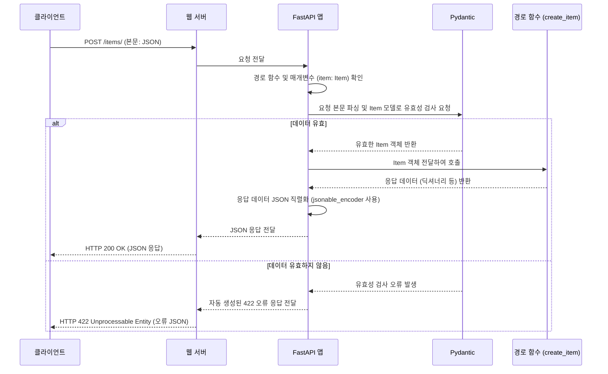

> 이 튜토리얼은 AI가 생성했습니다! 자세한 내용은 [AI 코드베이스 지식 빌더](https://github.com/The-Pocket/Tutorial-Codebase-Knowledge)를 참조하세요.


##  4장: 데이터 유효성 검사 및 직렬화 (Data Validation & Serialization)

*   이전 Chapter 3: 매개변수 선언 (Parameter Declaration)에서는 URL 경로와 쿼리 매개변수를 통해 간단한 데이터를 받는 방법을 배웠습니다. 마치 간단한 메모를 주고받는 것과 같았죠. 하지만 실제 웹 애플리케이션에서는 더 복잡하고 구조화된 데이터를 처리해야 하는 경우가 훨씬 많습니다. 예를 들어, 사용자가 새 상품을 등록할 때 이름, 설명, 가격, 태그 등 여러 정보를 한 번에 보내야 할 수 있습니다.

*   이번 장에서는 FastAPI가 이렇게 복잡한 데이터를 어떻게 효율적으로 처리하는지, 즉 **데이터 유효성 검사(Data Validation)** 와 **데이터 직렬화(Data Serialization)** 에 대해 배웁니다. 클라이언트가 보낸 데이터가 우리가 기대하는 형식과 타입에 맞는지 꼼꼼히 확인하고(유효성 검사), 서버의 처리 결과를 클라이언트가 이해할 수 있는 표준 형식(주로 JSON)으로 변환하여 전달하는(직렬화) 과정입니다.

### 4.1 왜 데이터 유효성 검사와 직렬화가 필요한가요?
온라인 쇼핑몰에서 새 상품을 등록하는 API를 만든다고 상상해 봅시다. 클라이언트(웹 프론트엔드나 앱)는 상품 정보를 JSON 형태로 서버에 보낼 것입니다.

```json
// 클라이언트가 보낼 수 있는 상품 정보 예시 (이상적인 경우)
{
    "name": "최고급 키보드",
    "description": "기계식 청축, RGB 백라이트",
    "price": 150000,
    "tax": 15000,
    "tags": ["기계식", "게이밍", "RGB"]
}
```

이 데이터를 받을 때 서버는 몇 가지 중요한 작업을 해야 합니다.

1.  **데이터 구조 확인:** 
    *   클라이언트가 보낸 데이터가 우리가 정의한 `상품` 구조와 일치하는가? 필수 항목(예: `name`, `price`)이 모두 포함되었는가?
2.  **데이터 타입 확인:** 
    *   각 항목의 데이터 타입이 올바른가? `price`는 숫자(float 또는 int)인가, 문자열은 아닌가? `tags`는 리스트인가?
3.  **데이터 처리:** 
    *   유효한 데이터라면, 이 정보를 사용하여 데이터베이스에 새 상품을 저장하거나 다른 비즈니스 로직을 수행합니다.
4.  **응답 생성:** 
    *   처리 결과를 클라이언트에게 알려줘야 합니다. 이때 서버 내부의 파이썬 객체(예: 데이터베이스 모델 객체)를 클라이언트가 이해할 수 있는 JSON 형식으로 변환해야 합니다.

이 과정에서 1번과 2번이 **데이터 유효성 검사**에 해당하고, 4번이 **데이터 직렬화**에 해당합니다. 만약 데이터가 유효하지 않다면(예: `price`가 문자열이거나 필수 필드 누락), 서버는 어떤 부분이 잘못되었는지 명확한 오류 메시지를 클라이언트에게 보내주어야 합니다.

*  FastAPI는 이 복잡하고 반복적인 작업을 **Pydantic**이라는 라이브러리를 사용해 매우 쉽고 강력하게 처리.

### 4.2 Pydantic 모델: 데이터 구조의 청사진
FastAPI는 **Pydantic** 모델을 사용하여 데이터의 구조와 유효성 검사 규칙을 정의합니다. Pydantic 모델은 파이썬의 **타입 힌트**를 사용하여 데이터 필드와 그 타입을 선언하는 간단한 클래스입니다.

*   상품 데이터를 위한 Pydantic 모델을 만들어 봅시다.

```python
# main.py
from typing import Union, List
from fastapi import FastAPI
from pydantic import BaseModel # Pydantic의 BaseModel을 가져옵니다.

# 상품 데이터 구조를 정의하는 Pydantic 모델
class Item(BaseModel):
    name: str  # 이름은 문자열(str) 타입이고 필수입니다.
    description: Union[str, None] = None # 설명은 문자열이거나 없을(None) 수 있습니다. 기본값은 None.
    price: float # 가격은 실수(float) 타입이고 필수입니다.
    tax: Union[float, None] = None # 세금은 실수이거나 없을(None) 수 있습니다. 기본값은 None.
    tags: List[str] = [] # 태그는 문자열 리스트(List[str])입니다. 기본값은 빈 리스트.

app = FastAPI()
```

*   `from pydantic import BaseModel`: 
    *   Pydantic 라이브러리에서 모델 정의의 기초가 되는 `BaseModel` 클래스를 가져옵니다.
*   `class Item(BaseModel):`: 
    *   `Item`이라는 이름의 클래스를 정의하고 `BaseModel`을 상속받습니다. 이 클래스가 우리 데이터의 구조(스키마)를 나타냅니다.
*   `name: str`: 
    *   `name`이라는 속성은 문자열(`str`) 타입이어야 함을 나타냅니다. 기본값이 없으므로 필수 항목.
*   `description: Union[str, None] = None`: 
    *   `description`은 문자열(`str`)이거나 `None`일 수 있습니다 (`Union[str, None]`). 
    *   기본값으로 `None`을 지정했으므로 선택적(optional) 항목입니다. (Python 3.10+ 에서는 `str | None = None` 으로 더 간결하게 쓸 수 있습니다.)
*   `price: float`: 
    *   `price`는 실수(`float`) 타입이어야 합니다. 필수 항목입니다.
*   `tags: List[str] = []`: 
    *   `tags`는 문자열들의 리스트(`List[str]`)여야 합니다. 
    *   기본값으로 빈 리스트 `[]`를 주었으므로 선택적 항목입니다.

이 Pydantic 모델 `Item`은 이제 상품 데이터가 어떤 형태여야 하는지를 명확하게 정의하는 '청사진' 역할.

### 4.3 요청 본문(Request Body) 처리하기
이제 이 `Item` 모델을 사용하여 클라이언트로부터 상품 데이터를 받는 API 경로 함수를 만들어 봅시다. 이전 장에서 경로 및 쿼리 매개변수를 선언했던 것과 유사하게, **경로 작업 함수의 매개변수로 Pydantic 모델 타입을 선언**하면 됩니다.

```python
# main.py (이어서)

@app.post("/items/") # POST 메소드로 /items/ 경로 처리
async def create_item(item: Item): # 함수 매개변수로 Item 모델 타입을 선언
    """
    Item 모델 타입으로 선언된 'item' 매개변수는
    FastAPI에게 HTTP 요청의 본문(body)을 읽어서
    Item 모델의 구조에 맞게 파싱하고 유효성을 검사하라고 지시합니다.
    """
    # 유효성 검사를 통과하면, 'item'은 Item 클래스의 인스턴스가 됩니다.
    # 이 객체의 속성에 접근하여 데이터를 사용할 수 있습니다.
    item_data = item.model_dump() # Pydantic v2 방식. Pydantic v1 에서는 item.dict()
    # 여기서는 받은 데이터를 그대로 반환합니다.
    return item_data
```

*   `@app.post("/items/")`: 
    *   `/items/` 경로에 대한 `POST` 요청을 처리하는 경로 작업을 정의합니다. 
    *   `POST` 메소드는 주로 새로운 데이터를 생성할 때 사용됩니다.
*   `async def create_item(item: Item)`: 
    *   `create_item` 함수는 `item`이라는 매개변수를 받습니다. 
    *   여기서 **`item: Item`** 부분이 핵심입니다! FastAPI는 이 타입 힌트를 보고, **HTTP 요청의 본문(body)에 있는 JSON 데이터를 읽어서 `Item` 모델에 따라 파싱하고 유효성을 검사**해야 한다는 것을 자동으로 알아챕니다.
*   `item_data = item.model_dump()`: 
    *   유효성 검사를 통과하면 `item` 매개변수는 `Item` 클래스의 인스턴스가 됩니다. 
    *   `model_dump()` 메소드 (Pydantic v1에서는 `dict()`)를 사용해 이 객체를 파이썬 딕셔너리로 변환.
*   `return item_data`: 
    *   FastAPI는 함수가 반환하는 파이썬 객체(여기서는 딕셔너리)를 **자동으로 JSON 형식으로 변환(직렬화)** 하여 클라이언트에게 응답합니다.

### 4.4 실행 및 테스트

서버를 실행합니다.

```bash
fastapi dev main.py
```

*   이제 HTTP 클라이언트 도구(예: `curl`, Postman, 또는 FastAPI의 자동 문서 `/docs`)를 사용하여 `/items/` 경로로 `POST` 요청을 보내봅시다. 요청 본문에는 `Item` 모델 구조에 맞는 JSON 데이터를 포함해야 합니다.

**성공적인 요청 예시 (`curl` 사용):**

```bash
curl -X 'POST' \
  'http://127.0.0.1:8000/items/' \
  -H 'accept: application/json' \
  -H 'Content-Type: application/json' \
  -d '{
  "name": "최고급 키보드",
  "description": "기계식 청축, RGB 백라이트",
  "price": 150000,
  "tax": 15000,
  "tags": ["기계식", "게이밍", "RGB"]
}'
```

**예상 응답:**

```json
{
  "name": "최고급 키보드",
  "description": "기계식 청축, RGB 백라이트",
  "price": 150000.0,
  "tax": 15000.0,
  "tags": ["기계식", "게이밍", "RGB"]
}
```

*   FastAPI는 요청 본문의 JSON 데이터를 성공적으로 `Item` 모델로 변환(유효성 검사 포함)했고, 경로 함수는 이 데이터를 받아 처리한 후 (여기서는 다시 딕셔너리로 변환하여) 반환했습니다. FastAPI는 이 반환된 딕셔너리를 다시 JSON으로 직렬화하여 응답했습니다.

**유효성 검사 실패 예시 (잘못된 데이터 타입):**

*   만약 `price`를 숫자가 아닌 문자열로 보내면 어떻게 될까요?

```bash
curl -X 'POST' \
  'http://127.0.0.1:8000/items/' \
  -H 'accept: application/json' \
  -H 'Content-Type: application/json' \
  -d '{
  "name": "잘못된 키보드",
  "description": "가격이 문자열",
  "price": "비싸요", # <<< 숫자가 아닌 문자열!
  "tax": null,
  "tags": []
}'
```

**FastAPI 자동 오류 응답:**
*   FastAPI는 Pydantic을 통해 유효성 검사 오류를 감지하고, 어떤 필드가 왜 잘못되었는지 알려주는 **자동 오류 응답 (HTTP 422 Unprocessable Entity)** 을 생성합니다.

```json
{
  "detail": [
    {
      "loc": [ // 오류 위치: 요청 본문(body)의 'price' 필드
        "body",
        "price"
      ],
      "msg": "Input should be a valid number, unable to parse string as a number", // 오류 메시지: 숫자로 파싱할 수 없음
      "type": "float_parsing" // 오류 타입
    }
  ]
}
```

보시다시피, 개발자는 별도의 오류 처리 코드를 작성하지 않아도 FastAPI가 자동으로 명확한 오류 정보를 제공합니다. 이는 API 개발 생산성을 크게 향상.

### 4.5 내부 동작 방식: 유효성 검사와 직렬화

`POST /items/` 요청이 들어왔을 때 내부적으로 어떤 일이 일어나는지 좀 더 자세히 살펴봅시다.

1.  **요청 수신**: 
    *   웹 서버(Uvicorn)가 `POST /items/` 요청과 함께 JSON 형식의 요청 본문을 받습니다.
2.  **FastAPI 전달**: 
    *   웹 서버는 이 요청을 FastAPI 애플리케이션(`app`)에 전달합니다.
3.  **경로 및 매개변수 확인**: 
    *   FastAPI는 요청된 경로(`POST /items/`)에 해당하는 `create_item` 함수를 찾습니다. 
    *   그리고 함수의 매개변수 `item: Item`을 확인하여, 요청 본문을 `Item` Pydantic 모델로 처리해야 함을 인지합니다.
4.  **요청 본문 읽기**: 
    *   FastAPI는 요청의 원시(raw) 본문 데이터를 읽습니다.
5.  **JSON 파싱**: 
    *   읽어들인 본문 데이터를 JSON 파서로 파싱하여 파이썬 딕셔너리 형태로 변환합니다.
6.  **Pydantic 유효성 검사**: 
    *   FastAPI는 파싱된 딕셔너리와 `Item` 모델 정의를 **Pydantic**에게 넘겨 유효성 검사를 수행합니다.
        *   **성공 시**: Pydantic은 데이터로부터 `Item` 클래스의 인스턴스를 생성해 FastAPI에게 돌려준다.
        *   **실패 시**: Pydantic은 `ValidationError` 예외를 발생시킵니다. FastAPI는 이 예외를 잡아 표준화된 422 오류 응답(JSON 형식)을 생성합니다.
7.  **경로 함수 호출 (성공 시)**: 
    *   FastAPI는 생성된 `Item` 인스턴스를 `item` 매개변수에 담아 `create_item` 함수를 호출합니다.
8.  **반환값 처리**: 
    *   `create_item` 함수는 처리 결과를 반환합니다 (예: `item.model_dump()`로 얻은 딕셔너리).
9.  **응답 직렬화**: 
    *   FastAPI는 반환된 파이썬 객체(딕셔너리, 리스트, Pydantic 모델 등)를 JSON으로 변환(직렬화)합니다. 이 과정에서도 Pydantic의 기능(`jsonable_encoder`)이 사용될 수 있습니다.
10. **응답 전송**: 
    *   직렬화된 JSON 데이터를 포함한 HTTP 응답을 웹 서버를 통해 클라이언트에게 보냅니다. (오류 발생 시 6단계에서 생성된 422 오류 응답을 보냅니다).


### 4.6 내부 동작 과정을 다이어그램으로 표현
<br>



### 4.7 코드 내부 엿보기 
FastAPI가 이 모든 것을 어떻게 처리할까요? 핵심은 **Pydantic** 라이브러리와의 긴밀한 통합에 있습니다.

*   **Pydantic `BaseModel`**: 
    *   우리가 정의한 `Item` 모델은 Pydantic의 `BaseModel`을 상속합니다.
    *   이 `BaseModel`에는 데이터 파싱, 유효성 검사, 직렬화 등에 필요한 모든 로직이 내장되어 있습니다. (`pydantic` 라이브러리 내부)

*   **의존성 분석 (`fastapi/dependencies/utils.py`)**: 
    *   FastAPI는 경로 작업 함수가 정의될 때, 함수의 매개변수와 타입 힌트를 분석합니다 (`analyze_param` 함수 등). 
    *   `item: Item` 과 같은 Pydantic 모델 타입 힌트를 발견하면, 이 매개변수가 요청 본문에서 와야 하며 Pydantic 모델 `Item`을 사용하여 유효성을 검사해야 한다는 것을 기록 (`Dependant` 객체).

*   **요청 처리 (`fastapi/dependencies/utils.py`)**: 
    *   실제 요청이 들어오면, FastAPI는 기록된 정보를 바탕으로 요청 본문을 읽고(`request_body_to_args` 함수 등), Pydantic 모델의 `model_validate_json` (또는 유사한 Pydantic 내부 메소드)을 호출하여 유효성 검사와 객체 생성을 시도합니다. 
    *   오류가 발생하면 FastAPI의 예외 처리기가 이를 감지하여 422 응답을 만듭니다.

*   **응답 처리 (`fastapi/encoders.py`)**: 
    *   경로 함수가 값을 반환하면, FastAPI는 `jsonable_encoder` 함수를 사용하여 반환값을 JSON으로 변환할 수 있는 형태로 만듭니다. 
    *   Pydantic 모델 인스턴스가 반환되면, `jsonable_encoder`는 내부적으로 해당 모델의 `.model_dump(mode='json')` (Pydantic v2) 또는 `.dict()` (Pydantic v1) 등을 호출하여 JSON 친화적인 딕셔너리로 변환합니다.

```python
# fastapi/encoders.py 의 jsonable_encoder (간략화된 개념)

def jsonable_encoder(obj: Any, ...) -> Any:
    # ... (다른 타입 처리) ...
    if isinstance(obj, BaseModel): # Pydantic 모델인 경우
        # 모델의 내장 메소드를 사용하여 JSON 호환 딕셔너리로 변환
        return obj.model_dump(mode="json", ...) # Pydantic v2
        # 또는 return obj.dict(...) # Pydantic v1
    # ... (리스트, 딕셔너리 등 재귀적 처리) ...
    # ... (날짜, 시간 등 특수 타입 처리) ...
    try:
        # 일반 객체는 딕셔너리로 변환 시도
        data = dict(obj)
    except Exception:
        try:
            # 또는 vars() 사용 시도
            data = vars(obj)
        except Exception:
            raise ValueError("객체를 JSON으로 변환할 수 없습니다.")
    # 변환된 딕셔너리를 다시 jsonable_encoder로 처리
    return jsonable_encoder(data, ...)
```

이처럼 FastAPI는 Pydantic의 강력한 데이터 처리 능력과 파이썬의 타입 힌트 시스템을 영리하게 활용하여, 개발자가 최소한의 코드로 데이터 유효성 검사와 직렬화를 구현할 수 있도록 돕습니다.

### 4.8 마무리

이번 장에서는 FastAPI의 핵심 기능 중 하나인 **데이터 유효성 검사 및 직렬화**에 대해 배웠습니다.

*   **Pydantic 모델 (`BaseModel`)** 을 사용하여 기대하는 데이터의 구조와 타입을 정의합니다.
*   경로 작업 함수의 매개변수에 Pydantic 모델 타입을 힌트로 사용하면, FastAPI가 자동으로 **요청 본문** 데이터를 해당 모델에 따라 **유효성 검사**하고 파싱합니다.
*   유효성 검사에 실패하면 FastAPI는 자동으로 상세한 **422 오류 응답**을 생성합니다.
*   FastAPI는 경로 함수가 반환하는 Pydantic 모델 인스턴스, 딕셔너리, 리스트 등을 자동으로 **JSON으로 직렬화**하여 응답합니다.
*   이 모든 과정은 파이썬의 **타입 힌트** 덕분에 매우 직관적이고 간결하게 이루어집니다.

이제 우리는 클라이언트로부터 복잡한 데이터를 안전하게 받고, 처리 결과를 표준 형식으로 응답하는 방법을 알게 되었습니다.

*   하지만 때로는 API가 클라이언트에게 보내는 응답 데이터의 구조를 입력 데이터의 구조와 다르게 하고 싶을 수 있습니다. 예를 들어, 사용자 정보를 생성할 때는 비밀번호를 받지만, 응답으로 사용자 정보를 돌려줄 때는 비밀번호 필드를 제외하고 싶을 수 있습니다.

다음 장에서는 이렇게 응답 데이터의 구조를 명시적으로 제어하는 방법, 즉 **응답 모델(Response Model)** 에 대해 배우겠습니다.
