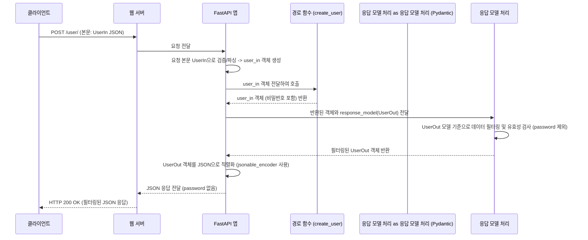

##  5장: 응답 모델 (Response Model)

* 이전 Chapter 4: 데이터 유효성 검사 및 직렬화 (Data Validation & Serialization)에서는 클라이언트로부터 들어오는 데이터를 Pydantic 모델을 사용해 검증하고 파싱하는 방법을 배웠습니다. 마치 우리가 원하는 양식에 맞춰 요청 데이터를 받는 방법을 배운 것과 같죠.

* 하지만 API는 데이터를 받기만 하는 것이 아니라, 처리 결과를 클라이언트에게 다시 **보내주어야(응답)** 합니다. 이때, 우리가 내부적으로 다루는 모든 데이터를 그대로 외부에 노출하는 것은 바람직하지 않을 수 있습니다. 예를 들어, 사용자 정보를 데이터베이스에 저장할 때는 비밀번호도 함께 다루지만, 사용자 생성 결과를 클라이언트에게 보여줄 때는 비밀번호 같은 민감한 정보는 제외하고 싶을 것입니다.

이번 장에서는 FastAPI가 API 응답 데이터의 **구조와 내용**을 어떻게 제어하는지, 즉 **응답 모델(Response Model)** 에 대해 배웁니다. 응답 모델은 클라이언트에게 최종적으로 전달될 데이터의 '설계도' 역할을 하여, 보내려는 데이터만 안전하게 필터링하고 형식을 맞춰줍니다.

### 5.1 응답 모델이란 무엇인가요?

* 응답 모델은 API 경로 작업이 반환해야 하는 데이터의 **구조와 타입**을 정의하는 Pydantic 모델입니다. 경로 작업 데코레이터(`@app.get`, `@app.post` 등)에 `response_model` 매개변수를 사용하여 이 모델을 지정하면, FastAPI는 다음 작업들을 자동으로 수행합니다.

1.  **데이터 필터링:** 
*   경로 함수가 반환한 데이터 중에서 응답 모델에 정의된 필드만 남기고 나머지는 **제외**합니다.
*    이는 실수로 민감한 정보(예: 비밀번호, 내부 관리 필드)가 클라이언트에게 유출되는 것을 방지합니다.
2.  **데이터 유효성 검사:** 
*   반환되는 데이터가 응답 모델에 정의된 타입과 제약 조건에 맞는지 **검사**합니다. 이는 일관되고 예상 가능한 형식의 응답을 보장합니다.
3.  **데이터 직렬화:** 
*   유효성 검사를 통과하고 필터링된 데이터를 JSON과 같은 표준 형식으로 **변환(직렬화)** 합니다.
4.  **자동 문서화:** 
*   API 문서(OpenAPI)에 이 경로가 **어떤 구조의 데이터를 반환하는지** 명확하게 명시합니다.

간단히 말해, 응답 모델은 API가 "이런 형식과 내용으로 응답할 것을 약속합니다"라고 선언.

### 5.2 응답 모델 사용하기
사용자 생성 API를 예시로 응답 모델을 사용해 봅시다. 

*   사용자를 생성할 때는 `username`, `password`, `email`, `full_name`을 입력받지만, 생성 성공 응답으로는 `password`를 제외한 `username`, `email`, `full_name`만 돌려주고 싶습니다.

1.  **입력 데이터 모델 정의 (`UserIn`)**: 클라이언트로부터 받을 데이터 구조입니다.

    ```python
    # main.py
    from typing import Union
    from fastapi import FastAPI
    from pydantic import BaseModel, EmailStr

    app = FastAPI()

    class UserIn(BaseModel):
        username: str
        password: str # 입력 시에는 비밀번호 필요
        email: EmailStr
        full_name: Union[str, None] = None
    ```

    *   이전 장에서 배운 것처럼 `UserIn` 모델은 요청 본문을 처리하는 데 사용. `password` 필드가 포함.

2.  **출력 데이터 모델 정의 (`UserOut`)**: 클라이언트에게 반환할 데이터 구조입니다.

    ```python
    # main.py (이어서)

    class UserOut(BaseModel):
        username: str
        email: EmailStr # 비밀번호는 여기에 없음!
        full_name: Union[str, None] = None
    ```

    *   `UserOut` 모델은 응답 데이터의 구조를 정의합니다. 여기에는 `password` 필드가 **없습니다**.

3.  **경로 작업에 `response_model` 지정**: `@app.post` 데코레이터에 `response_model=UserOut`을 추가.

    ```python
    # main.py (이어서)
    from typing import Any # Any를 사용하기 위해 가져옵니다.

    @app.post("/user/", response_model=UserOut) # 응답 모델로 UserOut 지정
    async def create_user(user: UserIn) -> Any:
        """
        사용자 생성을 시뮬레이션합니다.
        입력으로는 UserIn 모델을 사용하고,
        응답으로는 UserOut 모델에 따라 데이터가 필터링됩니다.
        """
        # 실제로는 데이터베이스에 user 데이터를 저장하겠지만,
        # 여기서는 받은 user 객체를 그대로 반환합니다.
        # 이 user 객체에는 password 필드가 포함되어 있습니다!
        return user
    ```

    *   `@app.post("/user/", response_model=UserOut)`: 이 경로의 응답은 `UserOut` 모델의 구조를 따라야 함을 FastAPI에게 알립니다.
    *   `async def create_user(user: UserIn) -> Any`: 함수는 `UserIn` 타입의 `user`를 입력으로 받습니다. 반환 타입 힌트는 `Any`로 지정했지만, 실제 응답은 `response_model`에 의해 제어됩니다.
    *   `return user`: 함수는 입력으로 받은 `user` 객체(내부적으로 `password` 포함)를 그대로 반환.

### 5.3 실행 및 테스트
서버를 실행합니다 (`fastapi dev main.py`).

*   이제 HTTP 클라이언트를 사용하여 `/user/` 경로로 `POST` 요청을 보내봅시다. 요청 본문에는 `UserIn` 모델에 맞는 데이터를 넣습니다 (비밀번호 포함).

**요청 예시 (`curl` 사용):**

```bash
curl -X 'POST' \
  'http://127.0.0.1:8000/user/' \
  -H 'accept: application/json' \
  -H 'Content-Type: application/json' \
  -d '{
  "username": "johndoe",
  "password": "supersecretpassword",
  "email": "johndoe@example.com",
  "full_name": "John Doe"
}'
```

**예상 응답:**

```json
{
  "username": "johndoe",
  "email": "johndoe@example.com",
  "full_name": "John Doe"
}
```

*  `create_user` 함수는 `password`가 포함된 `user` 객체를 반환했지만, 최종 응답에는 `password` 필드가 **사라졌습니다!** 이것이 바로 `response_model=UserOut`의 역할입니다. 
*   FastAPI는 함수가 반환한 `user` 객체를 가져와 `UserOut` 모델과 비교하여, `UserOut`에 정의된 필드 (`username`, `email`, `full_name`)만 남기고 나머지는 자동으로 필터링한 후 JSON으로 변환하여 응답.

### 5.4 내부 동작 방식: 응답 데이터 처리 과정

`POST /user/` 요청이 들어오고 `response_model`이 지정되었을 때, 내부적으로 어떤 일이 일어날까요?

1.  **요청 수신 및 입력 처리**: 
    *   클라이언트 요청이 들어오고, FastAPI는 4장에서 배운 대로 요청 본문을 `UserIn` 모델로 유효성 검사하고 파싱하여 `user` 객체를 만듭니다.
2.  **경로 함수 실행**: 
    *   FastAPI는 `create_user(user=...)` 와 같이 생성된 `user` 객체를 전달하여 경로 함수를 실행.
3.  **데이터 반환**: 
    *   `create_user` 함수는 처리 결과(여기서는 `password`가 포함된 `user` 객체)를 반환합니다.
4.  **응답 모델 적용**: 
    *   FastAPI는 반환된 `user` 객체와 경로 작업에 지정된 `response_model` (`UserOut`)을 확인합니다.
5.  **Pydantic 필터링 및 유효성 검사**: 
    *   FastAPI는 반환된 `user` 객체의 데이터를 사용하여 `UserOut` 모델의 인스턴스를 생성하려고 시도합니다. 이 과정에서 Pydantic은 다음 작업을 수행합니다.
        *   `UserOut` 모델에 정의된 필드(`username`, `email`, `full_name`)에 해당하는 값을 `user` 객체에서 가져옵니다.
        *   가져온 값이 `UserOut`에 정의된 타입과 일치하는지 확인합니다.
        *   `user` 객체에는 있지만 `UserOut` 모델에는 없는 필드(`password`)는 **무시(필터링)** 됩니다.
        *   만약 반환된 데이터가 `UserOut` 모델의 요구사항(예: 필수 필드 누락, 타입 불일치)을 만족하지 못하면, 서버 내부 오류(HTTP 500)가 발생합니다. (응답 모델은 *서버가* 약속한 형식이므로, 서버 로직 오류로 간주됩니다.)
6.  **데이터 직렬화**: 
    *   성공적으로 생성된 `UserOut` 인스턴스(필터링 및 유효성 검사 완료된 데이터)를 FastAPI의 `jsonable_encoder`를 사용하여 JSON으로 변환합니다.
7.  **응답 전송**: 
    *   최종 JSON 응답을 클라이언트에게 보냅니다.

### 5.5 내부 동작 과정을 다이어그램으로 표현
<br>



### 5.6 코드 내부 엿보기 

*   `response_model` 매개변수는 `fastapi/routing.py`의 `APIRoute` 클래스 (또는 `@app.post` 같은 데코레이터 헬퍼 함수)에 전달됩니다. FastAPI는 경로를 설정할 때 이 `response_model` 정보를 라우트 객체에 저장합니다.
*   경로 함수가 실행되고 값을 반환하면, FastAPI는 해당 라우트에 `response_model`이 설정되었는지 확인.
*   설정되어 있다면, FastAPI는 반환된 값을 가져와서 지정된 `response_model` (Pydantic 모델)을 사용하여 데이터를 처리합니다. 내부적으로 Pydantic 모델의 `model_validate`와 유사한 로직을 사용하여 반환된 데이터로부터 응답 모델의 인스턴스를 생성합니다. 이 과정에서 필터링과 유효성 검사가 이루어집니다.
*   이렇게 생성된 응답 모델 인스턴스는 4장에서 언급된 `fastapi.encoders.jsonable_encoder`를 통해 최종 JSON 응답으로 변환됩니다. `jsonable_encoder`는 Pydantic 모델 인스턴스를 받으면 내부적으로 `.model_dump(mode='json')` (Pydantic v2) 또는 `.dict()` (Pydantic v1) 등을 호출하여 JSON으로 변환하기 쉬운 딕셔너리 형태로 만듭니다.

### 5.7 추가 `response_model` 매개변수

`response_model`과 함께 사용할 수 있는 유용한 매개변수들이 있습니다.

*   `response_model_exclude_unset=True`

이 매개변수를 `True`로 설정하면, 경로 함수가 반환한 데이터에서 **명시적으로 설정된 값**만 응답에 포함시키고, 모델에 정의된 기본값(default value)이나 설정되지 않은 필드는 제외합니다. 이는 부분 업데이트(PATCH) 응답이나 기본값이 많은 모델을 다룰 때 유용합니다.

```python
# main.py (예시 아이템 데이터 추가)
class Item(BaseModel):
    name: str
    description: Union[str, None] = None
    price: float
    tax: float = 10.5 # 기본값 10.5

items = {
    "foo": {"name": "Foo", "price": 50.2}, # description과 tax는 명시적으로 설정 안됨
    "bar": {"name": "Bar", "description": "The bartenders", "price": 62, "tax": 20.2},
}

# response_model_exclude_unset=True 사용
@app.get("/items/{item_id}", response_model=Item, response_model_exclude_unset=True)
async def read_item(item_id: str):
    return items[item_id]
```

*   `GET /items/foo` 요청 시:
    *   `read_item` 함수는 `{"name": "Foo", "price": 50.2}`를 반환합니다.
    *   `response_model_exclude_unset=True` 때문에, `Item` 모델의 기본값 필드인 `tax`와 명시적으로 설정되지 않은 `description`은 최종 응답에서 **제외**됩니다.
    *   응답: `{"name": "Foo", "price": 50.2}`
*   `GET /items/bar` 요청 시:
    *   `read_item` 함수는 `{"name": "Bar", "description": "The bartenders", "price": 62, "tax": 20.2}`를 반환합니다. 모든 값이 명시적으로 설정되었으므로 모두 포함됩니다.
    *   응답: `{"name": "Bar", "description": "The bartenders", "price": 62.0, "tax": 20.2}`

### 5.8 `response_model_include` 및 `response_model_exclude`
이 매개변수들을 사용하면 응답 모델의 필드 중 어떤 것을 포함하거나 제외할지 **동적으로** 지정할 수 있습니다. 값으로는 포함/제외할 필드 이름의 `set` 또는 `dict`를 전달합니다.

```python
# main.py (Item 모델 및 items 데이터는 위와 동일)

# name과 description만 포함시키기
@app.get(
    "/items/{item_id}/name",
    response_model=Item,
    response_model_include={"name", "description"}, # name과 description만 포함
)
async def read_item_name(item_id: str):
    return items[item_id]

# tax 필드만 제외하기
@app.get(
    "/items/{item_id}/public",
    response_model=Item,
    response_model_exclude={"tax"}, # tax 필드 제외
)
async def read_item_public_data(item_id: str):
    return items[item_id]
```

*   `GET /items/bar/name` 요청 시:
    *   `response_model_include={"name", "description"}` 때문에 `name`과 `description`만 포함.
    *   응답: `{"name": "Bar", "description": "The bartenders"}`
*   `GET /items/bar/public` 요청 시:
    *   `response_model_exclude={"tax"}` 때문에 `tax` 필드만 제외됩니다.
    *   응답: `{"name": "Bar", "description": "The bartenders", "price": 62.0}`

이 매개변수들은 같은 응답 모델을 사용하면서도 특정 경로에서는 일부 필드만 노출하고 싶을 때 유용합니다.

### 5.9 마무리

이번 장에서는 API 응답 데이터의 구조를 제어하는 도구인 **응답 모델(Response Model)** 에 대해 학습.

*   경로 작업 데코레이터에 `response_model` 매개변수로 Pydantic 모델을 지정합니다.
*   FastAPI는 함수 반환값을 `response_model`에 맞춰 자동으로 **필터링**하고 **유효성 검사**합니다.
*   이를 통해 민감한 데이터 유출을 방지하고 일관된 응답 형식을 보장할 수 있습니다.
*   `response_model_exclude_unset`, `response_model_include`, `response_model_exclude` 같은 추가 매개변수로 응답 내용을 더 세밀하게 제어할 수 있습니다.
*   응답 모델 정보는 API 문서에도 자동으로 반영됩니다.

지금까지 우리는 요청 데이터를 받고(매개변수 선언, 요청 본문), 데이터를 검증하고(Pydantic 모델), 응답 데이터 형식을 제어하는(응답 모델) 방법을 배웠습니다. FastAPI는 이 모든 정보를 활용하여 개발자를 위한 또 하나의 강력한 기능을 제공합니다. 바로 **자동 대화형 API 문서**입니다.

*   다음 장에서는 FastAPI가 어떻게 코드만으로 깔끔하고 사용하기 쉬운 API 문서를 자동으로 생성해 주는지 살펴보겠습니다.
