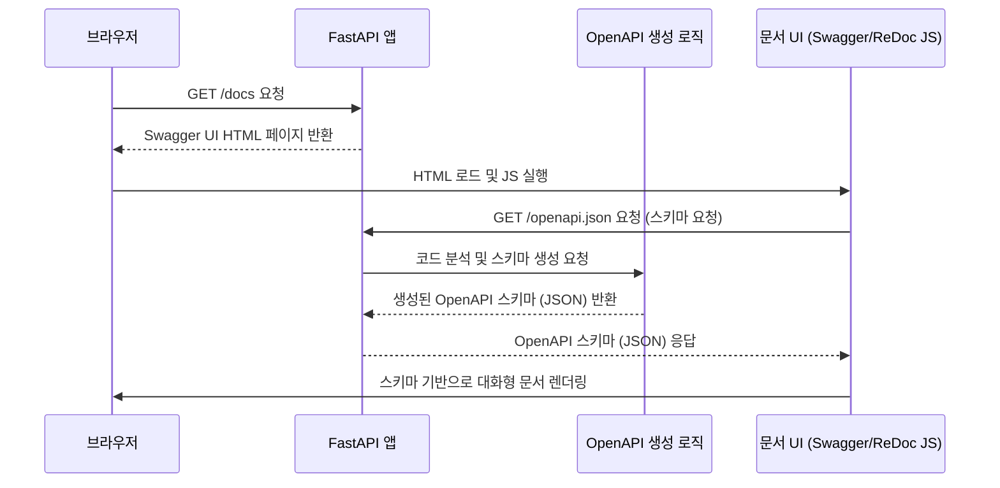

> 이 튜토리얼은 AI가 생성했습니다! 자세한 내용은 [AI 코드베이스 지식 빌더](https://github.com/The-Pocket/Tutorial-Codebase-Knowledge)를 참조하세요.


## 6장: OpenAPI 자동 문서화 (Automatic OpenAPI Documentation)

*   이전 제 5장: 응답 모델 (Response Model)에서는 API가 클라이언트에게 어떤 형식의 데이터를 반환할지 명확하게 정의하는 방법을 배웠습니다. 이렇게 응답 형식을 제어하는 것은 API를 사용하는 클라이언트에게 매우 중요합니다. 하지만 클라이언트 개발자가 API를 어떻게 사용해야 하는지 알려면 또 무엇이 필요할까요? 바로 잘 정리된 **사용 설명서**, 즉 **API 문서**입니다.

*   API를 새로 만들거나 업데이트할 때마다 문서를 수동으로 작성하고 관리하는 것은 매우 번거롭고 오류가 발생하기 쉽습니다. 코드는 변경되었는데 문서는 예전 그대로라면, API 사용자는 혼란을 겪게 됩니다. 마치 최신 시설로 리모델링된 건물의 안내도가 예전 버전이라면 방문객들이 길을 잃는 것과 같죠.

FastAPI는 이러한 문제를 해결하기 위해 매우 강력한 기능을 제공합니다. 바로 여러분이 작성한 **파이썬 코드 자체를 기반으로 API 문서를 자동으로 생성**하는 기능입니다! 코드를 변경하면 문서도 실시간으로 업데이트되므로, 항상 최신 상태의 정확한 문서를 유지할 수 있습니다.

### 6.1 API 문서: 왜 중요하고, FastAPI는 어떻게 도와주나요?
여러분이 만든 API를 다른 개발자(프론트엔드 개발자, 앱 개발자, 또는 미래의 여러분!)가 사용한다고 상상해 보세요. 그들은 다음과 같은 질문에 대한 답을 알아야 합니다.

*   이 API에는 어떤 기능(경로)들이 있나요? (`/users/`, `/items/{item_id}` 등)
*   각 기능은 어떤 HTTP 메소드(GET, POST, PUT, DELETE 등)를 사용해야 하나요?
*   각 기능을 사용할 때 어떤 데이터(경로 매개변수, 쿼리 매개변수, 요청 본문)를 보내야 하나요? 데이터 형식(타입)은 무엇인가요? 필수인가요, 선택인가요?
*   각 기능을 사용하면 어떤 응답을 받게 되나요? 성공 시 응답 데이터의 구조는 무엇인가요? 오류가 발생하면 어떤 형식으로 알려주나요?

이 모든 정보를 담고 있는 것이 API 문서입니다. FastAPI는 여러분이 이미 작성한 파이썬 코드를 분석하여 이 모든 질문에 대한 답을 자동으로 찾아냅니다.

*   **경로 작업 데코레이터 (`@app.get`, `@app.post` 등):** 
    *   API 경로와 HTTP 메소드를 알려줍니다.
*   **함수 매개변수와 타입 힌트 (`item_id: int`, `q: str | None`):** 
    *   경로 및 쿼리 매개변수, 그리고 그 타입과 필수 여부를 알려줍니다.
*   **Pydantic 모델 타입 힌트 (`user: UserIn`):** 
    *   요청 본문의 구조와 유효성 검사 규칙을 알려줍니다. 
*   **`response_model` 매개변수:** 
    *   응답 데이터의 구조를 알려줍니다. 
*   **함수 독스트링 (Docstrings):** 
    *   API 기능에 대한 설명을 제공합니다.

FastAPI는 이 정보를 모아 **OpenAPI**라는 표준 사양에 맞는 데이터를 생성합니다. 그리고 이 OpenAPI 데이터를 기반으로 두 가지 종류의 멋진 대화형(Interactive) API 문서를 웹 브라우저에서 바로 볼 수 있도록 제공.

*   **Swagger UI:** 매우 인기 있는 대화형 API 문서 인터페이스입니다. API 기능을 시각적으로 탐색하고, 문서 페이지에서 직접 API를 호출하여 테스트해 볼 수 있습니다.
*   **ReDoc:** 또 다른 인기 있는 API 문서 인터페이스입니다. 깔끔하고 가독성 높은 디자인을 제공합니다.

### 6.2 자동 문서 확인하기
FastAPI 애플리케이션을 실행하면, 별도의 설정 없이도 이 두 가지 문서 페이지에 즉시 접근할 수 있습니다. 이전 장들에서 사용했던 간단한 예제 코드를 다시 사용해 봅시다.

```python
# main.py
from typing import Union, List
from fastapi import FastAPI
from pydantic import BaseModel, EmailStr

app = FastAPI()

# 입력 모델
class UserIn(BaseModel):
    username: str
    password: str # 입력 시 비밀번호
    email: EmailStr
    full_name: Union[str, None] = None

# 출력 (응답) 모델
class UserOut(BaseModel):
    username: str
    email: EmailStr # 응답 시 비밀번호 제외
    full_name: Union[str, None] = None

@app.post("/user/", response_model=UserOut, tags=["users"]) # 태그 추가
async def create_user(user: UserIn):
    """
    새로운 사용자를 생성합니다.

    - **username**: 각 사용자의 고유 식별자
    - **email**: 사용자의 이메일 주소
    - **password**: 사용자 비밀번호
    - **full_name**: 사용자의 전체 이름 (선택 사항)
    """
    # 실제로는 DB에 저장하겠지만, 여기서는 받은 데이터를 반환
    return user

@app.get("/items/{item_id}", tags=["items"]) # 태그 추가
async def read_item(item_id: int, q: Union[str, None] = None):
    """
    item_id에 해당하는 아이템 정보를 읽어옵니다.

    - **item_id**: 조회할 아이템의 ID (경로 매개변수)
    - **q**: 선택적인 검색어 (쿼리 매개변수)
    """
    result = {"item_id": item_id}
    if q:
        result.update({"q": q})
    return result
```

*   위 코드에 `tags=["users"]`, `tags=["items"]` 와 함수 독스트링(docstring)을 추가했습니다. 이 정보들도 문서에 반영됩니다.

이제 서버를 실행합니다.

```bash
fastapi dev main.py
```

*   서버가 실행되면 웹 브라우저를 열고 다음 두 주소로 접속해 보세요.

### 6.3 Swagger UI (`/docs`)
주소창에 `http://127.0.0.1:8000/docs` 를 입력합니다. 다음과 유사한 화면을 볼 수 있습니다.


*(이미지 출처: FastAPI 공식 문서)*

*   **경로 그룹:** 
    *   `tags`로 지정한 "users"와 "items" 그룹으로 API 경로들이 정리되어 있습니다.
*   **경로 및 메소드:** 
    *   `/user/` (POST) 와 `/items/{item_id}` (GET) 경로가 보입니다.
*   **요약 및 설명:** 
    *   경로 작업 함수의 이름(`create_user`, `read_item`)에서 생성된 기본 요약 정보와 함수 독스트링에 작성한 설명이 표시됩니다.

`/user/` 경로의 POST 작업을 펼쳐보면 더 자세한 정보를 볼 수 있습니다.


*(이미지 출처: FastAPI 공식 문서)*

*   **Parameters:** 
    *   경로/쿼리/헤더 매개변수가 표시됩니다. (이 예제에서는 없음)
*   **Request body:** 
    *   `UserIn` 모델을 기반으로 생성된 요청 본문 구조가 보입니다. 
    *   각 필드의 이름(`username`, `password` 등), 타입(`string`, `string (email)`), 필수 여부(`required`)가 명시되어 있습니다. 
    *   Pydantic 모델 정의가 그대로 반영된 것입니다!
*   **Responses:** 
    *   `response_model=UserOut` 설정에 따라 성공 응답(200 OK)의 구조가 `UserOut` 모델 기준 표시. 
    *   비밀번호 필드가 없는 것을 확인할 수 있습니다. 
    *   또한, FastAPI가 자동으로 추가하는 422 (Validation Error) 응답 형식도 보여줍니다.

가장 멋진 기능 중 하나는 **"Try it out"** 버튼입니다. 이 버튼을 누르면 문서 페이지 내에서 직접 API 요청을 보내고 응답을 확인할 수 있습니다.


*(이미지 출처: FastAPI 공식 문서)*

*   요청 본문에 예시 데이터를 입력하고 "Execute" 버튼을 누르면, FastAPI 서버로 실제 요청이 전송되고 그 결과가 아래에 표시됩니다. API를 테스트하기 위해 별도의 도구를 사용할 필요가 없습니다!

### 6.4 ReDoc (`/redoc`)

주소창에 `http://127.0.0.1:8000/redoc` 를 입력합니다. 다음과 유사한 화면을 볼 수 있습니다.


*(이미지 출처: FastAPI 공식 문서)*

*   ReDoc은 Swagger UI와는 다른 스타일로 API 문서를 보여줍니다. 3단 레이아웃으로 구성되어 있으며, API 경로, 요청/응답 상세 정보, 코드 예시 등을 깔끔하게 제공합니다. ReDoc에는 "Try it out" 기능은 없지만, 문서를 읽고 이해하는 데 집중하기 좋습니다.

### 6.5 문서 정보 커스터마이징
함수 독스트링 외에도, 데코레이터 매개변수나 Pydantic 설정을 통해 문서에 표시될 정보를 더 상세하게 제어.

*   **`FastAPI` 앱 생성 시:** 
    *   `title`, `description`, `version` 등을 설정하여 OpenAPI 문서의 전반적인 정보를 지정 가능.

    ```python
    app = FastAPI(
        title="나의 멋진 API",
        description="이 API는 사용자 및 아이템 관리를 위한 기능을 제공합니다.",
        version="1.0.0",
    )
    ```

*   **경로 작업 데코레이터:** 
    *   `summary`, `description`, `tags` 등을 사용하여 각 경로 작업에 대한 정보를 추가합니다.

    ```python
    @app.post("/user/", ..., summary="새 사용자 생성", description="사용자 이름, 이메일, 비밀번호를 받아 새 사용자를 등록합니다.")
    ```

*   **`Path`, `Query`, `Body`:** 
    *   매개변수 선언 시 `title`, `description`, `examples` 등을 사용하여 각 매개변수에 대한 상세 정보를 제공할 수 있습니다.

    ```python
    from fastapi import Path, Query

    async def read_item(
        item_id: Annotated[int, Path(title="아이템 ID", description="조회할 아이템의 고유 ID", ge=1)],
        q: Annotated[str | None, Query(title="검색어", description="검색할 내용 (선택 사항)")] = None,
    ): ...
    ```

*   **Pydantic 모델:** 
    *   모델 클래스와 필드에 독스트링이나 `Field` 함수의 `title`, `description`, `example` 등을 사용하여 데이터 구조에 대한 설명을 추가할 수 있습니다.

    ```python
    from pydantic import Field

    class UserOut(BaseModel):
        username: str = Field(title="사용자 이름", description="사용자의 고유 식별자")
        email: EmailStr = Field(title="이메일 주소", example="user@example.com")
        full_name: Union[str, None] = Field(default=None, title="전체 이름")
    ```

이렇게 추가된 정보들은 모두 `/docs` 와 `/redoc` 문서에 자동으로 반영되어, 더욱 풍부하고 이해하기 쉬운 API 문서를 만들 수 있습니다.

### 6.6 내부 동작 방식: 코드가 문서가 되기까지

FastAPI는 어떻게 코드만으로 이 모든 문서를 생성할까요?

1.  **애플리케이션 분석:** 
    *   FastAPI 애플리케이션이 시작될 때 (또는 처음 요청을 받을 때), 등록된 모든 경로 작업(`@app.get`, `@app.post` 등)과 관련 정보를 분석합니다.
        *   경로, HTTP 메소드
        *   함수 매개변수 (이름, 타입 힌트, 기본값) -> 경로/쿼리/헤더/쿠키 매개변수 식별
        *   Pydantic 모델 타입 힌트 -> 요청 본문 구조 식별
        *   `response_model` -> 응답 구조 식별
        *   독스트링, `tags`, `summary`, `description` 등 메타데이터
2.  **OpenAPI 스키마 생성:** 
    *   분석된 정보를 바탕으로 **OpenAPI 표준 사양**에 맞는 커다란 JSON 객체(스키마)를 생성합니다. 
    *   이 스키마는 API의 모든 세부 사항(경로, 매개변수, 데이터 모델, 응답 등)을 기계가 읽을 수 있는 형식으로 정의합니다.
3.  **OpenAPI 스키마 제공 (`/openapi.json`):** 
    *   FastAPI는 생성된 OpenAPI 스키마를 기본적으로 `/openapi.json` 경로에서 JSON 형식으로 제공. 
    *   웹 브라우저에서 이 주소로 직접 접속하면 거대한 JSON 데이터를 볼 수 있습니다.
4.  **문서 UI 렌더링 (`/docs`, `/redoc`):**
    *   사용자가 `/docs` (Swagger UI) 또는 `/redoc` (ReDoc) 경로로 접속하면, FastAPI는 해당 UI를 로드하는 HTML 페이지를 반환합니다.
    *   이 HTML 페이지에 포함된 JavaScript 코드는 브라우저 내에서 `/openapi.json` 경로를 호출하여 OpenAPI 스키마(JSON 데이터)를 가져옵니다.
    *   가져온 스키마 데이터를 사용하여 Swagger UI 또는 ReDoc 라이브러리가 화면에 대화형 문서를 동적으로 렌더링합니다.


### 6.7 내부 동작 과정 다이어그램으로 표현
<br>



### 6.8 코드 내부 엿보기 

*   **스키마 생성 (`fastapi/openapi/utils.py`)**: 
    *   `get_openapi()` 함수가 핵심적인 역할을 합니다. 
    *   이 함수는 애플리케이션의 라우트(경로 정보)를 입력받아 분석하고, Pydantic 모델 정보를 활용하여 OpenAPI 사양에 맞는 딕셔너리를 만듭니다. 
    *   내부적으로 `get_openapi_path()` 함수 등을 호출하여 각 경로에 대한 세부 정보를 생성합니다.
*   **OpenAPI 모델 (`fastapi/openapi/models.py`)**: 
    *   FastAPI는 OpenAPI 사양 자체를 Pydantic 모델(`OpenAPI`, `Info`, `PathItem`, `Operation`, `Schema` 등)로 정의해 두었습니다. 
    *   `get_openapi()` 함수는 최종적으로 이 모델들을 사용하여 생성된 딕셔너리의 유효성을 검사하고 구조화합니다.
*   **문서 HTML 생성 (`fastapi/openapi/docs.py`)**: 
    *   `get_swagger_ui_html()` 과 `get_redoc_html()` 함수는 각각 Swagger UI와 ReDoc을 로드하는 HTML 문자열을 생성합니다. 
    *   이 함수들은 `/openapi.json` URL을 포함시켜, UI가 로드된 후 해당 URL에서 스키마 데이터를 가져오도록 설정합니다.

예를 들어, `/items/{item_id}` 경로에 대한 OpenAPI 스키마의 일부는 다음과 같이 생성될 수 있습니다 (JSON 형식):

```json
{
  "/items/{item_id}": { // 경로
    "get": { // HTTP 메소드
      "tags": ["items"], // 태그
      "summary": "Read Item", // 요약 (자동 생성 또는 지정)
      "description": "item_id에 해당하는 아이템 정보를 읽어옵니다.\n\n- **item_id**: 조회할 아이템의 ID (경로 매개변수)\n- **q**: 선택적인 검색어 (쿼리 매개변수)", // 설명 (독스트링)
      "operationId": "read_item_items__item_id__get", // 고유 ID (자동 생성)
      "parameters": [ // 매개변수 목록
        {
          "name": "item_id",
          "in": "path", // 경로 매개변수
          "required": true,
          "schema": {
            "type": "integer", // 타입: 정수
            "title": "Item Id"
          }
        },
        {
          "name": "q",
          "in": "query", // 쿼리 매개변수
          "required": false, // 선택 사항
          "schema": {
            "anyOf": [ // 타입: 문자열 또는 null
              { "type": "string" },
              { "type": "null" }
            ],
            "title": "Q"
          }
        }
      ],
      "responses": { // 응답 정보
        "200": { // 성공 (기본 상태 코드)
          "description": "Successful Response",
          "content": {
            "application/json": {
              "schema": {} // 여기서는 response_model이 없으므로 빈 스키마
            }
          }
        },
        "422": { // 유효성 검사 오류 (자동 추가)
          "description": "Validation Error",
          "content": {
            "application/json": {
              "schema": {
                "$ref": "#/components/schemas/HTTPValidationError" // 관련 스키마 참조
              }
            }
          }
        }
      }
    }
  }
  // ... 다른 경로 및 components/schemas 정의 ...
}
```

이처럼 FastAPI는 여러분의 코드를 정교하게 분석하여 표준화된 OpenAPI 문서를 자동으로 생성하고, 이를 기반으로 사용자 친화적인 대화형 문서를 제공합니다.

### 6.9 마무리
이번 장에서는 FastAPI의 가장 강력하고 편리한 기능 중 하나인 **OpenAPI 자동 문서화**에 대해 배웠습니다.

*   FastAPI는 여러분이 작성한 **파이썬 코드(경로, 매개변수, Pydantic 모델, 타입 힌트, 독스트링 등)를 기반**으로 API 문서를 **자동으로 생성**합니다.
*   표준 **OpenAPI** 사양을 따르므로 다양한 도구와 호환됩니다.
*   **Swagger UI (`/docs`)** 와 **ReDoc (`/redoc`)** 이라는 두 가지 **대화형 API 문서**를 기본으로 제공합니다.
*   Swagger UI에서는 문서를 보면서 **직접 API를 테스트**할 수도 있습니다.
*   코드를 변경하면 문서도 자동으로 업데이트되므로, **항상 최신 상태의 정확한 문서**를 유지할 수 있습니다.
*   문서에 표시될 정보를 **다양한 방법으로 커스터마이징**할 수 있습니다.

자동 문서는 API 개발 속도를 높여줄 뿐만 아니라, API를 사용하는 다른 개발자들과의 협업을 매우 원활하게 만들어 줍니다.

지금까지 우리는 FastAPI의 기본적인 구성 요소들(애플리케이션, 경로 작업, 매개변수, 데이터 모델, 응답 모델)과 자동 문서화 기능을 살펴보았습니다. 

*   다음 장에서는 여러 경로 작업에서 공통적으로 사용되는 로직이나 자원을 효율적으로 관리하고 재사용할 수 있게 해주는 강력한 개념인 **의존성 주입(Dependency Injection)** 에 대해 알아보겠습니다. 이는 코드의 중복을 줄이고 테스트를 용이하게 만드는 데 큰 도움을 줄 것입니다.
