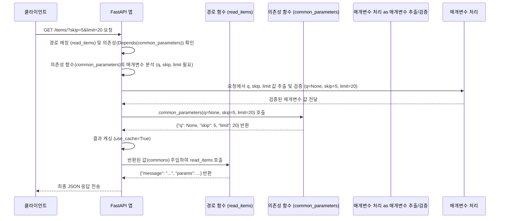

> 이 튜토리얼은 AI가 생성했습니다! 자세한 내용은 [AI 코드베이스 지식 빌더](https://github.com/The-Pocket/Tutorial-Codebase-Knowledge)를 참조하세요.


## 7장: 의존성 주입 (Dependency Injection)

*   이전 제 6장: OpenAPI 자동 문서화 (Automatic OpenAPI Documentation)에서는 FastAPI가 어떻게 자동으로 API 문서를 생성하여 개발자와 사용자 모두에게 도움을 주는지 알아보았습니다. 코드를 기반으로 문서를 만들어주니 정말 편리했죠!

*   이번 장에서는 코드 자체를 더 깔끔하고 효율적으로 관리하는 방법을 배웁니다. 여러 API 경로에서 반복적으로 사용되는 로직이나 설정이 있다면 어떻게 해야 할까요? 예를 들어, 거의 모든 API 엔드포인트에서 데이터베이스 연결이 필요하거나, 사용자 인증 정보가 필요할 수 있습니다. 이런 공통 로직을 각 경로 함수마다 복사해서 붙여넣는다면 코드가 지저분해지고 유지보수가 어려워질 것입니다.

*   이러한 문제를 해결하기 위해 FastAPI는 매우 강력하고 우아한 시스템인 **의존성 주입(Dependency Injection, DI)** 을 제공합니다. 마치 단골 식당에서 "늘 먹던 걸로 주세요!"라고 말하면 주방장이 알아서 준비해주는 것처럼, API 경로 함수가 "이 기능(의존성)이 필요해요!"라고 선언하면 FastAPI가 자동으로 해당 기능을 실행하고 그 결과를 함수에 전달(주입)해주는 방식입니다.

이 장에서는 의존성 주입이 무엇인지, 그리고 어떻게 사용하여 코드 중복을 줄이고 애플리케이션을 더 잘 구조화할 수 있는지 배워보겠습니다. 간단한 예시로, 여러 경로에서 공통적으로 사용되는 쿼리 매개변수를 처리하는 의존성을 만들어 보겠습니다.

### 7.1 의존성 주입이란 무엇인가요?

"의존성 주입"이라는 용어가 조금 어렵게 들릴 수 있지만, 개념은 생각보다 간단합니다. 
*   여러분의 API 경로 함수가 특정 작업을 수행하기 위해 다른 코드 조각(함수, 클래스 등)의 도움이 필요하다고 상상해 보세요. 이때, 도움을 주는 코드 조각을 **의존성(Dependency)** 이라고 부릅니다. 그리고 경로 함수가 직접 이 의존성을 만들거나 호출하는 대신, FastAPI 프레임워크가 의존성을 실행하고 그 결과를 경로 함수에 **자동으로 전달(주입)** 해주는 메커니즘이 바로 **의존성 주입**입니다.

FastAPI에서 의존성 주입을 사용하는 핵심 도구는 `Depends` 입니다. 경로 함수의 매개변수에 `Depends(다른_함수)` 와 같이 선언하면, FastAPI는 요청이 들어왔을 때 다음 작업을 수행합니다.

1.  `다른_함수` (의존성 함수)를 실행합니다.
2.  `다른_함수`가 반환하는 값을 가져옵니다.
3.  이 값을 `Depends`가 선언된 경로 함수의 매개변수에 넣어줍니다 (주입).

*   이는 마치 서비스 창구 직원이 특정 업무(예: 고객 정보 조회)를 처리하기 위해 "고객 인증 시스템(의존성)"이 필요하다고 선언(`Depends`)하면, 관리 시스템(FastAPI)이 자동으로 인증 시스템을 작동시키고 그 결과(인증된 고객 정보)를 창구 직원에게 전달해주는 것과 유사합니다. 
*   직원은 인증 시스템의 복잡한 내부 동작을 알 필요 없이 결과만 받아서 자신의 업무에 집중할 수 있습니다.

**의존성 주입의 주요 장점:**

*   **코드 재사용:** 
    *   공통 로직을 별도의 의존성 함수로 분리하여 여러 경로에서 재사용할 수 있습니다.
*   **코드 분리:** 
    *   경로 작동 함수는 비즈니스 로직에 집중하고, 데이터베이스 연결, 인증, 공통 매개변수 처리 등 부가적인 작업은 의존성으로 분리하여 코드 구조를 명확하게 만듭니다.
*   **테스트 용이성:** 
    *   의존성을 실제 구현 대신 테스트용 가짜(mock) 객체로 쉽게 교체할 수 있어 단위 테스트 작성이 용이.

### 7.2 첫 의존성 만들기: 공통 쿼리 매개변수 처리

이제 실제 코드로 의존성을 만들어 봅시다. 많은 API 경로에서 페이징(paging)을 위해 `skip` (건너뛸 항목 수)과 `limit` (가져올 항목 수) 쿼리 매개변수를 사용한다고 가정해 보겠습니다. 이 로직을 의존성으로 만들어 재사용해 봅시다.

1.  **의존성 함수 정의:** 
    *   `skip`과 `limit` 쿼리 매개변수를 받아서 딕셔너리 형태로 반환하는 간단한 함수를 만듭니다. 이 함수가 우리의 의존성이 됩니다.

    ```python
    # main.py
    from typing import Union, Annotated # Annotated는 Python 3.9 이상에서 권장됩니다.
    from fastapi import Depends, FastAPI

    app = FastAPI()

    # 공통 쿼리 매개변수를 처리하는 의존성 함수
    async def common_parameters(
        q: Union[str, None] = None, # 선택적 검색어 q 추가
        skip: int = 0,
        limit: int = 100
    ):
        """
        q, skip, limit 쿼리 매개변수를 받아 딕셔너리로 반환합니다.
        이 함수 자체가 의존성입니다.
        """
        return {"q": q, "skip": skip, "limit": limit}
    ```

    *   `common_parameters` 함수는 일반적인 경로 작동 함수처럼 매개변수를 선언합니다. 
    *   FastAPI는 이 함수가 의존성으로 사용될 때, 필요한 `q`, `skip`, `limit` 값을 요청의 쿼리 문자열에서 자동으로 찾아 이 함수에 전달해줍니다. 
    *   이 함수는 받은 매개변수들을 딕셔너리에 담아 반환합니다. 이 반환값이 경로 함수에 주입될 값입니다.

### 7.3 의존성 사용하기
이제 위에서 만든 `common_parameters` 의존성을 실제 경로 작동 함수에서 사용해 봅시다. `/items/` 와 `/users/` 라는 두 개의 경로에서 이 공통 매개변수 처리가 필요하다고 가정합니다.

1.  **경로 함수 매개변수에 `Depends` 사용:** 
    *   경로 함수의 매개변수 타입 힌트에 `Annotated[<반환타입>, Depends(<의존성 함수>)]` 또는 간단히 `= Depends(<의존성 함수>)` 형태로 의존성을 선언합니다.

    ```python
    # main.py (이어서)

    @app.get("/items/")
    # commons 매개변수에 common_parameters 의존성의 결과를 주입하도록 선언
    async def read_items(commons: Annotated[dict, Depends(common_parameters)]):
        """
        /items/ 경로. common_parameters 의존성을 사용하여
        q, skip, limit 매개변수를 처리합니다.
        """
        # commons 변수에는 common_parameters 함수의 반환값(딕셔너리)이 들어옵니다.
        # 예: {"q": "검색어", "skip": 0, "limit": 10}
        return {"message": "아이템 목록 조회", "params": commons}

    @app.get("/users/")
    # 여기에서도 동일한 의존성을 사용합니다.
    async def read_users(commons: Annotated[dict, Depends(common_parameters)]):
        """
        /users/ 경로. 여기에서도 common_parameters 의존성을 재사용합니다.
        """
        # 코드가 중복되지 않고 간결해졌습니다!
        return {"message": "사용자 목록 조회", "params": commons}

    ```

    *   `commons: Annotated[dict, Depends(common_parameters)]`: 
        *   `read_items` 함수의 `commons` 매개변수는 `common_parameters` 함수에 의존한다는 것을 FastAPI에게 알립니다. 
        *   `Annotated[dict, ...]`는 `commons`가 딕셔너리 타입일 것이며, 그 값은 `Depends(common_parameters)`를 통해 얻어진다는 의미입니다. 
    *   FastAPI는 `/items/` 또는 `/users/` 요청이 들어오면, 
        *   먼저 `common_parameters` 함수를 실행합니다. 이때 필요한 `q`, `skip`, `limit` 값은 요청 URL의 쿼리 문자열에서 가져옵니다.
    *   `common_parameters` 함수가 딕셔너리를 반환하면, 
        *   FastAPI는 이 딕셔너리를 `commons` 매개변수에 할당(주입)한 후 `read_items` 또는 `read_users` 함수를 호출합니다.
    *   결과적으로, `read_items`와 `read_users` 함수는 `q`, `skip`, `limit` 매개변수를 직접 선언하고 처리할 필요 없이, 이미 처리된 결과를 `commons` 딕셔너리로 받아서 사용하기만 하면 됩니다.

### 7.4 실행 및 테스트

서버를 실행합니다.

```bash
fastapi dev main.py
```

*   이제 웹 브라우저나 `curl` 같은 도구를 사용하여 API를 호출해 봅시다.

1.  **`http://127.0.0.1:8000/items/?skip=5&limit=20`**
    *   FastAPI는 `common_parameters(q=None, skip=5, limit=20)`를 실행하고 `{"q": None, "skip": 5, "limit": 20}`를 얻습니다.
    *   이 값을 `read_items` 함수의 `commons` 매개변수에 주입하여 호출합니다.
    *   응답:
        ```json
        {"message":"아이템 목록 조회","params":{"q":null,"skip":5,"limit":20}}
        ```

2.  **`http://127.0.0.1:8000/users/?q=test`**
    *   FastAPI는 `common_parameters(q="test", skip=0, limit=100)`를 실행하고 `{"q": "test", "skip": 0, "limit": 100}`를 얻습니다. (`skip`과 `limit`은 기본값이 사용됩니다.)
    *   이 값을 `read_users` 함수의 `commons` 매개변수에 주입하여 호출합니다.
    *   응답:
        ```json
        {"message":"사용자 목록 조회","params":{"q":"test","skip":0,"limit":100}}
        ```

보시다시피, 두 개의 다른 경로에서 동일한 쿼리 매개변수 처리 로직을 `common_parameters`라는 단일 의존성 함수를 통해 재사용하고 있습니다. 코드 중복이 사라지고 각 경로 함수는 더 간결해졌습니다!

### 7.5 내부 동작 방식: 의존성이 해결되는 과정

FastAPI는 `Depends`를 어떻게 처리할까요? `GET /items/?skip=5&limit=20` 요청을 예로 든 내부 동작.

1.  **요청 수신 및 경로 매칭:** 
    *   웹 서버(Uvicorn)가 요청을 받고 FastAPI 앱(`app`)에 전달합니다. 
    *   FastAPI는 `/items/` 경로와 `GET` 메소드에 해당하는 `read_items` 함수를 찾습니다.
2.  **의존성 탐색:** 
    *   FastAPI는 `read_items` 함수의 매개변수 `commons: Annotated[dict, Depends(common_parameters)]`를 분석하여 `common_parameters` 함수에 대한 의존성을 발견.
3.  **의존성 매개변수 분석:** 
    *   FastAPI는 이제 의존성 함수인 `common_parameters`의 시그니처 `(q: str | None = None, skip: int = 0, limit: int = 100)`를 분석합니다. 
    *   이 함수가 `q`, `skip`, `limit`이라는 쿼리 매개변수를 필요로 한다는 것을 알아냅니다.
4.  **매개변수 값 추출 및 변환:** 
    *   FastAPI는 현재 요청(`/items/?skip=5&limit=20`)에서 `common_parameters`에 필요한 것 추출.
        *   `q`: 쿼리 문자열에 없음 -> 기본값 `None` 사용
        *   `skip`: 쿼리 문자열에서 `"5"` 추출 -> `int` 타입으로 변환하여 `5`
        *   `limit`: 쿼리 문자열에서 `"20"` 추출 -> `int` 타입으로 변환하여 `20`
        *   이 과정에서 제 3장에서 배운 것과 동일한 타입 변환 및 유효성 검사가 수행됩니다.
5.  **의존성 함수 실행:** 
    *   FastAPI는 추출하고 변환한 값들을 사용하여 의존성 함수를 호출합니다: 
        *   `await common_parameters(q=None, skip=5, limit=20)`.
6.  **결과 반환:** 
    *   `common_parameters` 함수는 `{"q": None, "skip": 5, "limit": 20}` 딕셔너리를 반환.
7.  **(캐싱 확인 - 기본 동작):** 
    *   FastAPI는 이 결과를 내부 캐시에 저장합니다 (`use_cache=True`가 기본값). 
    *   만약 같은 요청 내에서 다른 곳에서도 `Depends(common_parameters)`가 필요하다면, 함수를 다시 실행하지 않고 캐시된 값을 재사용합니다.
8.  **결과 주입:** 
    *   FastAPI는 `common_parameters` 함수가 반환한 딕셔너리를 `read_items` 함수의 `commons` 매개변수에 전달(주입)합니다.
9.  **경로 함수 실행:** 
    *   마지막으로 FastAPI는 준비된 매개변수와 함께 경로 작동 함수를 호출합니다: 
        *   `await read_items(commons={"q": None, "skip": 5, "limit": 20})`.
10. **응답 처리:** 
    *   `read_items` 함수가 반환한 값을 JSON으로 직렬화하여 최종 응답을 생성하고 클라이언트에게 보냄.

### 7.6 내부 동작 과정을 다이어그램으로 표현
<br>



### 7.7 코드 내부 엿보기 
의존성 주입 시스템의 핵심은 FastAPI가 함수의 시그니처를 분석하고, 필요한 값들을 재귀적으로 해결하는 방식에 있습니다.

*   **`Depends` 클래스 (`fastapi/params.py`)**: 
    *   `Depends` 자체는 매우 간단한 클래스입니다. 주로 의존성으로 사용될 함수(`dependency`)와 캐시 사용 여부(`use_cache`)를 저장하는 역할을 합니다.

    ```python
    # fastapi/params.py 내부 (개념적 표현)
    class Depends:
        def __init__(
            self, dependency: Optional[Callable[..., Any]] = None, *, use_cache: bool = True
        ):
            self.dependency = dependency # 의존성 함수 저장
            self.use_cache = use_cache     # 캐시 사용 여부 저장

        # ... (repr 등) ...
    ```

*   **의존성 분석 (`fastapi/dependencies/utils.py`)**: 
    *   FastAPI가 경로 작동 함수를 등록할 때, `get_dependant` 함수는 파이썬의 내장 `inspect` 모듈을 사용하여 함수의 매개변수들을 분석합니다. 
    *   `Depends(...)`가 발견되면, 이를 별도의 의존성으로 인식하고 해당 의존성 함수(`common_parameters`)에 대해서도 재귀적으로 `get_dependant`를 호출하여 필요한 하위 매개변수(쿼리 매개변수 `q`, `skip`, `limit`)를 파악합니다. 
    *   이 분석 결과는 `Dependant`라는 데이터 클래스 객체에 계층적으로 저장됩니다.

*   **의존성 해결 (`fastapi/dependencies/utils.py`)**: 
    *   실제 요청이 들어오면 `solve_dependencies` 함수가 호출됩니다. 이 함수는 `Dependant` 객체에 저장된 정보를 바탕으로 다음과 같은 작업을 수행합니다.
    1.  현재 의존성(`common_parameters`)이 필요로 하는 하위 매개변수(`q`, `skip`, `limit`) 값들을 요청(경로, 쿼리, 헤더, 쿠키, 본문 등)으로부터 추출하고 검증합니다.
    2.  만약 하위 매개변수 중 다른 의존성(`Depends`)이 있다면, 해당 의존성을 먼저 재귀적으로 해결.
    3.  모든 필요한 값이 준비되면, 의존성 함수(`common_parameters`)를 호출합니다. (비동기 함수는 `await`하고, 일반 함수는 스레드 풀에서 실행합니다.)
    4.  `use_cache=True`이고 이전에 같은 요청 내에서 동일한 의존성(같은 함수, 같은 scope)이 이미 해결되었다면, 함수를 다시 호출하지 않고 캐시된 값을 사용합니다.
    5.  의존성 함수의 반환값을 원래 이 의존성을 필요로 했던 상위 함수(여기서는 `read_items`의 `commons` 매개변수)에 주입할 준비를 합니다.

이러한 과정을 통해 FastAPI는 복잡하게 얽힌 의존성 관계도 자동으로 해결하고 필요한 값들을 정확한 위치에 주입해 줄 수 있습니다.

### 7.8 마무리

이번 장에서는 FastAPI의 강력한 기능인 **의존성 주입 (Dependency Injection)** 에 대해 학습.

*   의존성 주입은 **반복적인 코드**나 **공통 설정**을 별도의 함수(의존성)로 분리하여 관리하는 방법입니다.
*   `Depends(<의존성 함수>)`를 경로 작동 함수의 매개변수로 선언하여 사용합니다.
*   FastAPI는 요청 처리 시 **자동으로 의존성 함수를 실행**하고, 그 **결과를 경로 함수에 주입**해줍니다.
*   의존성 함수도 일반 경로 함수처럼 **매개변수 선언, 타입 힌트, 유효성 검사** 등의 기능을 동일하게 사용할 수 있습니다.
*   의존성 주입을 사용하면 **코드 재사용성**이 높아지고, **코드 구조**가 명확해지며, **테스트**가 용이해집니다.

의존성 주입은 데이터베이스 세션 관리, 사용자 인증 및 권한 부여, 외부 API 클라이언트 설정 등 다양한 시나리오에서 매우 유용하게 사용될 수 있습니다.

*   지금까지 우리는 FastAPI의 주요 기능들을 하나씩 살펴보았습니다. 애플리케이션 생성부터 경로 정의, 데이터 처리, 문서화, 그리고 코드 재사용까지 다루었죠. 하지만 실제 애플리케이션은 점점 커지고 복잡해집니다. 수십, 수백 개의 API 경로가 하나의 파일에 모두 있다면 관리하기 어려울 것입니다.

다음 장에서는 이렇게 커지는 애플리케이션을 어떻게 더 작은 단위로 나누고 체계적으로 구성할 수 있는지, 즉 **APIRouter**를 사용하는 방법에 대해 알아보겠습니다.
