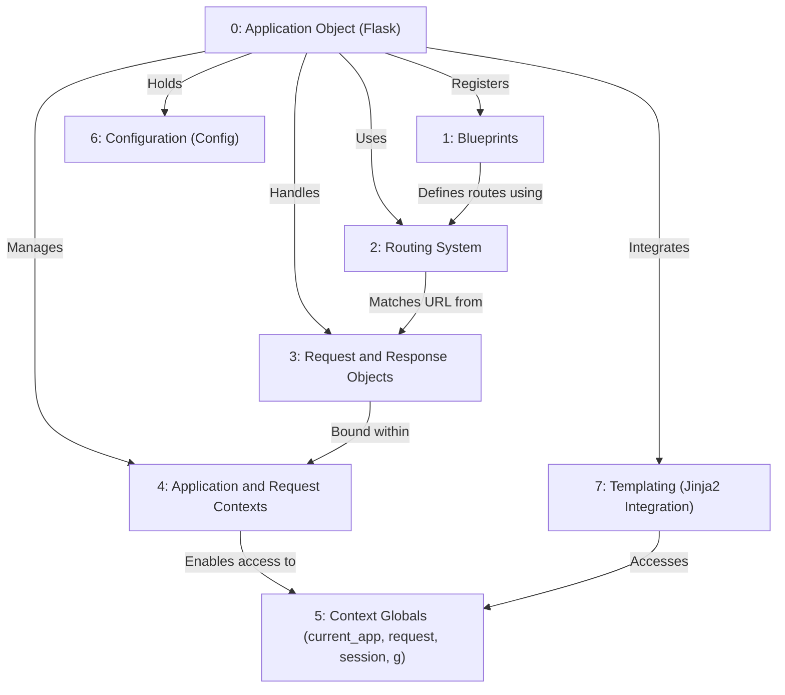
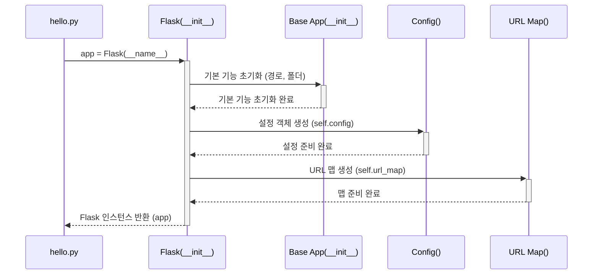
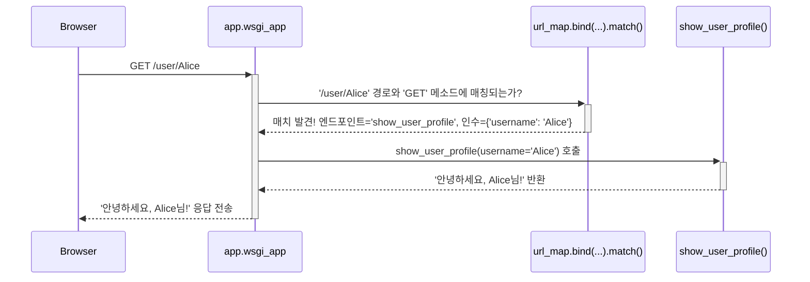

## Flask 개요
> 이 튜토리얼은 AI가 생성했습니다! 자세한 내용은 [AI 코드베이스 지식 빌더](https://github.com/The-Pocket/Tutorial-Codebase-Knowledge)를 참조하세요.

* Flask<sup>[저장소 보기](https://github.com/pallets/flask/tree/ab8149664182b662453a563161aa89013c806dc9/src/flask)</sup>는 Python용 경량 **웹 프레임워크**입니다.
Flask는 수신 *웹 요청*을 처리하고 *응답*을 반환하여 웹 애플리케이션을 구축하는 데 도움을 줍니다.
Flask는 Python 함수로 URL을 **라우팅**하고, *요청 데이터*를 관리하고, *응답*을 생성하고, *템플릿*을 사용하여 HTML을 생성하는 도구를 제공합니다.



## 1장: 애플리케이션 객체 (`Flask`)

* 플라스크의 세계로 발을 내딛으신 것을 환영합니다. 플라스크는 파이썬으로 웹 애플리케이션을 구축하기 위한 "마이크로프레임워크"입니다. "마이크로"라고 해서 기능이 제한적인 것은 아닙니다. 플라스크는 빠르게 시작하는 데 필요한 핵심 기능만을 제공하며, 필요한 기능들을 필요에 따라 추가할 수 있도록 설계되었습니다.

* 이번 장에서는 모든 플라스크 애플리케이션의 핵심이라고 할 수 있는 **애플리케이션 객체**에 대해 자세히 알아보겠습니다.

### 1.1 어떤 문제를 해결할까요? 관제탑의 필요성

* 간단한 웹사이트를 구축한다고 상상해 보세요. 아마 홈페이지에 "Hello, World\!"라는 문구만 표시하면 될 수도 있습니다. 하지만 웹 서버는 누군가가 홈페이지(`/`)로 접속했을 때 *어떤* 파이썬 코드를 실행해야 하는지 어떻게 알까요? `/about`이나 `/contact` 같은 다른 페이지들은 어떻게 관리할까요? 설정은 어떻게 처리하고 다른 도구들과는 어떻게 연결할까요?

* 이러한 모든 작업을 관리할 중앙 집중식 장소가 필요합니다. 마치 분주한 공항과 같습니다. 들어오는 비행기(웹 요청)를 안내하고, 활주로(URL 경로)를 관리하며, 지상 근무자(애플리케이션의 다른 부분)를 조율하는 **관제탑**이 필요합니다.

* 플라스크에서 `Flask` 객체가 바로 그 관제탑 역할을 합니다. 이 객체는 여러분의 전체 웹 애플리케이션을 나타내는 주된 객체입니다.

### 1.2 첫 번째 플라스크 애플리케이션 만들기

* 가장 간단한 플라스크 앱을 만들어 보겠습니다. 파이썬 파일이 하나 필요합니다. 여기서는 `hello.py`라고 부르겠습니다.

1.  **Flask 임포트:** 먼저 `Flask` 클래스를 여러분의 코드 안으로 가져와야 합니다.
2.  **인스턴스 생성:** 그런 다음 이 클래스의 *인스턴스*를 생성합니다. 이 인스턴스가 바로 여러분의 애플리케이션입니다.

<!-- end list -->

```python
# hello.py

from flask import Flask

# 애플리케이션 객체 생성
app = Flask(__name__)

# 곧 더 많은 코드를 추가할 예정입니다!
```

`app = Flask(__name__)` 코드를 자세히 살펴보겠습니다.

* `from flask import Flask`: 
  - 이 줄은 설치한 Flask 라이브러리에서 필요한 `Flask` 클래스를 임포트합니다.
* `app = Flask(...)`:
  -  이 줄은 실제 애플리케이션 객체를 생성합니다. 
  - 보통 변수 이름을 `app`이라고 하지만, 다른 이름으로 지정해도 됩니다.
* `__name__`: 
  - 이것은 파이썬의 특별한 변수입니다. 
  - 파이썬 스크립트를 직접 실행하면 파이썬은 `__name__`을 문자열 `"__main__"`으로 설정합니다. 
  - 만약 이 스크립트가 다른 스크립트에 의해 임포트되면, `__name__`은 모듈의 이름(예: 파일 이름이 `hello.py`라면 `"hello"`)으로 설정됩니다.
    * **왜 `__name__`일까요?** 
      - 플라스크는 이 인수를 사용하여 여러분의 애플리케이션의 위치를 파악. 
      - 이는 나중에 템플릿이나 정적 자산(이미지, CSS 등)과 같은 다른 파일들을 찾는 데 도움
      - 간단한 단일 모듈 애플리케이션에서는 `__name__`을 사용하는 것이 표준
      - 플라스크 문서에서는 파이썬 패키지 형태로 구성된 더 큰 애플리케이션을 구축하는 경우 패키지 이름을 직접 하드코딩할 수도 있지만(`app = Flask('yourapplication')`), 초보자에게는 `__name__`을 사용하는 것이 좋습니다.


### 1.3 기본적인 라우트 추가하기

- 아직 우리의 `app` 객체는 아무것도 하지 않습니다. 누군가가 홈페이지(`/`)에 접속했을 때 무엇을 해야 할지 알려주겠습니다. 이를 위해 라우트를 사용합니다. 라우팅에 대해서는 다음 장에서 자세히 다루겠지만, 여기서는 간단히 맛보기만 하겠습니다.

```python
# hello.py (계속)

from flask import Flask

app = Flask(__name__)

# 누군가가 홈페이지("/")에 접속했을 때 어떤 일이 일어날지 정의합니다.
@app.route('/')
def index():
    return 'Hello, World!'

# 아래에 앱을 실행하는 더 많은 코드가 있습니다...
```

* `@app.route('/')`: 
  - 이것은 파이썬 데코레이터입니다. 바로 아래에 정의된 함수(`index`)를 수정합니다. 
  - 이 데코레이터는 우리의 `app` 객체에게 "URL 경로 `/`로 웹 요청이 들어오면 `index` 함수를 호출하라"고 지시합니다.
* `def index(): ...`: 
  - 이것은 간단한 파이썬 함수입니다. 플라스크는 이러한 함수를 "뷰 함수"라고 부릅니다.
* `return 'Hello, World!'`: 
  - 뷰 함수가 반환하는 값은 웹 브라우저를 통해 사용자에게 응답으로 전송됩니다.

### 1.4 애플리케이션 실행하기

- 사람들이 실제로 우리 페이지에 접속할 수 있도록 웹 서버를 어떻게 시작할까요? 
- `app` 객체의 `run()` 메서드를 사용합니다. 일반적으로 다음과 같은 특별한 `if` 블록 안에 이 코드를 넣음.

```python
# hello.py (파일 끝)

from flask import Flask

app = Flask(__name__)

@app.route('/')
def index():
    return 'Hello, World!'

# 이 블록은 스크립트가 직접 실행될 때만 앱을 실행합니다.
if __name__ == '__main__':
    # 내장 개발 서버를 시작합니다.
    app.run(debug=True)
```

* `if __name__ == '__main__':`: 
  - 이 표준 파이썬 구조는 이 블록 안의 코드가 `hello.py`를 직접 실행했을 때만(터미널에서 `python hello.py`라고 입력하는 것처럼) 실행되도록 보장합니다. 
  - 만약 다른 파이썬 파일에서 `hello.py`를 *임포트*하는 경우에는 서버가 시작되지 않도록 합니다.
* `app.run()`: 
  - 이 메서드는 플라스크의 내장 개발 웹 서버를 시작합니다. 
  - 이 서버는 테스트에는 훌륭하지만 실제 운영 환경(라이브 웹사이트)에는 적합하지 않습니다.
* `debug=True`: 
  - 이 설정은 플라스크의 "디버그 모드"를 활성화합니다. 
  - 브라우저에 유용한 오류 메시지를 표시하고 코드를 저장할 때마다 서버를 자동으로 재시작하여 개발을 훨씬 쉽게 만들어 줍니다. 
  - **운영 환경에서는 절대로 디버그 모드를 사용하지 마세요\!**

### **1.5 실행 방법:**

1.  전체 코드를 `hello.py`로 저장합니다.
2.  터미널 또는 명령 프롬프트를 엽니다.
3.  파일을 저장한 디렉토리로 이동합니다.
4.  `python hello.py` 명령을 실행합니다.
5.  다음과 유사한 출력이 표시됩니다.

    ```
     * Serving Flask app 'hello'
     * Debug mode: on
     * Running on http://127.0.0.1:5000 (Press CTRL+C to quit)
     * Restarting with stat
     * Debugger is active!
     * Debugger PIN: ...
    ```

6.  웹 브라우저를 열고 `http://127.0.0.1:5000/`으로 이동합니다.
7.  "Hello, World\!"라는 텍스트가 표시되어야 합니다.

- 여러분은 첫 번째 플라스크 애플리케이션을 만들고 실행했습니다. 
- `app = Flask(__name__)` 줄은 모든 것을 관리하는 중앙 객체를 생성하는 중요한 첫 번째 단계였습니다.

### 1.6 내부 동작 방식: `Flask(__name__)`을 생성할 때 일어나는 일

- 당장 깊숙한 내부 구조를 알 필요는 없지만, 약간의 이해는 도움이 됩니다. 
- `app = Flask(__name__)`을 호출하면 플라스크 내부에서 여러 가지 일들이 (단순화해서) 일어남.

1.  **초기화:** 
  - `Flask` 클래스의 `__init__` 메서드(`app.py`에 있으며, `sansio/app.py`의 `App` 클래스를 상속받습니다)가 호출됩니다.
2.  **경로 결정:**  
  -  전달된 `import_name`(`__name__`)을 사용하여 애플리케이션의 `root_path`를 파악합니다. 
  - 이는 공항에서 메인 격납고를 찾는 것과 같습니다. (`helpers.py`의 `get_root_path`와 `sansio/scaffold.py`의 `find_package`를 참조하세요.)
3.  **설정 구성:** 
  - 일반적으로 `config.py`의 `Config` 클래스의 인스턴스인 설정 객체(`self.config`)를 생성합니다. 
  - 이 객체는 `DEBUG`, `SECRET_KEY` 등과 같은 설정을 보관합니다.
4.  **URL 맵 생성:** 
  - 들어오는 요청 URL을 뷰 함수와 매칭시키는 역할을 하는 `URL Map`(`self.url_map`)을 생성합니다.
5.  **내부 구조:** 
    - 뷰 함수(`self.view_functions`), 오류 처리기(`self.error_handler_spec`), 
    - 요청 전후에 실행될 함수 등과 같은 다양한 내부 딕셔너리를 설정합니다.
6.  **정적 라우트 (선택 사항):** 
  - `static_folder`를 구성한 경우(플라스크는 기본적으로 설정합니다), 
  - CSS 및 JavaScript와 같은 정적 파일을 제공하기 위해 자동으로 URL 규칙(`/static/<filename>`)을 추가합니다.

### 1.7 내부 동작에 대한 단순화한 다이어그램
<br>



- 반환된 `app` 객체는 이제 라우트를 등록하고 요청을 처리할 준비가 된 완전히 초기화된 "관제탑"입니다.

### 1.8 결론

- 플라스크에서 가장 기본적인 개념인 **애플리케이션 객체**를 학습. 
- 이 객체는 `Flask` 클래스를 인스턴스화하여 생성되며(일반적으로 `app = Flask(__name__)`와 같이 사용합니다), 전체 웹 애플리케이션의 중앙 등록소이자 컨트롤러 역할을 합니다.
-  URL 라우트를 정의하고, 설정을 관리하며, 다양한 컴포넌트를 연결하는 곳입니다.

- 최소한의 애플리케이션을 만들고, `@app.route()`를 사용하여 간단한 라우트를 추가하고, `app.run()`을 사용하여 개발 서버를 실행하는 방법을 살펴보았습니다.

- 이제 중앙 `app` 객체를 갖게 되었으므로, 다음 논리적 단계는 플라스크가 들어오는 웹 요청을 올바른 파이썬 함수로 어떻게 전달하는지 이해하는 것입니다. 이것이 바로 라우팅 시스템의 역할입니다.

# 2장: 라우팅 시스템

다시 만나서 반갑습니다! [1장: 애플리케이션 객체 (`Flask`)](01_application_object___flask__.md)에서는 Flask 애플리케이션의 핵심인 `app` 객체를 생성하는 방법과 `@app.route('/')`를 사용해 간단한 "Hello, World!" 페이지를 추가하는 방법을 배웠습니다.

하지만 Flask는 어떻게 홈페이지(`/`)를 방문했을 때 `index()` 함수를 실행해야 하는지 알았을까요? 그리고 `/about` 같은 "About Us" 페이지는 어떻게 만들 수 있을까요? 바로 **라우팅 시스템**이 이 역할을 담당합니다.

## 해결할 문제: 길 찾기의 필요성

홈페이지, about 페이지, contact 페이지, 개별 사용자 프로필 페이지 등 여러 페이지로 구성된 웹사이트를 상상해 보세요. 사용자가 브라우저에 `http://yourwebsite.com/about` 같은 URL을 입력하면, Flask 애플리케이션은 어떻게 이 요청을 처리하고 "About Us" 콘텐츠를 생성할 *어떤* Python 코드를 찾아낼 수 있을까요?

각각의 들어오는 URL을 해당 페이지의 응답을 생성하는 특정 Python 함수에 매핑할 시스템이 필요합니다. 도시 지도의 색인과 비슷하다고 생각해보세요:

*   **URL:** 찾고자 하는 주소 (예: `/about`)
*   **라우팅 시스템:** 지도책의 색인
*   **뷰 함수:** 해당 주소의 상세 정보를 보여주는 지도책의 특정 페이지 번호

Flask의 라우팅 시스템은 대부분 Werkzeug라는 라이브러리에 의해 구동되며, 이 색인 역할을 합니다. URL 패턴(예: `/`, `/about`, `/user/<username>`)을 정의하고 이를 Python 함수(**뷰 함수**라고 함)에 연결할 수 있게 해줍니다.

## `@app.route()`로 라우트 정의하기

Flask에서 URL-함수 매핑을 정의하는 가장 일반적인 방법은 1장에서 잠깐 본 `@app.route()` 데코레이터를 사용하는 것입니다.

`hello.py` 파일을 다시 살펴보고 "About" 페이지를 추가해 봅시다.

1.  홈페이지(`/`) 라우트는 유지합니다.
2.  `/about`에 대한 *새로운* 라우트를 추가합니다.

```python
# hello.py

from flask import Flask

# 1장에서 배운 애플리케이션 객체 생성
app = Flask(__name__)

# 홈페이지 라우트
@app.route('/')
def index():
  return '홈페이지에 오신 것을 환영합니다!'

# 새로 추가: about 페이지 라우트
@app.route('/about')
def about():
  return '여기는 About Us 페이지입니다.'

# 애플리케이션 실행 코드 (1장에서 배움)
if __name__ == '__main__':
  app.run(debug=True)
```

**설명:**

*   `@app.route('/')`: Flask에게 "URL 경로 `/`에 대한 요청이 들어오면 바로 아래에 있는 함수(`index`)를 실행하라"고 지시합니다.
*   `@app.route('/about')`: Flask에게 "URL 경로 `/about`에 대한 요청이 들어오면 바로 아래에 있는 함수(`about`)를 실행하라"고 지시합니다.
*   `def index(): ...`와 `def about(): ...`: 이들은 **뷰 함수**입니다. 각각의 라우트에 대해 실행될 Python 코드를 포함하며, 브라우저로 보낼 응답을 반환해야 합니다.

**실행 방법:**

1.  코드를 `hello.py`로 저장합니다.
2.  터미널에서 `python hello.py`를 실행합니다.
3.  브라우저에서 `http://127.0.0.1:5000/`을 방문합니다. "홈페이지에 오신 것을 환영합니다!"가 표시되어야 합니다.
4.  `http://127.0.0.1:5000/about`을 방문합니다. "여기는 About Us 페이지입니다."가 표시되어야 합니다.

보셨나요? 라우팅 시스템이 각 URL을 올바른 뷰 함수로 연결했습니다!

## 동적 라우트: URL에 변수 사용하기

URL에 따라 변경되는 페이지를 원한다면 어떻게 해야 할까요? 예를 들어 `/user/alice`와 `/user/bob` 같은 다른 사용자들의 프로필 페이지를 원한다면, 모든 사용자마다 새로운 뷰 함수를 작성하고 싶지는 않을 겁니다!

Flask는 꺾쇠 괄호 `< >`를 사용해 URL 규칙에 *변수 부분*을 정의할 수 있게 해줍니다.

사용자에게 인사하는 동적 라우트를 만들어 봅시다:

```python
# hello.py (계속)

# ... (Flask import, app 생성, index 및 about 라우트 유지) ...

# 새로 추가: 사용자 프로필을 위한 동적 라우트
@app.route('/user/<username>')
def show_user_profile(username):
  # URL의 'username' 변수가 함수에 전달됩니다!
  return f'안녕하세요, {username}님!'

# ... (if __name__ == '__main__': 블록 유지) ...
```

**설명:**

*   `@app.route('/user/<username>')`:
    *   `/user/` 부분은 고정됩니다.
    *   `<username>`은 **변수 자리 표시자**입니다. Flask는 여기에 있는 모든 텍스트(예: `alice`, `bob`, `123`)를 매칭하고 캡처합니다.
*   `def show_user_profile(username):`:
    *   함수가 이제 `username`이라는 인수를 받는 것에 주목하세요. 이는 라우트의 꺾쇠 괄호 안에 사용된 변수 이름과 **반드시 일치**해야 합니다.
    *   Flask는 자동으로 URL에서 캡처한 값을 이 인수에 전달합니다.
*   `return f'안녕하세요, {username}님!'`: 캡처한 사용자 이름을 응답에 포함시키기 위해 f-string을 사용합니다.

**실행 방법:**

1.  업데이트된 `hello.py`를 저장합니다(`debug=True`가 여전히 설정되어 있어 서버가 재시작되도록 합니다).
2.  `http://127..0.1:5000/user/Alice`를 방문합니다. "안녕하세요, Alice님!"이 표시되어야 합니다.
3.  `http://127.0.0.1:5000/user/Bob`을 방문합니다. "안녕하세요, Bob님!"이 표시되어야 합니다.

Flask의 라우팅 시스템은 두 URL을 동일한 규칙(`/user/<username>`)에 매칭시키고 다른 사용자 이름(`'Alice'`, `'Bob'`)을 `show_user_profile` 함수에 전달했습니다.

## 데이터 타입 지정하기: 변환기

기본적으로 URL에서 캡처된 변수는 문자열로 처리됩니다. 하지만 숫자가 필요하다면 어떻게 해야 할까요? 예를 들어, 5번 블로그 포스트를 `/post/5`에 표시하고 싶다면, URL의 해당 부분에 숫자만 허용되도록 Flask에 지시하고 싶을 수 있습니다.

꺾쇠 괄호 안에 `<converter:variable_name>`을 사용해 **변환기**를 지정할 수 있습니다.

`int` 변환기를 사용해 블로그 포스트에 대한 라우트를 추가해 봅시다:

```python
# hello.py (계속)

# ... (이전 코드 유지) ...

# 새로 추가: 특정 블로그 포스트 ID로 표시하기 위한 라우트
@app.route('/post/<int:post_id>')
def show_post(post_id):
  # Flask는 post_id가 정수임을 보장하고 여기에 전달합니다
  # 참고: 실제 포스트를 가져오는 것이 아니라 ID만 표시합니다
  return f'포스트 번호: {post_id} (타입: {type(post_id).__name__})'

# ... (if __name__ == '__main__': 블록 유지) ...
```

**설명:**

*   `@app.route('/post/<int:post_id>')`:
    *   `<int:post_id>`는 Flask에게 "이 부분의 URL을 매칭하되, 정수처럼 보이는 경우에만 해당합니다. 정수로 변환하고 `post_id` 변수로 전달하라"고 지시합니다.
*   `def show_post(post_id):`: `post_id` 인수는 이제 실제 Python `int`를 받게 됩니다.

**실행 방법:**

1.  업데이트된 `hello.py`를 저장합니다.
2.  `http://127.0.0.1:5000/post/123`을 방문합니다. "포스트 번호: 123 (타입: int)"가 표시되어야 합니다.
3.  `http://127.0.0.1:5000/post/abc`를 방문합니다. "Not Found" 오류가 발생합니다! 왜냐하면 `abc`는 `int` 변환기와 매칭되지 않으므로 Flask는 이 URL이 규칙과 일치한다고 간주하지 않기 때문입니다.

일반적인 변환기에는 다음이 포함됩니다:

*   `string`: (기본값) 슬래시 없는 모든 텍스트를 허용합니다.
*   `int`: 양의 정수를 허용합니다.
*   `float`: 양의 부동 소수점 값을 허용합니다.
*   `path`: `string`과 비슷하지만 슬래시도 허용합니다(파일 경로 매칭에 유용합니다).
*   `uuid`: UUID 문자열을 허용합니다.

## 내부 동작: 라우팅은 어떻게 작동할까요?

깊은 내부까지 알 필요는 없지만, 기본적인 이해는 도움이 됩니다.

`@app.route()`를 사용해 라우트를 정의할 때, Flask는 즉시 URL을 확인하지 않습니다. 대신, 우리가 이야기한 지도 색인을 미리 컴파일하는 것처럼 맵을 구축합니다.

1.  **맵 구축:**
    *   `app = Flask(__name__)`([1장](01_application_object___flask__.md))을 생성할 때, Flask는 Werkzeug 라이브러리의 빈 `URLMap` 객체를 초기화합니다(`app.url_map`에 저장됨). `app.py`의 `Flask.__init__`은 `sansio/app.py`의 `super().__init__`을 호출하여 `self.url_map`을 생성합니다.
    *   `@app.route('/some/rule', ...)`을 사용하거나 직접 `app.add_url_rule(...)`(`sansio/scaffold.py` 참조)을 호출할 때마다, Flask는 패턴, 허용된 HTTP 메소드(GET, POST 등), 엔드포인트 이름(보통 함수 이름), 변환기를 설명하는 `Rule` 객체(예: `Rule('/user/<username>')`)를 생성합니다.
    *   이 `Rule` 객체는 `app.url_map`에 추가됩니다.

2.  **요청 매칭:**
    *   `GET /user/Alice` 같은 요청이 도착하면, Flask의 `wsgi_app` 메소드(`app.py`에 있음)가 호출됩니다.
    *   들어오는 요청 환경(URL 경로, HTTP 메소드)과 `app.url_map`을 사용해 매칭되는 `Rule`을 찾습니다. Werkzeug의 `MapAdapter.match()` 메소드(`app.create_url_adapter`를 통해 생성되며, `url_map.bind_to_environ`을 호출함)가 여기서 중요한 역할을 합니다.
    *   `/user/<username>`에 대한 매치가 발견되면, `match()`는 엔드포인트 이름(예: `'show_user_profile'`)과 추출된 변수의 딕셔너리(예: `{'username': 'Alice'}`)를 반환합니다. 이들은 `request` 객체([3장](03_request_and_response_objects.md))에 `request.url_rule`과 `request.view_args`로 저장됩니다.
    *   매칭되는 규칙이 없으면 "Not Found" (404) 오류가 발생합니다.

3.  **뷰 함수로 전달:**
    *   Flask의 `app.dispatch_request()` 메소드(`app.py`에 있음)는 `request.url_rule.endpoint`에서 엔드포인트 이름을 가져옵니다.
    *   `app.view_functions` 딕셔너리에서 해당 엔드포인트 이름과 연결된 실제 Python 뷰 함수를 찾습니다(`@app.route`도 여기를 채웁니다).
    *   뷰 함수를 호출하고, `request.view_args`에서 추출된 변수를 키워드 인수로 전달합니다(예: `show_user_profile(username='Alice')`).
    *   뷰 함수의 반환 값이 응답이 됩니다.

매칭 프로세스의 간단한 다이어그램은 다음과 같습니다:



핵심은 `@app.route`가 미리 맵을 구축하고, Werkzeug가 들어오는 각 요청에 대해 이 맵을 효율적으로 검색하여 올바른 함수를 찾고 변수 부분을 추출한다는 것입니다.

## 결론

Flask의 **라우팅 시스템**이 URL과 이를 처리하는 Python 함수(뷰 함수) 사이의 매핑 역할을 하는 방법을 배웠습니다.

*   URL 규칙을 정의하기 위해 `@app.route()` 데코레이터를 사용합니다.
*   `/about` 같은 정적 라우트와 `/user/<username>` 같은 동적 라우트를 생성할 수 있습니다.
*   변환기(`<int:post_id>`)를 사용해 URL 변수의 예상 데이터 타입을 지정할 수 있으며, 자동 검증과 변환을 제공합니다.
*   내부적으로 Flask와 Werkzeug는 이러한 규칙으로부터 `URLMap`을 구축하고, 이를 사용해 들어오는 요청을 효율적으로 올바른 뷰 함수로 전달합니다.

이제 요청을 올바른 함수로 전달하는 방법을 알았으니, 요청과 함께 오는 정보(폼 데이터나 쿼리 매개변수 같은)는 무엇일까요? 그리고 보내는 데이터를 올바르게 포맷하는 방법은 무엇일까요? 바로 요청과 응답 객체가 여기서 역할을 합니다.

[3장: 요청과 응답 객체](03_request_and_response_objects.md)로 넘어가 봅시다.