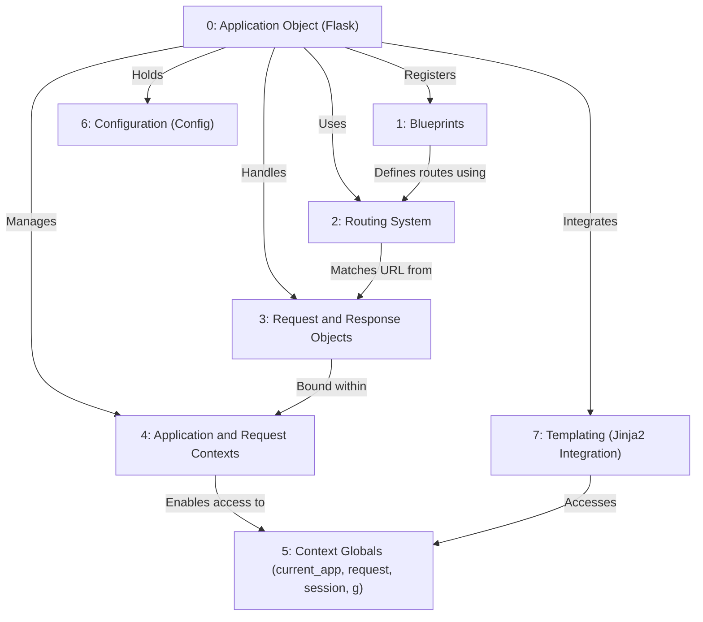
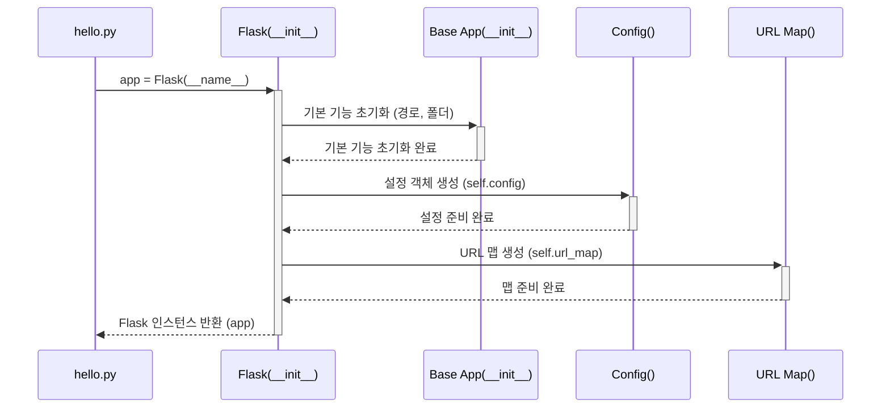

## Flask 개요
> 이 튜토리얼은 AI가 생성했습니다! 자세한 내용은 [AI 코드베이스 지식 빌더](https://github.com/The-Pocket/Tutorial-Codebase-Knowledge)를 참조하세요.

* Flask<sup>[저장소 보기](https://github.com/pallets/flask/tree/ab8149664182b662453a563161aa89013c806dc9/src/flask)</sup>는 Python용 경량 **웹 프레임워크**입니다.
Flask는 수신 *웹 요청*을 처리하고 *응답*을 반환하여 웹 애플리케이션을 구축하는 데 도움을 줍니다.
Flask는 Python 함수로 URL을 **라우팅**하고, *요청 데이터*를 관리하고, *응답*을 생성하고, *템플릿*을 사용하여 HTML을 생성하는 도구를 제공합니다.



# 1장: 애플리케이션 객체 (`Flask`)

* 플라스크의 세계로 발을 내딛으신 것을 환영합니다. 플라스크는 파이썬으로 웹 애플리케이션을 구축하기 위한 "마이크로프레임워크"입니다. "마이크로"라고 해서 기능이 제한적인 것은 아닙니다. 플라스크는 빠르게 시작하는 데 필요한 핵심 기능만을 제공하며, 필요한 기능들을 필요에 따라 추가할 수 있도록 설계되었습니다.

* 이번 장에서는 모든 플라스크 애플리케이션의 핵심이라고 할 수 있는 **애플리케이션 객체**에 대해 자세히 알아보겠습니다.

### 1.1 어떤 문제를 해결할까요? 관제탑의 필요성

* 간단한 웹사이트를 구축한다고 상상해 보세요. 아마 홈페이지에 "Hello, World\!"라는 문구만 표시하면 될 수도 있습니다. 하지만 웹 서버는 누군가가 홈페이지(`/`)로 접속했을 때 *어떤* 파이썬 코드를 실행해야 하는지 어떻게 알까요? `/about`이나 `/contact` 같은 다른 페이지들은 어떻게 관리할까요? 설정은 어떻게 처리하고 다른 도구들과는 어떻게 연결할까요?

* 이러한 모든 작업을 관리할 중앙 집중식 장소가 필요합니다. 마치 분주한 공항과 같습니다. 들어오는 비행기(웹 요청)를 안내하고, 활주로(URL 경로)를 관리하며, 지상 근무자(애플리케이션의 다른 부분)를 조율하는 **관제탑**이 필요합니다.

* 플라스크에서 `Flask` 객체가 바로 그 관제탑 역할을 합니다. 이 객체는 여러분의 전체 웹 애플리케이션을 나타내는 주된 객체입니다.

### 1.2 첫 번째 플라스크 애플리케이션 만들기

* 가장 간단한 플라스크 앱을 만들어 보겠습니다. 파이썬 파일이 하나 필요합니다. 여기서는 `hello.py`라고 부르겠습니다.

1.  **Flask 임포트:** 먼저 `Flask` 클래스를 여러분의 코드 안으로 가져와야 합니다.
2.  **인스턴스 생성:** 그런 다음 이 클래스의 *인스턴스*를 생성합니다. 이 인스턴스가 바로 여러분의 애플리케이션입니다.

<!-- end list -->

```python
# hello.py

from flask import Flask

# 애플리케이션 객체 생성
app = Flask(__name__)

# 곧 더 많은 코드를 추가할 예정입니다!
```

`app = Flask(__name__)` 코드를 자세히 살펴보겠습니다.

* `from flask import Flask`: 
  - 이 줄은 설치한 Flask 라이브러리에서 필요한 `Flask` 클래스를 임포트합니다.
* `app = Flask(...)`:
  -  이 줄은 실제 애플리케이션 객체를 생성합니다. 
  - 보통 변수 이름을 `app`이라고 하지만, 다른 이름으로 지정해도 됩니다.
* `__name__`: 
  - 이것은 파이썬의 특별한 변수입니다. 
  - 파이썬 스크립트를 직접 실행하면 파이썬은 `__name__`을 문자열 `"__main__"`으로 설정합니다. 
  - 만약 이 스크립트가 다른 스크립트에 의해 임포트되면, `__name__`은 모듈의 이름(예: 파일 이름이 `hello.py`라면 `"hello"`)으로 설정됩니다.
    * **왜 `__name__`일까요?** 
      - 플라스크는 이 인수를 사용하여 여러분의 애플리케이션의 위치를 파악. 
      - 이는 나중에 템플릿이나 정적 자산(이미지, CSS 등)과 같은 다른 파일들을 찾는 데 도움
      - 간단한 단일 모듈 애플리케이션에서는 `__name__`을 사용하는 것이 표준
      - 플라스크 문서에서는 파이썬 패키지 형태로 구성된 더 큰 애플리케이션을 구축하는 경우 패키지 이름을 직접 하드코딩할 수도 있지만(`app = Flask('yourapplication')`), 초보자에게는 `__name__`을 사용하는 것이 좋습니다.


### 1.3 기본적인 라우트 추가하기

- 아직 우리의 `app` 객체는 아무것도 하지 않습니다. 누군가가 홈페이지(`/`)에 접속했을 때 무엇을 해야 할지 알려주겠습니다. 이를 위해 라우트를 사용합니다. 라우팅에 대해서는 다음 장에서 자세히 다루겠지만, 여기서는 간단히 맛보기만 하겠습니다.

```python
# hello.py (계속)

from flask import Flask

app = Flask(__name__)

# 누군가가 홈페이지("/")에 접속했을 때 어떤 일이 일어날지 정의합니다.
@app.route('/')
def index():
    return 'Hello, World!'

# 아래에 앱을 실행하는 더 많은 코드가 있습니다...
```

* `@app.route('/')`: 
  - 이것은 파이썬 데코레이터입니다. 바로 아래에 정의된 함수(`index`)를 수정합니다. 
  - 이 데코레이터는 우리의 `app` 객체에게 "URL 경로 `/`로 웹 요청이 들어오면 `index` 함수를 호출하라"고 지시합니다.
* `def index(): ...`: 
  - 이것은 간단한 파이썬 함수입니다. 플라스크는 이러한 함수를 "뷰 함수"라고 부릅니다.
* `return 'Hello, World!'`: 
  - 뷰 함수가 반환하는 값은 웹 브라우저를 통해 사용자에게 응답으로 전송됩니다.

### 1.4 애플리케이션 실행하기

- 사람들이 실제로 우리 페이지에 접속할 수 있도록 웹 서버를 어떻게 시작할까요? 
- `app` 객체의 `run()` 메서드를 사용합니다. 일반적으로 다음과 같은 특별한 `if` 블록 안에 이 코드를 넣음.

```python
# hello.py (파일 끝)

from flask import Flask

app = Flask(__name__)

@app.route('/')
def index():
    return 'Hello, World!'

# 이 블록은 스크립트가 직접 실행될 때만 앱을 실행합니다.
if __name__ == '__main__':
    # 내장 개발 서버를 시작합니다.
    app.run(debug=True)
```

* `if __name__ == '__main__':`: 
  - 이 표준 파이썬 구조는 이 블록 안의 코드가 `hello.py`를 직접 실행했을 때만(터미널에서 `python hello.py`라고 입력하는 것처럼) 실행되도록 보장합니다. 
  - 만약 다른 파이썬 파일에서 `hello.py`를 *임포트*하는 경우에는 서버가 시작되지 않도록 합니다.
* `app.run()`: 
  - 이 메서드는 플라스크의 내장 개발 웹 서버를 시작합니다. 
  - 이 서버는 테스트에는 훌륭하지만 실제 운영 환경(라이브 웹사이트)에는 적합하지 않습니다.
* `debug=True`: 
  - 이 설정은 플라스크의 "디버그 모드"를 활성화합니다. 
  - 브라우저에 유용한 오류 메시지를 표시하고 코드를 저장할 때마다 서버를 자동으로 재시작하여 개발을 훨씬 쉽게 만들어 줍니다. 
  - **운영 환경에서는 절대로 디버그 모드를 사용하지 마세요\!**

### **1.5 실행 방법:**

1.  전체 코드를 `hello.py`로 저장합니다.
2.  터미널 또는 명령 프롬프트를 엽니다.
3.  파일을 저장한 디렉토리로 이동합니다.
4.  `python hello.py` 명령을 실행합니다.
5.  다음과 유사한 출력이 표시됩니다.

    ```
     * Serving Flask app 'hello'
     * Debug mode: on
     * Running on http://127.0.0.1:5000 (Press CTRL+C to quit)
     * Restarting with stat
     * Debugger is active!
     * Debugger PIN: ...
    ```

6.  웹 브라우저를 열고 `http://127.0.0.1:5000/`으로 이동합니다.
7.  "Hello, World\!"라는 텍스트가 표시되어야 합니다.

- 여러분은 첫 번째 플라스크 애플리케이션을 만들고 실행했습니다. 
- `app = Flask(__name__)` 줄은 모든 것을 관리하는 중앙 객체를 생성하는 중요한 첫 번째 단계였습니다.

### 1.6 내부 동작 방식: `Flask(__name__)`을 생성할 때 일어나는 일

- 당장 깊숙한 내부 구조를 알 필요는 없지만, 약간의 이해는 도움이 됩니다. 
- `app = Flask(__name__)`을 호출하면 플라스크 내부에서 여러 가지 일들이 (단순화해서) 일어남.

1.  **초기화:** 
  - `Flask` 클래스의 `__init__` 메서드(`app.py`에 있으며, `sansio/app.py`의 `App` 클래스를 상속받습니다)가 호출됩니다.
2.  **경로 결정:**  
  -  전달된 `import_name`(`__name__`)을 사용하여 애플리케이션의 `root_path`를 파악합니다. 
  - 이는 공항에서 메인 격납고를 찾는 것과 같습니다. (`helpers.py`의 `get_root_path`와 `sansio/scaffold.py`의 `find_package`를 참조하세요.)
3.  **설정 구성:** 
  - 일반적으로 `config.py`의 `Config` 클래스의 인스턴스인 설정 객체(`self.config`)를 생성합니다. 
  - 이 객체는 `DEBUG`, `SECRET_KEY` 등과 같은 설정을 보관합니다.
4.  **URL 맵 생성:** 
  - 들어오는 요청 URL을 뷰 함수와 매칭시키는 역할을 하는 `URL Map`(`self.url_map`)을 생성합니다.
5.  **내부 구조:** 
    - 뷰 함수(`self.view_functions`), 오류 처리기(`self.error_handler_spec`), 
    - 요청 전후에 실행될 함수 등과 같은 다양한 내부 딕셔너리를 설정합니다.
6.  **정적 라우트 (선택 사항):** 
  - `static_folder`를 구성한 경우(플라스크는 기본적으로 설정합니다), 
  - CSS 및 JavaScript와 같은 정적 파일을 제공하기 위해 자동으로 URL 규칙(`/static/<filename>`)을 추가합니다.

### 1.7 내부 동작에 대한 단순화한 다이어그램
<br>



- 반환된 `app` 객체는 이제 라우트를 등록하고 요청을 처리할 준비가 된 완전히 초기화된 "관제탑"입니다.

### 1.8 결론

- 플라스크에서 가장 기본적인 개념인 **애플리케이션 객체**를 학습. 
- 이 객체는 `Flask` 클래스를 인스턴스화하여 생성되며(일반적으로 `app = Flask(__name__)`와 같이 사용합니다), 전체 웹 애플리케이션의 중앙 등록소이자 컨트롤러 역할을 합니다.
-  URL 라우트를 정의하고, 설정을 관리하며, 다양한 컴포넌트를 연결하는 곳입니다.

- 최소한의 애플리케이션을 만들고, `@app.route()`를 사용하여 간단한 라우트를 추가하고, `app.run()`을 사용하여 개발 서버를 실행하는 방법을 살펴보았습니다.

- 이제 중앙 `app` 객체를 갖게 되었으므로, 다음 논리적 단계는 플라스크가 들어오는 웹 요청을 올바른 파이썬 함수로 어떻게 전달하는지 이해하는 것입니다. 이것이 바로 라우팅 시스템의 역할입니다.