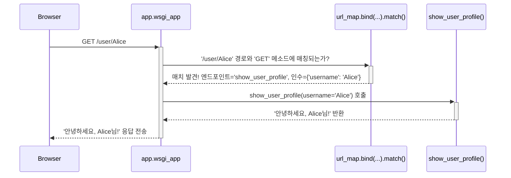

> 이 튜토리얼은 AI가 생성했습니다! 자세한 내용은 [AI 코드베이스 지식 빌더](https://github.com/The-Pocket/Tutorial-Codebase-Knowledge)를 참조하세요.

# 2장: 라우팅 시스템

* Flask는 어떻게 홈페이지(`/`)를 방문했을 때 `index()` 함수를 실행해야 하는지 알았을까요? 
* `/about` 같은 "About Us" 페이지는 어떻게 만들 수 있을까요? 바로 **라우팅 시스템**이 이 역할을 담당.

### 2.1 해결할 문제: 길 찾기의 필요성

* 홈페이지, about 페이지, contact 페이지, 개별 사용자 프로필 페이지 등 여러 페이지로 구성된 웹사이트를 상상해 보세요. 사용자가 브라우저에 `http://yourwebsite.com/about` 같은 URL을 입력하면, Flask 애플리케이션은 어떻게 이 요청을 처리하고 "About Us" 콘텐츠를 생성할 어떤 Python 코드를 찾아낼 수 있을까요?

* 각각의 들어오는 URL을 해당 페이지의 응답을 생성하는 특정 Python 함수에 매핑할 시스템이 필요합니다. 도시 지도의 색인과 비슷하다고 생각해보세요:
  *   **URL:** 찾고자 하는 주소 (예: `/about`)
  *   **라우팅 시스템:** 지도책의 색인
  *   **뷰 함수:** 해당 주소의 상세 정보를 보여주는 지도책의 특정 페이지 번호

* Flask의 라우팅 시스템은 대부분 Werkzeug라는 라이브러리에 의해 구동되며, 이 색인 역할을 합니다. URL 패턴(예: `/`, `/about`, `/user/<username>`)을 정의하고 이를 Python 함수(**뷰 함수**라고 함)에 연결.

### 2.2 `@app.route()`로 라우트 정의하기

* Flask에서 URL-함수 매핑을 정의하는 가장 일반적인 방법은 1장에서 잠깐 본 `@app.route()` 데코레이터를 사용하는 것입니다.

* `hello.py` 파일을 다시 살펴보고 "About" 페이지를 추가해 봅시다.
1.  홈페이지(`/`) 라우트는 유지합니다.
2.  `/about`에 대한 *새로운* 라우트를 추가합니다.

```python
# hello.py

from flask import Flask

# 1장에서 배운 애플리케이션 객체 생성
app = Flask(__name__)

# 홈페이지 라우트
@app.route('/')
def index():
  return '홈페이지에 오신 것을 환영합니다!'

# 새로 추가: about 페이지 라우트
@app.route('/about')
def about():
  return '여기는 About Us 페이지입니다.'

# 애플리케이션 실행 코드 (1장에서 배움)
if __name__ == '__main__':
  app.run(debug=True)
```

**설명:**

*   `@app.route('/')`: 
    - Flask에 "URL 경로 `/`에 대한 요청이 들어오면 바로 아래에 있는 함수(`index`)를 실행하라"고 지시.
*   `@app.route('/about')`: 
    - Flask에 "URL 경로 `/about`에 대한 요청이 들어오면 바로 아래에 있는 함수(`about`)를 실행하라"
*   `def index(): ...`와 `def about(): ...`: 
    - 이들은 **뷰 함수**입니다. 
	- 각각의 라우트에 대해 실행될 Python 코드를 포함하며, 브라우저로 보낼 응답을 반환해야.

**실행 방법:**

1.  코드를 `hello.py`로 저장합니다.
2.  터미널에서 `python hello.py`를 실행합니다.
3.  브라우저에서 `http://127.0.0.1:5000/`을 방문. "홈페이지에 오신 것을 환영합니다!"가 표시되어야.
4.  `http://127.0.0.1:5000/about`을 방문. "여기는 About Us 페이지입니다."가 표시되어야.

### 2.3 동적 라우트: URL에 변수 사용하기

* URL에 따라 변경되는 페이지를 원한다면 어떻게 해야 할까요? 
* 예를 들어 `/user/alice`와 `/user/bob` 같은 다른 사용자들의 프로필 페이지를 원한다면, 모든 사용자마다 새로운 뷰 함수를 작성하고 싶지는 않을 겁니다!

* Flask는 꺾쇠 괄호 `< >`를 사용해 URL 규칙에 *변수 부분*을 정의할 수 있게 해줍니다.

```python
# hello.py (계속)

# ... (Flask import, app 생성, index 및 about 라우트 유지) ...

# 새로 추가: 사용자 프로필을 위한 동적 라우트
@app.route('/user/<username>')
def show_user_profile(username):
  # URL의 'username' 변수가 함수에 전달됩니다!
  return f'안녕하세요, {username}님!'

# ... (if __name__ == '__main__': 블록 유지) ...
```

**설명:**
*   `@app.route('/user/<username>')`:
    *   `/user/` 부분은 고정됩니다.
    *   `<username>`은 **변수 자리 표시자**입니다. Flask는 여기에 있는 모든 텍스트(예: `alice`, `bob`, `123`)를 매칭하고 캡처합니다.
*   `def show_user_profile(username):`:
    *   함수가 이제 `username`이라는 인수를 받는 것에 주목하세요. 이는 라우트의 꺾쇠 괄호 안에 사용된 변수 이름과 **반드시 일치**해야 합니다.
    *   Flask는 자동으로 URL에서 캡처한 값을 이 인수에 전달합니다.
*   `return f'안녕하세요, {username}님!'`: 캡처한 사용자 이름을 응답에 포함시키기 위해 f-string을 사용.

**실행 방법:**
1.  업데이트된 `hello.py`를 저장(`debug=True`가 여전히 설정되어 있어 서버가 재시작되도록).
2.  `http://127..0.1:5000/user/Alice`를 방문. "안녕하세요, Alice님!"이 표시되어야.
3.  `http://127.0.0.1:5000/user/Bob`을 방문. "안녕하세요, Bob님!"이 표시되어야.

* Flask의 라우팅 시스템은 두 URL을 동일한 규칙(`/user/<username>`)에 매칭시키고 다른 사용자 이름(`'Alice'`, `'Bob'`)을 `show_user_profile` 함수에 전달했습니다.

### 2.4 데이터 타입 지정하기: 변환기

* 기본적으로 URL에서 캡처된 변수는 문자열로 처리됩니다. 하지만 숫자가 필요하다면 어떻게 해야 할까요? 
* 예를 들어, 5번 블로그 포스트를 `/post/5`에 표시하고 싶다면, URL의 해당 부분에 숫자만 허용되도록 Flask에 지시하고 싶을 수 있습니다.

* 꺾쇠 괄호 안에 `<converter:variable_name>`을 사용해 **변환기**를 지정할 수 있습니다.

* `int` 변환기를 사용해 블로그 포스트에 대한 라우트를 추가해 봅시다:

```python
# hello.py (계속)

# ... (이전 코드 유지) ...

# 새로 추가: 특정 블로그 포스트 ID로 표시하기 위한 라우트
@app.route('/post/<int:post_id>')
def show_post(post_id):
  # Flask는 post_id가 정수임을 보장하고 여기에 전달합니다
  # 참고: 실제 포스트를 가져오는 것이 아니라 ID만 표시합니다
  return f'포스트 번호: {post_id} (타입: {type(post_id).__name__})'

# ... (if __name__ == '__main__': 블록 유지) ...
```

**설명:**

*   `@app.route('/post/<int:post_id>')`:
    *   `<int:post_id>`는 Flask에게 "이 부분의 URL을 매칭하되, 정수처럼 보이는 경우에만 해당합니다. 정수로 변환하고 `post_id` 변수로 전달하라"고 지시합니다.
*   `def show_post(post_id):`: `post_id` 인수는 이제 실제 Python `int`를 받게 됩니다.

**실행 방법:**

1.  업데이트된 `hello.py`를 저장합니다.
2.  `http://127.0.0.1:5000/post/123`을 방문. "포스트 번호: 123 (타입: int)"가 표시되어야 합니다.
3.  `http://127.0.0.1:5000/post/abc`를 방문. "Not Found" 오류가 발생합니다! 왜냐하면 `abc`는 `int` 변환기와 매칭되지 않으므로 Flask는 이 URL이 규칙과 일치한다고 간주하지 않기 때문입니다.

일반적인 변환기에는 다음이 포함됩니다:
*   `string`: (기본값) 슬래시 없는 모든 텍스트를 허용합니다.
*   `int`: 양의 정수를 허용합니다.
*   `float`: 양의 부동 소수점 값을 허용합니다.
*   `path`: `string`과 비슷하지만 슬래시도 허용합니다(파일 경로 매칭에 유용합니다).
*   `uuid`: UUID 문자열을 허용합니다.

### 2.5 내부 동작: 라우팅은 어떻게 작동할까요?

* `@app.route()`를 사용해 라우트를 정의할 때, Flask는 즉시 URL을 확인하지 않습니다. 대신, 우리가 이야기한 지도 색인을 미리 컴파일하는 것처럼 맵을 구축합니다.

1.  **맵 구축:**
    *   `app = Flask(__name__)`을 생성할 때, Flask는 Werkzeug 라이브러리의 빈 `URLMap` 객체를 초기화합니다(`app.url_map`에 저장됨). `app.py`의 `Flask.__init__`은 `sansio/app.py`의 `super().__init__`을 호출하여 `self.url_map`을 생성합니다.
    *   `@app.route('/some/rule', ...)`을 사용하거나 직접 `app.add_url_rule(...)`(`sansio/scaffold.py` 참조)을 호출할 때마다, Flask는 패턴, 허용된 HTTP 메소드(GET, POST 등), 엔드포인트 이름(보통 함수 이름), 변환기를 설명하는 `Rule` 객체(예: `Rule('/user/<username>')`)를 생성합니다.
    *   이 `Rule` 객체는 `app.url_map`에 추가됩니다.

2.  **요청 매칭:**
    *   `GET /user/Alice` 같은 요청이 도착하면, Flask의 `wsgi_app` 메소드(`app.py`에 있음)가 호출.
    *   들어오는 요청 환경(URL 경로, HTTP 메소드)과 `app.url_map`을 사용해 매칭되는 `Rule`을 찾습니다. Werkzeug의 `MapAdapter.match()` 메소드(`app.create_url_adapter`를 통해 생성되며, `url_map.bind_to_environ`을 호출함)가 여기서 중요한 역할을 합니다.
    *   `/user/<username>`에 대한 매치가 발견되면, `match()`는 엔드포인트 이름(예: `'show_user_profile'`)과 추출된 변수의 딕셔너리(예: `{'username': 'Alice'}`)를 반환합니다. 이들은 `request` 객체에 `request.url_rule`과 `request.view_args`로 저장됩니다.
    *   매칭되는 규칙이 없으면 "Not Found" (404) 오류가 발생합니다.

3.  **뷰 함수로 전달:**
    *   Flask의 `app.dispatch_request()` 메소드(`app.py`에 있음)는 `request.url_rule.endpoint`에서 엔드포인트 이름을 가져옵니다.
    *   `app.view_functions` 딕셔너리에서 해당 엔드포인트 이름과 연결된 실제 Python 뷰 함수를 찾습니다(`@app.route`도 여기를 채웁니다).
    *   뷰 함수를 호출하고, `request.view_args`에서 추출된 변수를 키워드 인수로 전달합니다(예: `show_user_profile(username='Alice')`).
    *   뷰 함수의 반환 값이 응답이 됩니다.

### 2.6 매칭 프로세스의 간단한 다이어그램
<br>



* 핵심은 `@app.route`가 미리 맵을 구축하고, Werkzeug가 들어오는 각 요청에 대해 이 맵을 효율적으로 검색하여 올바른 함수를 찾고 변수 부분을 추출한다는 것입니다.

### 2.7 결론

Flask의 **라우팅 시스템**이 URL과 이를 처리하는 Python 함수(뷰 함수) 사이의 매핑 역할을 하는 방법을 학습.

*   URL 규칙을 정의하기 위해 `@app.route()` 데코레이터를 사용합니다.
*   `/about` 같은 정적 라우트와 `/user/<username>` 같은 동적 라우트를 생성할 수 있습니다.
*   변환기(`<int:post_id>`)를 사용해 URL 변수의 예상 데이터 타입을 지정, 자동 검증과 변환을 제공.
*   내부적으로 Flask와 Werkzeug는 이러한 규칙으로부터 `URLMap`을 구축하고, 이를 사용해 들어오는 요청을 효율적으로 올바른 뷰 함수로 전달합니다.

