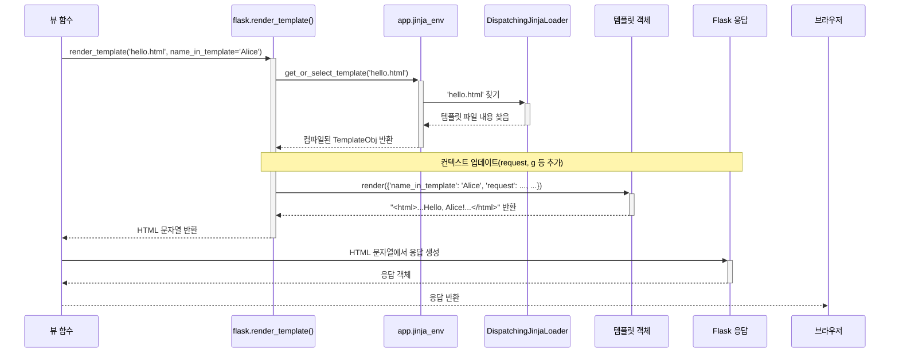

> 이 튜토리얼은 AI가 생성했습니다! 자세한 내용은 [AI 코드베이스 지식 빌더](https://github.com/The-Pocket/Tutorial-Codebase-Knowledge)를 참조하세요.

# 4장: 템플릿 (Jinja2 통합)

* 웹 페이지의 디자인과 구조(HTML)를 동적 콘텐츠를 생성하는 파이썬 코드와 어떻게 분리할 수 있을까요? 이 장에서는 **템플릿**을 소개합니다.

### 4.1 해결하려는 문제: 코드와 디자인의 혼재는 지저분합니다

* 개인화된 이메일 뉴스레터를 작성하는 것을 생각해보세요. 표준 편지 형식(디자인)이 있지만, 각 수신자에게 맞는 특정 세부 정보(동적 데이터)를 삽입해야 합니다. 모든 사람마다 코드에서 편지를 처음부터 작성하고 싶지는 않을 것입니다!

* 마찬가지로 웹 페이지를 구축할 때는 HTML 구조(디자인)가 있지만, 애플리케이션의 데이터(현재 로그인한 사용자의 이름, 제품 목록, 검색 결과 등)에 따라 일부가 변경되어야 합니다. 복잡한 HTML을 파이썬 뷰 함수에 직접 넣으면 코드를 읽기 어렵고 유지 관리가 어려우며, 웹 디자이너(파이썬을 모를 수 있는)가 작업하기 어렵습니다.

* 동적 부분을 위한 특수 자리 표시자가 있는 HTML "템플릿"을 만들고, 파이썬 코드가 실제 데이터로 해당 자리 표시자를 채우는 방법이 필요합니다.

* Flask는 이 문제를 해결하기 위해 **Jinja2**라는 강력한 템플릿 엔진을 사용합니다. Jinja2를 사용하면 템플릿 자체 내에서 변수와 간단한 논리(루프 및 조건문 같은)를 포함하는 HTML 파일(또는 기타 텍스트 파일)을 만들 수 있습니다. Flask는 이러한 템플릿 파일 중 하나를 가져와 데이터를 채우고 최종 HTML을 사용자의 브라우저로 보낼 준비가 된 상태로 반환하는 편리한 함수인 `render_template`을 제공합니다.

이는 **메일 머지**와 정확히 같습니다:

*   **템플릿 파일(`.html`):** 표준 편지 형식.
*   **자리 표시자(`{{ variable }}`):** <<이름>> 또는 <<주소>>를 넣을 위치.
*   **컨텍스트 변수(파이썬 딕셔너리):** 실제 데이터(예: `name="Alice"`, `address="..."`).
*   **`render_template` 함수:** 메일 머지 도구 자체.
*   **최종 HTML:** 전송 준비가 된 개인화된 편지.

### 4.2 첫 번째 템플릿 만들기

기본적으로 Flask는 메인 애플리케이션 파일(예: `hello.py`) 바로 옆에 있는 `templates`라는 폴더에서 템플릿 파일을 찾습니다.

1.  `hello.py` 파일과 같은 디렉터리에 `templates`라는 폴더를 만듭니다.
2.  `templates` 폴더 안에 `hello.html`이라는 파일을 만듭니다.

```html
<!-- templates/hello.html -->

<!doctype html>
<html>
  <head>
    <title>Hello Flask!</title>
  </head>
  <body>
    <h1>Hello, {{ name_in_template }}!</h1>
    <p>Welcome to our templated page.</p>
  </body>
</html>

```

**설명:**

*   대부분 표준 HTML입니다.
*   `{{ name_in_template }}`: 
	- 이것은 Jinja2 **자리 표시자** 또는 **표현식**입니다. 
	- Jinja2에게 "이 템플릿이 렌더링될 때 이 부분을 파이썬 코드가 제공하는 `name_in_template`이라는 변수의 값으로 바꾸세요"라고 알려줍니다.

### 4.3 `render_template`로 템플릿 렌더링하기

이제 파이썬 코드(`hello.py`)를 수정하여 이 템플릿을 사용해 보겠습니다. 다음이 필요합니다:

1.  Flask에서 `render_template` 함수를 가져옵니다.
2.  뷰 함수에서 `render_template`을 호출하고 템플릿 파일의 이름과 템플릿에서 사용할 수 있게 하려는 변수를 전달합니다.

```python
# hello.py

# 다른 곳에서 사용하는 경우 'request'를 가져왔는지 확인하세요.
# 그렇지 않으면 이 예제에서는 제거하세요.
from flask import Flask, render_template

app = Flask(__name__)

# 홈페이지 경로
@app.route('/')
def index():
  # 템플릿에 표시할 이름
  user_name = "World"
  # 템플릿을 렌더링하고 user_name을 변수로 전달
  # 왼쪽의 키('name_in_template')는 HTML에서 접근하는 방식입니다.
  # 오른쪽의 값(user_name)은 파이썬 변수입니다.
  return render_template('hello.html', name_in_template=user_name)

# 같은 템플릿을 사용하여 특정 사용자에게 인사하는 새로운 경로
@app.route('/user/<username>')
def greet_user(username):
  # 여기서 'username'은 URL에서 가져옵니다.
  # 템플릿을 위한 키로 여전히 'name_in_template'을 사용합니다.
  return render_template('hello.html', name_in_template=username)

# 앱 실행 코드(1장에서)
if __name__ == '__main__':
  app.run(debug=True)
```

**설명:**

*   `from flask import render_template`: 필요한 함수를 가져옵니다.
*   `render_template('hello.html', ...)`: 
	- Flask에게 `hello.html` 파일을 찾으라고 지시합니다(`templates` 폴더에서 찾습니다).
*   `name_in_template=user_name`: 
	- 데이터를 템플릿으로 전달하는 중요한 부분입니다. 
	- 이는 `{'name_in_template': 'World'}`(또는 두 번째 경로에서는 `{'name_in_template': 'Alice'}`)와 같은 "컨텍스트" 딕셔너리를 생성합니다. 
	- Jinja2는 이 컨텍스트를 사용하여 자리 표시자를 채웁니다. 
	- 키워드 인수 이름(`name_in_template`)은 HTML 파일의 `{{ }}` 안에 사용된 변수 이름과 일치해야.

**실행 방법:**

1.  `templates` 폴더 안에 `hello.html`이 있는지 확인하세요.
2.  업데이트된 `hello.py`를 저장하세요.
3.  터미널에서 `python hello.py`를 실행하세요.
4.  `http://127.0.0.1:5000/`을 방문하세요. 브라우저는 `hello.html`에서 생성된 HTML을 받아 "Hello, World!"를 표시합니다.
5.  `http://127.0.0.1:5000/user/Alice`를 방문하세요. 브라우저는 동일한 `hello.html` 템플릿에서 생성된 HTML을 받지만 이번에는 "Hello, Alice!"를 표시합니다.

- `render_template`과 변수를 사용하여 동일한 HTML 구조를 재사용하면서 콘텐츠를 동적으로 변경하는 방법을 확인하세요!

### 4.4 기본 Jinja2 구문: 변수, 조건문 및 루프

* Jinja2는 변수 치환 이상의 기능을 제공합니다. HTML 안에서 기본적인 프로그래밍 구문을 사용할 수 있습니다.
* 주요 구분 기호는 두 가지입니다:

	
	*   `{{ ... }}`: 
		- **표현식**에 사용됩니다. 
		- 표시하려는 변수나 간단한 계산 또는 함수 호출을 넣는 곳입니다. 
		- 결과는 HTML에 삽입됩니다.
	*   ``: 
		- **문장**에 사용됩니다. 
		- `if`/`else` 블록, 
		- `for` 루프 및 기타 제어 구조가 포함됩니다. 
		- 이들은 직접적으로 텍스트를 출력하지는 않지만 템플릿이 렌더링되는 방식을 제어합니다.
	

몇 가지 예를 살펴보겠습니다.

### 4.5 예: `if`/`else` 사용하기

* 사용자가 로그인했는지 여부에 따라 다른 콘텐츠를 표시하려 한다고 가정해 보세요.

**파이썬(`hello.py`):**

```python
# hello.py (이 경로를 추가하세요)

@app.route('/profile')
def profile():
  # 데모를 위해 로그인한 사용자를 시뮬레이션합니다.
  current_user = {'name': 'Charlie', 'is_logged_in': True}
  # 로그인한 사용자가 없는 경우 시뮬레이션
  # current_user = None
  return render_template('profile.html', user=current_user)

# ... (다른 경로와 실행 코드 유지)
```

**템플릿(`templates/profile.html`):**

```html
<!-- templates/profile.html -->

<!doctype html>
<html>
<head><title>User Profile</title></head>
<body>
  
    <h1>Welcome back, {{ user.name }}!</h1>
    <p>You are logged in.</p>
  
    <h1>Welcome, Guest!</h1>
    <p>Please log in.</p>
  
</body>
</html>

```

**설명:**


*   ``: 
	- `if` 블록을 시작합니다. Jinja2는 `user` 변수가 존재하고 `is_logged_in` 속성이 참인지 확인합니다.
*   ``: 
	- `if` 조건이 거짓이면 `else` 아래의 코드가 사용됩니다.
*   ``: 
	- `if` 블록의 끝을 표시합니다.
*   `{{ user.name }}`: 
	- 파이썬에서 전달된 `user` 딕셔너리의 `name` 속성에 접근합니다.


이를 실행하고 `/profile`을 방문하면 "Welcome back, Charlie!" 메시지가 표시됩니다. 
파이썬 코드에서 `current_user`를 `None`으로 변경하고 새로 고치면 "Welcome, Guest!" 메시지가 표시됩니다.

### 4.6 예: `for` 루프 사용하기

* 항목 목록을 표시하려 한다고 가정해 보세요.

**파이썬(`hello.py`):**

```python
# hello.py (이 경로를 추가하세요)

@app.route('/items')
def show_items():
  item_list = ['Apple', 'Banana', 'Cherry']
  return render_template('items.html', items=item_list)

# ... (다른 경로와 실행 코드 유지)
```

**템플릿(`templates/items.html`):**

```html
<!-- templates/items.html -->

<!doctype html>
<html>
<head><title>Item List</title></head>
<body>
  <h2>Available Items:</h2>
  <ul>
    
      <li>{{ fruit }}</li>
    
      <li>No items available.</li>
    
  </ul>
</body>
</html>

```

**설명:**


*   ``: 
	- `for` 루프를 시작합니다. 파이썬에서 전달된 `items` 목록을 반복합니다. 
	- 각 반복에서 현재 항목은 `fruit` 변수에 할당됩니다.
*   `<li>{{ fruit }}</li>`: 
	- 루프 내에서 현재 `fruit`을 표시합니다.
*   ``: 
	- 이 선택적 블록은 `items` 목록이 비어 있는 경우 실행됩니다.
*   ``: 
	- `for` 루프의 끝을 표시합니다.


`/items`를 방문하면 과일의 글머리 기호 목록이 표시됩니다.

### 4.7 템플릿 내에서 `url_for`를 사용하여 URL 생성하기

- 파이썬에서 `url_for`를 사용한 것처럼, HTML 템플릿 내에서 URL을 생성해야 하는 경우가 많습니다(예: 링크 또는 폼 액션용). 
- Flask는 Jinja2 템플릿 내에서 `url_for` 함수를 자동으로 사용할 수 있게 합니다.

**템플릿(`templates/navigation.html`):**

```html
<!-- templates/navigation.html -->

<nav>
  <ul>
    <li><a href="{{ url_for('index') }}">Home</a></li>
    <li><a href="{{ url_for('show_items') }}">Items</a></li>
    <li><a href="{{ url_for('greet_user', username='Admin') }}">Admin Profile</a></li>
    <!-- 로그인이 필요한 링크 예시 -->
    
      <li><a href="{{ url_for('profile') }}">My Profile</a></li>
    
      <li><a href="#">Login</a></li> {# 나중에 #을 로그인 URL로 대체 #}
    
  </ul>
</nav>

```

**설명:**


*   `{{ url_for('index') }}`: 
	- `'index'` 엔드포인트와 연결된 뷰 함수의 URL을 생성합니다(아마도 `/`).
*   `{{ url_for('show_items') }}`: 
	- `show_items` 엔드포인트의 URL을 생성합니다(아마도 `/items`).
*   `{{ url_for('greet_user', username='Admin') }}`: 
	- `greet_user` 엔드포인트의 URL을 생성하고 `username` 변수를 채웁니다(아마도 `/user/Admin`).


템플릿에서 `url_for`를 사용하면 나중에 파이썬 코드에서 URL 규칙을 변경하더라도 링크가 항상 올바른 위치를 가리키도록 할 수 있습니다.

### 4.8 내부 동작: `render_template` 작동 방식
`render_template('some_template.html', var=value)`를 호출할 때 Flask와 Jinja2 내부에서 발생하는 일의 간략한 순서는 다음과 같습니다:


1.  **Jinja 환경 가져오기:** 
	- Flask는 구성된 Jinja2 환경(`current_app.jinja_env`)에 접근합니다. 
	- 이 환경은 설정, 필터, 전역 변수 및 특히 **템플릿 로더**를 보유합니다(`templating.py:render_template`에서 `current_app.jinja_env`에 접근하는 부분 참조).
2.  **템플릿 찾기:** 
	- 환경은 로더(`app.jinja_env.loader`, 일반적으로 `app.py:create_jinja_environment` 및 `templating.py:Environment`에서 생성된 `DispatchingJinjaLoader`)에게 템플릿 파일(`'some_template.html'`)을 찾도록 요청합니다.
3.  **로더 검색:** 
	- `DispatchingJinjaLoader`는 어디를 찾아야 하는지 알고 있습니다:
		*   먼저 애플리케이션의 `template_folder`(일반적으로 `./templates`)를 확인합니다.
		*   찾지 못하면 등록된 Blueprint의 `template_folder`를 확인합니다(`templating.py:DispatchingJinjaLoader._iter_loaders` 참조).
4.  **로드 및 파싱:** 
	- 로더가 파일을 찾으면 Jinja2는 해당 내용을 읽고 파싱하여 효율적인 렌더링을 위해 내부 표현(`Template` 객체)으로 컴파일합니다. 
	- 이는 캐시될 수 있습니다(`jinja_env.get_or_select_template`에서 처리).
5.  **컨텍스트 업데이트:** 
	- Flask는 `app.update_template_context(context)`를 호출하여 전달한 변수 딕셔너리(`{'var': value}`)에 표준 변수인 `request`, `session`, `g`, `config` 등을 추가합니다.
	-  이는 "컨텍스트 프로세서"를 사용하여 수행됩니다(`templating.py:_render` 참조).
6.  **신호:** 
	- Flask는 `before_render_template` 신호를 보냅니다.
7.  **렌더링:** 
	- `Template` 객체의 `render()` 메서드가 결합된 컨텍스트 딕셔너리와 함께 호출됩니다. 
	- Jinja2는 템플릿을 처리하고 문장(``)을 실행하며 컨텍스트의 값으로 표현식(`{{ }}`)을 대체합니다.
8.  **HTML 반환:** 
	- `render()` 메서드는 최종적으로 완전히 렌더링된 HTML 문자열을 반환합니다.
9.  **신호:** 
	- Flask는 `template_rendered` 신호를 보냅니다.
10. **응답 전송:** 
	- Flask는 이 HTML 문자열을 가져와 브라우저로 다시 보낼 HTTP 응답 객체를 생성합니다


### 4.9 `render_template` 작동 방식에 대한 다이아그램
<br>



* 주요 구성 요소는 Jinja2 환경 구성을 보유하는 `Flask` 애플리케이션 인스턴스, `render_template` 함수, 그리고 템플릿을 찾기 위해 로더를 사용하고 렌더링 중 사용 가능한 데이터를 풍부하게 하기 위해 컨텍스트 프로세서를 사용하는 Jinja2 `Environment` 자체입니다.

### 4.10 결론

* 템플릿은 동적 웹 페이지를 구축하기 위한 기본 기술. Flask는 강력한 Jinja2 템플릿 엔진과 원활하게 통합.


	*   템플릿이 HTML 구조를 파이썬 논리와 분리한다는 것을 배웠습니다.
	*   Flask는 기본적으로 `templates` 폴더에서 템플릿을 찾습니다.
	*   `render_template()` 함수는 템플릿 파일을 로드하고 데이터(컨텍스트 변수)를 전달하는 데 사용.
	*   Jinja2 템플릿은 데이터를 표시하기 위해 `{{ variable }}`을 사용하고 제어 흐름(예: `if` 및 `for`)을 위해 ``를 사용.
	*   `url_for()` 함수는 URL을 동적으로 생성하기 위해 템플릿에서 사용할 수 있습니다.


* 이제 Flask 애플리케이션의 데이터와 논리에 의해 구동되는 깔끔하고 유지 관리 가능한 HTML 페이지를 만들 수 있습니다.

* 그런데 `url_for`와 같은 함수와 `request`, `session`과 같은 변수가 매번 명시적으로 전달하지 않아도 어떻게 템플릿 내에서 마법처럼 사용할 수 있을까요? 이는 Flask의 컨텍스트 시스템과 컨텍스트 프로세서를 통해 발생합니다. 다음 장에서 이러한 "마법" 변수를 탐구해 보겠습니다.