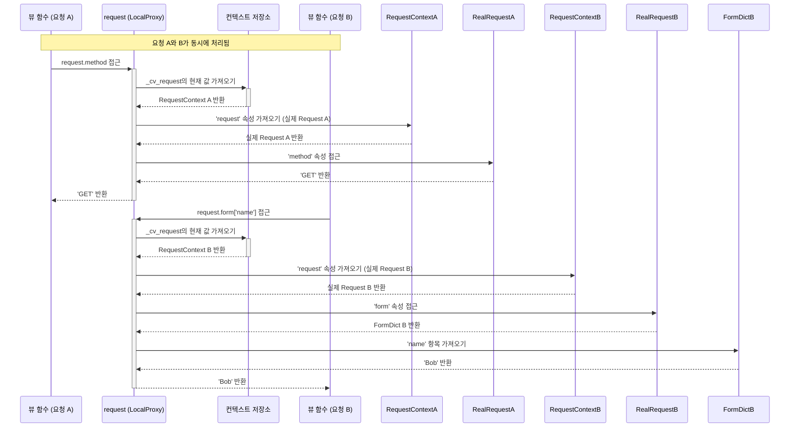

> 이 튜토리얼은 AI가 생성했습니다! 자세한 내용은 [AI 코드베이스 지식 빌더](https://github.com/The-Pocket/Tutorial-Codebase-Knowledge)를 참조하세요.

# 5장: 컨텍스트 전역 변수 (`current_app`, `request`, `session`, `g`)

* 4장: 템플릿 (Jinja2 통합)에서는 템플릿과 `render_template` 함수를 사용해 HTML 구조를 Python 코드와 분리하는 방법을 배웠습니다. 템플릿에서 `request` 같은 변수나 `url_for` 같은 함수가 마법처럼 사용 가능한 것을 보았죠.

* 그런데 이게 어떻게 가능할까요? 더 중요한 것은, 모든 함수에 수동으로 객체를 전달하지 않고도 Python 뷰 함수 내에서 현재 애플리케이션 인스턴스나 들어오는 웹 요청의 세부 정보 같은 중요한 정보에 쉽게 접근할 수 있는 방법은 무엇일까요? 모든 헬퍼 함수에 `app`과 `request`를 인자로 추가해야 한다고 상상해보세요 - 매우 반복적일 것입니다!


### 4.1 어떤 문제를 해결하는가? 지루한 매개변수 전달 피하기

- 팀 프로젝트를 생각해보세요. 팀원 모두가 자주 접근해야 하는 특정 도구나 정보가 있습니다: 
  - 프로젝트 계획, 공유 캘린더, 주요 연락처 등. 누군가가 프로젝트 계획이 필요할 때마다 다른 사람에게 그것을 전달해 달라고 요청해야 한다면 매우 비효율적일 것입니다. 
  - 대신, "The Plan"처럼 모두가 찾는 방법을 아는 중앙 집중식 장소나 잘 알려진 이름이 있을 수 있다.

* 마찬가지 Flask 애플리케이션에서도 웹 요청을 처리하는 동안 일반적으로 필요한 몇 가지 객체가 있다:
  * 애플리케이션 인스턴스 자체 (설정, 로거 등에 접근하기 위해)
  * 들어오는 요청 객체 (폼 데이터, 쿼리 매개변수, 헤더 등을 얻기 위해)
  * 여러 요청에 걸쳐 현재 사용자와 관련된 임시 정보를 저장하는 방법 (세션)
  * 현재 요청만을 위한 임시 저장 공간

- 이러한 객체를 필요로 할 수 있는 모든 함수 (특히 뷰 함수, `before_request` 함수, `after_request` 함수, 템플릿 컨텍스트 프로세서)에 명시적으로 매개변수로 전달하는 것은 코드를 관리하기 어렵게 만듦.

- Flask는 **`current_app`**, **`request`**, **`session`**, **`g`** 같은 특별한 "전역" 변수를 제공합니다. 
  - 이들은 스마트 포인터처럼 작동합니다. 
  - 현재 처리 중인 특정 요청과 관련된 올바른 객체에 접근할 수 있게 해주며, 아무것도 전달할 필요가 없습니다. 마법 같은 변수처럼 느껴집니다!

### 4.2 컨텍스트 전역 변수 소개
* 이 특별한 변수들은 기술적으로 **프록시**라고 합니다. 프록시는 대리자나 대표자로 생각할 수 있습니다. 
	* `request` 프록시와 대화할 때, 그것은 비밀리에 현재 처리 중인 HTTP 요청에 대한 실제 요청 객체를 찾아 그 대신 행동합니다. 
	* 이 마법은 Flask의 "컨텍스트" 시스템을 사용하여 이루어지며, 이건 나중에  더 자세히 살펴볼 것이다.

*	 주요 컨텍스트 전역 변수를 소개합니다:
1.	**`request`**: 
	- 클라이언트(브라우저)로부터 들어오는 HTTP 요청을 나타냅니다. 
	- 폼 데이터, URL 매개변수, HTTP 헤더, 요청된 URL 등 클라이언트가 보낸 모든 데이터를 포함. 
2.	**`session`**: 
	- 여러 요청에 걸쳐 사용자별 정보를 저장할 수 있는 딕셔너리 같은 객체입니다. 
	- 일반적으로 사용자가 로그인했는지 기억하거나 쇼핑 카트에 항목을 저장하는 데 사용. 
	- Flask는 일반적으로 이를 처리하기 위해 보안 쿠키를 사용합니다.
3.	**`current_app`**: 
	- 현재 요청을 처리하고 있는 Flask 애플리케이션의 인스턴스를 나타냅니다. 
	- 이는 애플리케이션 전체의 구성, 리소스 또는 확장에 접근하는 데 유용합니다. 
	- `app = Flask(__name__)`으로 생성한 것과 같은 객체를 가리키지만, `app` 변수를 직접 필요로 하지 않고 요청 중 어디에서나 접근할 수 있다.
4.	**`g`**: 
	- 현재 요청의 지속 시간 동안만 사용 가능한 간단한 네임스페이스 객체(빈 상자나 스크래치패드로 생각하세요)입니다. 
	- 여러 함수가 동일한 요청 주기 내에서 접근해야 할 임시 데이터를 전달하지 않고 저장. 
	- 예를 들어, 현재 로그인한 사용자 객체나 데이터베이스 연결을 여기에 저장할 수 있습니다. 모든 새 요청에 대해 재설정됩니다. 
	- 'g'는 "global"을 의미하지만 요청 컨텍스트 내에서만 전역입니다.

### 4.3 컨텍스트 전역 변수 사용하기

* 먼저, 일반적으로 `flask` 패키지에서 이들을 가져와야 합니다:

```python
from flask import Flask, request, session, current_app, g, render_template
import os  # 비밀 키 생성용

# 애플리케이션 객체 생성
app = Flask(__name__)

# !! 중요 !! 세션은 보안을 위해 비밀 키가 필요합니다.
# 실제 앱에서는 환경 변수나 구성 파일에서 이 값을 설정하세요!
# 프로덕션에서는 이렇게 하드코딩하지 마세요.
app.config['SECRET_KEY'] = os.urandom(24)
# 구성에 대해서는 6장: 구성(Config)에서 더 배울 것입니다.
```

### 4.4 `request`: 들어오는 데이터 접근

- `index` 함수가 `request`를 인자로 전달받지 않고도 직접 사용할 수 있는 방법에 주목하세요.

```python
# hello.py (계속)

@app.route('/')
def index():
  user_agent = request.headers.get('User-Agent', 'Unknown')
  method = request.method
  return f'Welcome! Method: {method}, Browser: {user_agent}'
```

**설명:**

* `request.headers.get(...)`: 들어오는 요청의 HTTP 헤더에 접근합니다.
* `request.method`: 사용된 HTTP 메서드(예: 'GET', 'POST')를 가져옵니다.

* Flask는 `/` 경로를 방문할 때 자동으로 올바른 `request` 객체를 여기에서 사용할 수 있게 합니다.

### 4.5 `current_app`: 애플리케이션 설정 접근

* 애플리케이션의 로거를 사용하여 무언가를 기록하거나 구성 값에 접근하려 한다고 상상해보세요.

```python
# hello.py (계속)

# 데모를 위해 다른 구성 값 추가
app.config['MY_SETTING'] = 'Flask is Cool'

@app.route('/app-info')
def app_info():
  # 애플리케이션의 로거 사용
  current_app.logger.info('Someone accessed the app-info page.')

  # 구성 값 접근
  setting = current_app.config.get('MY_SETTING', 'Default Value')
  debug_mode = current_app.config['DEBUG']  # 디버그 상태 접근

  return f'My Setting: {setting}<br>Debug Mode: {debug_mode}'

# 로거 예제가 쉽게 보이도록 디버그가 활성화되었는지 확인
# if __name__ == '__main__':
#   app.run(debug=True)
```

**설명:**

* `current_app.logger.info(...)`: `app` 객체에 구성된 로거를 사용합니다.
* `current_app.config.get(...)`: 애플리케이션의 구성 딕셔너리에 접근합니다.

다시 말하지만, `app_info`는 `app`을 전달받을 필요가 없습니다.
`current_app`은 요청 컨텍스트 내에서 그것에 대한 접근을 제공합니다.

### 4.6 `session`: 여러 요청에 걸쳐 기억하기

* 세션을 사용하면 특정 사용자의 브라우저 세션과 관련된 데이터를 저장할 수 있습니다. 
* Flask는 사용자가 세션 쿠키를 수정하는 것을 방지하기 위해 비밀 키(`app.secret_key` 또는 `app.config['SECRET_KEY']`)를 사용하여 암호화적으로 서명합니다. **항상 강력하고 무작위인 비밀 키를 설정하세요!**

* 동일한 사용자가 페이지를 방문할 때마다 증가하는 간단한 뷰 카운터를 만들어 보겠습니다.

```python
# hello.py (계속)

@app.route('/counter')
def counter():
  # 세션에서 현재 카운트를 가져오고, 없으면 0으로 기본값 설정
  count = session.get('view_count', 0)

  # 카운트 증가
  count += 1

  # 새 카운트를 세션에 다시 저장
  session['view_count'] = count

  # 데모를 위해 세션 내용 기록
  current_app.logger.info(f"Session data: {session}")

  return f'You have visited this page {count} times during this session.'
```

**설명:**

* `session.get('view_count', 0)`: 세션에서 `view_count` 값을 읽습니다. 첫 방문이라면 아직 존재하지 않으므로 기본값 `0`으로 설정합니다.
* `session['view_count'] = count`: 업데이트된 카운트를 세션에 다시 저장합니다.
* Flask는 업데이트된 세션 데이터를 백그라운드에서 보안 쿠키로 브라우저에 다시 보내는 작업을 처리.

**실행 방법:**

1. `hello.py`에서 `app.config['SECRET_KEY']`가 설정되었는지 확인하세요.
2. `python hello.py`를 실행하세요.
3. `http://127.0.0.1:5000/counter`를 방문하세요. "You have visited this page 1 times..."이 보일 것.
4. 페이지를 새로고침하세요. "You have visited this page 2 times..."이 보일 것입니다.
5. 다시 새로고침하세요. 3이 되고, 계속 증가할 것입니다.
6. 브라우저를 완전히 닫았다가 다시 열거나(또는 개인/시크릿 창을 사용하면) 카운트가 1로 재설정됩니다. 일반적으로 세션 쿠키가 지워지거나 다르기 때문입니다.

### 4.7 `g`: 단일 요청을 위한 임시 저장소

- `g` 객체는 동일한 요청 주기 내에서 여러 함수가 접근해야 할 데이터를 저장하는 데 유용합니다. 
- 일반적인 예는 데이터베이스에서 현재 사용자의 정보를 로드하거나 API 키를 확인하는 것입니다. 
- `@app.before_request` 함수에서 이 작업을 수행한 다음 `g`를 사용하여 뷰 함수에서 결과에 접근할 수 있습니다.

* 요청 전에 일부 데이터를 로드하고 뷰에서 접근하는 시뮬레이션을 해보겠습니다.

```python
# hello.py (계속)
import time

# 이 함수는 모든 요청 전에 실행됩니다.
@app.before_request
def load_request_data():
  # 여기서 데이터베이스나 외부 소스에서 데이터를 로드한다고 상상하세요.
  g.request_time = time.time()
  g.user = 'Guest'  # 기본 사용자
  # 여기서 API 키나 사용자 세션을 확인하고 g.user를 그에 따라 설정할 수 있습니다.
  # 예: if session.get('logged_in_user'): g.user = session['logged_in_user']
  current_app.logger.info(f"Before request: Set g.user to {g.user}")

@app.route('/show-g')
def show_g():
  # before_request 핸들러에 의해 'g'에 저장된 데이터에 접근
  req_time = g.get('request_time', 'Not Set')
  current_user = g.get('user', 'Unknown')

  # 요청 후에도 여전히 있는지 확인하기는 어렵습니다(다음 요청에는 없어야 합니다).
  # 여기서는 쉽게 보여줄 수 없지만, g는 요청 사이에 지워집니다.

  return f'Data from g:<br>Request Time: {req_time}<br>User: {current_user}'

# 이 함수는 오류가 발생해도 모든 요청 후에 실행됩니다.
# 응답 객체를 받습니다.
@app.teardown_request
def teardown_request_data(exception=None):
    # g에 저장된 DB 연결 같은 리소스를 정리하기 좋은 장소입니다.
    req_time = g.pop('request_time', None)  # 안전하게 request_time 제거
    user = g.pop('user', None)  # 안전하게 user 제거
    if req_time:
      duration = time.time() - req_time
      current_app.logger.info(f"Teardown request: User={user}, Duration={duration:.4f}s")
    else:
      current_app.logger.info("Teardown request: g values already popped or not set.")

# ... (앱의 나머지 부분, including if __name__ == '__main__': app.run(debug=True))
```

**설명:**

* `@app.before_request`: 
	- 이 데코레이터는 `load_request_data`가 각 요청이 처리되기 전에 실행되도록 등록.
* `g.request_time = ...` 및 `g.user = ...`: 
	- `g` 객체에 임의의 데이터를 저장합니다. 속성을 설정할 수 있는 Python 객체처럼 작동.
* `g.get('request_time', ...)`: 
	- 뷰 함수 `show_g`에서 `g`에 저장된 데이터를 검색합니다. 
	- `.get()`을 사용하는 것은 속성이 설정되지 않았을 경우 기본값을 제공할 수 있으므로 더 안전.
* `@app.teardown_request`: 
	- 이 데코레이터는 `teardown_request_data`가 요청이 처리되고 응답이 전송된 후에 실행되도록 등록합니다. 예외가 발생해도 실행됩니다. 
	- `g`에 저장된 리소스를 정리하기 좋은 장소입니다. `g.pop()`은 값을 가져오고 제거하는 데 사용되며, 복잡한 시나리오에서 테어다운이 여러 번 실행될 경우 잠재적인 문제를 방지합니다.

`/show-g`를 방문하면 `before_request` 함수가 먼저 실행되어 `g.user`와 `g.request_time`을 설정합니다. 그런 다음 `show_g`가 실행되어 `g`에서 그 값들을 읽습니다. 마지막으로 `teardown_request`가 실행됩니다. 다른 요청을 하면 `before_request`가 그 새로운 요청에 대해 실행될 때까지 `g`가 다시 비어 있게 됩니다.

### 4.8 왜 "컨텍스트"인가? 배후의 마법

이러한 전역 변수들은 어떻게 항상 어떤 `request`나 `app`을 가리켜야 하는지 알고 있을까요, 특히 웹 서버가 동시에 여러 요청을 처리하고 있을 때?

* 	 Flask는 **컨텍스트**를 사용하여 이를 관리합니다. 두 가지 주요 유형이 있습니다:
1. **애플리케이션 컨텍스트:** 
	- 애플리케이션 자체에 대한 정보를 보유합니다. 
	- 애플리케이션 컨텍스트가 활성화되면 `current_app`과 `g`는 올바른 애플리케이션 인스턴스와 그 요청-전역 저장소(`g`)를 가리킵니다. 
	- 요청 컨텍스트가 푸시될 때 애플리케이션 컨텍스트가 자동으로 생성되거나, `with app.app_context():`를 사용하여 수동으로 생성할 수 있습니다. 
	- 이는 특정 요청에 연결되지 않지만 애플리케이션이 필요한 작업(백그라운드 작업 실행이나 스크립트를 통한 데이터베이스 테이블 초기화 등)에 필요합니다.
2. **요청 컨텍스트:** 
	- 단일 특정 HTTP 요청에 대한 정보를 보유합니다. 
	- 요청 컨텍스트가 활성화되면 `request`와 `session`은 그 특정 요청에 대한 올바른 요청 객체와 세션 데이터를 가리킵니다. 
	- Flask는 들어오는 HTTP 요청을 받으면 자동으로 요청 컨텍스트를 생성하고 활성화(푸시)하며, 요청이 완료되면 제거(팝)합니다.

- 이러한 컨텍스트를 임시 버블이나 환경으로 생각하세요. Flask가 요청을 처리할 때, 요청 컨텍스트 버블(그 안에 애플리케이션 컨텍스트 버블이 자동으로 포함됨)을 팽창시킵니다. 이 버블 내부에서 `request`, `session`, `current_app`, `g`라는 이름은 그 특정 버블에 속한 객체를 가리키도록 설정됩니다. 다른 요청이 동시에 들어오면(다른 스레드나 프로세스에서) Flask는 그것을 위한 별도의 버블을 생성하고, 그 두 번째 버블 내부의 컨텍스트 전역 변수들은 *그 자체의* 요청, 세션, 앱, g 객체를 가리킵니다.

- 이 시스템은 여러 동시 요청이 있어도 요청 A를 처리하는 코드의 `request`는 항상 요청 A의 데이터를 참조하고, 요청 B를 처리하는 코드의 `request`는 항상 요청 B의 데이터를 참조하도록 보장합니다.

이에 대해서는 <7장: 애플리케이션 및 요청 컨텍스트>에서 더 자세히 살펴볼 것입니다.

### 4.9 내부 동작: 프록시와 `contextvars`

- `request` 같은 변수들이 실제로 현재 컨텍스트 내에서 어떻게 조회를 수행할까요?

- Flask는 **로컬 프록시**, 특히 `werkzeug.local.LocalProxy`라는 개념을 사용합니다. 
	- 이 프록시 객체는 기본적으로 영리한 대리자입니다. 프록시(예: `request.method`)에서 속성이나 메서드에 접근할 때, 프록시 자체는 그 메서드를 가지고 있지 않습니다. 
	- 대신, 현재 컨텍스트에 기반하여 그 순간 대표해야 할 실제 객체를 찾기 위해 조회를 수행합니다.

- 내부적으로 Flask(버전 1.1부터 Werkzeug 업데이트를 활용)는 Python의 내장 `contextvars` 모듈(또는 이전 Python 버전용 백포트)을 사용합니다. 
`contextvars`는 현재 실행 컨텍스트(처리 중인 특정 요청/스레드/비동기 작업)에 따라 다른 값을 보유할 수 있는 특별한 종류의 변수(`ContextVar`)를 제공합니다.

1. Flask는 컨텍스트 변수를 정의합니다, 
	- 예를 들어 `flask.globals`의 `_cv_request`.
2. 요청 컨텍스트가 푸시될 때(`ctx.py`의 `RequestContext.push()`), Flask는 현재 요청에 대한 실제 `Request` 객체를 현재 컨텍스트의 `_cv_request`에 저장합니다.
3. `request` 전역 변수(`flask.globals`에 정의됨)는 `_cv_request`에 저장된 객체를 조회하도록 구성된 `LocalProxy`입니다.
4. 코드가 `request.method`를 사용할 때, 프록시는 실제 요청 객체가 필요하다는 것을 알게 되고, 현재 컨텍스트의 `_cv_request` 값을 보고, 거기에 저장된 실제 `Request` 객체를 가져온 다음, 그 객체의 `.method` 속성을 호출합니다.

* `current_app`, `session`, `g`에 대해서도 `_cv_app`을 사용하여 유사한 과정이 일어납니다.

다음은 `flask/globals.py`에서 `request`와 `session`이 어떻게 정의되는지 보여줍니다:

```python
# flask/globals.py (단순화됨)
from contextvars import ContextVar
from werkzeug.local import LocalProxy
# ... 다른 임포트

# 컨텍스트 변수는 실제 컨텍스트 객체를 보유합니다.
_cv_app: ContextVar[AppContext] = ContextVar("flask.app_ctx")
_cv_request: ContextVar[RequestContext] = ContextVar("flask.request_ctx")

# 프록시는 현재 활성 컨텍스트 내의 객체를 가리킵니다.
# LocalProxy는 실제 객체를 찾는 방법(예: _cv_request를 통해)과
# 해당 컨텍스트 객체에서 반환할 속성(예: 'request')을 알려줍니다.
request: Request = LocalProxy(_cv_request, "request") # type: ignore
session: SessionMixin = LocalProxy(_cv_request, "session") # type: ignore
current_app: Flask = LocalProxy(_cv_app, "app") # type: ignore
g: _AppCtxGlobals = LocalProxy(_cv_app, "g") # type: ignore
```

* 이 프록시 메커니즘은 간단한 전역 이름을 사용하여 깔끔한 코드를 작성할 수 있게 해주며, Flask는 그 이름들이 배후에서 올바른 컨텍스트별 객체를 가리키도록 하는 복잡성을 처리합니다.

### 4.10 두 개의 동시 요청과 `request` 프록시가 각 컨텍스트에서 어떻게 다르게 해석되는지 보여주는 다이어그램
<br>



### 4.11 결론
- Flask의 컨텍스트 전역 변수인 `current_app`, `request`, `session`, `g`에 대해 배웠습니다. 이들은 객체를 수동으로 전달할 필요 없이 애플리케이션 또는 요청별 정보에 쉽게 접근할 수 있게 해주는 강력한 프록시 객체입니다.
	* **`request`**: 들어오는 요청 데이터에 접근합니다.
	* **`session`**: 여러 요청에 걸쳐 사용자별 데이터를 저장합니다(`SECRET_KEY` 필요).
	* **`current_app`**: 활성 애플리케이션 인스턴스와 그 설정/리소스에 접근합니다.
	* **`g`**: 단일 요청의 지속 시간 동안 임시 저장 공간입니다.

* 이 전역 변수들은 Flask의 **컨텍스트** 시스템(애플리케이션 컨텍스트와 요청 컨텍스트)과 **프록시**를 통해 마법을 부리며, 종종 Python의 `contextvars`에 의해 구동됩니다.

* 이러한 전역 변수를 이해하는 것은 Flask 코드를 관용적으로 작성하는 데 핵심적입니다. 사용자 입력을 처리하기 위해 `request`를, 사용자 상태를 위해 `session`을, 구성을 위해 `current_app`을, 데이터베이스 연결 같은 요청 범위 리소스를 관리하기 위해 `g`를 자주 사용하게 될 것입니다.

* 구성에 대해 말하자면, `SECRET_KEY`, 데이터베이스 URL 또는 애플리케이션을 위한 다른 설정을 어떻게 정확히 설정할까요? 그것이 다음 장의 주제입니다.