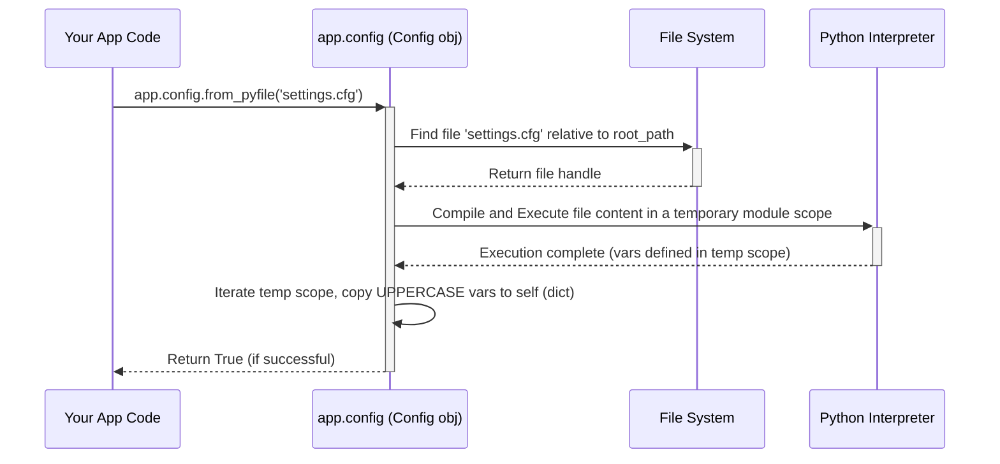

> 이 튜토리얼은 AI가 생성했습니다! 자세한 내용은 [AI 코드베이스 지식 빌더](https://github.com/The-Pocket/Tutorial-Codebase-Knowledge)를 참조하세요.

# 6장. 설정(Config)

*    5장(컨텍스트 전역 변수)에서 우리는 Flask가 `current_app`과 `session` 같은 컨텍스트 전역 변수를 어떻게 사용하는지 살펴보았습니다. 심지어 `session`을 사용하려면 애플리케이션 객체에 `SECRET_KEY`를 설정해야 한다는 것도 배웠습니다. 하지만 시크릿 키나 데이터베이스 연결 문자열, 디버깅 기능을 켜거나 끄는 플래그 같은 설정들은 어디에 두는 것이 가장 좋을까요?

*    이번 장에서는 Flask의 내장 솔루션인 **설정(Configuration)** 시스템을 소개합니다.

### 6.1 어떤 문제를 해결하나요? 설정 패널의 필요성

- 스테레오 앰프 같은 전자 장비를 만든다고 상상해보세요. 여기에는 볼륨, 베이스, 트레블, 입력 소스 선택기 같은 다양한 노브와 스위치가 있습니다. 이 컨트롤들은 장비를 열어서 재배선하지 않고도 앰프의 동작을 조정할 수 있게 해줍니다.

- 웹 애플리케이션도 동작을 제어하기 위한 설정이 필요합니다:
  *   **보안:** 안전한 세션을 위해 `SECRET_KEY`가 필요합니다.
  *   **디버깅:** 상세한 오류 메시지를 보여줄까요? (개발 시에는 유용하지만 프로덕션에서는 위험합니다)
  *   **데이터베이스:** 데이터베이스는 어디에 위치해 있나요? 로그인 자격 증명은 무엇인가요?
  *   **외부 서비스:** 이메일 전송이나 결제 처리 같은 서비스를 위한 API 키는 무엇인가요?

- 이런 값들을 뷰 함수나 애플리케이션 설정 코드에 직접 하드코딩하는 것은 지저분하고 유연성이 떨어집니다. 노트북에서 실제 서버로 앱을 배포할 때 데이터베이스 위치를 변경해야 한다면 코드를 찾아서 변경해야 합니다. 이는 오류가 발생하기 쉽고 다른 환경(개발, 테스트, 프로덕션)을 관리하기 어렵게 만듭니다.

- Flask는 일반적으로 `app.config`를 통해 접근하는 중앙 객체를 제공합니다. 
  - 이 객체는 애플리케이션의 주요 **설정 패널** 역할을 합니다. 
  - 이는 모든 설정 값을 저장할 수 있는 딕셔너리 같은 객체입니다. 
  - Flask 자체도 `DEBUG`나 `SECRET_KEY` 같은 자체 설정에 이 객체를 사용하며, 여기에 자신만의 커스텀 설정을 추가할 수도 있습니다. 
  - 중요한 것은 Flask가 설정을 코드와 분리하여 유지하기 위해 파일이나 환경 변수 같은 다양한 곳에서 이러한 설정을 편리하게 로드할 수 있는 방법을 제공한다는 점.

- 지금 당장 우리의 주요 사용 사례는 5장 에서 논의한 대로 `session` 객체를 안전하게 사용할 수 있도록 `SECRET_KEY`를 제대로 설정하는 것입니다.

### 6.2 `app.config` 만나기

Flask 애플리케이션 객체(`app = Flask(__name__)`)를 생성할 때, Flask는 자동으로 `app.config`로 접근할 수 있는 설정 객체를 생성합니다.

*   표준 Python 딕셔너리처럼 동작합니다: 키를 사용하여 값을 저장하고(`app.config['SECRET_KEY'] = '...'`), 검색할 수 있습니다(`key = app.config['SECRET_KEY']`).
*   키는 일반적으로 대문자 문자열입니다(예: `DEBUG`, `DATABASE_URI`). Flask의 내장 설정도 이 관례를 따르며, 자신의 설정에도 이를 따르는 것이 좋습니다.
*   일부 기본 값으로 미리 채워져 있습니다.
*   다양한 소스에서 설정을 로드하기 위한 특별한 메서드가 있습니다.

### 6.3 설정 채우기

* `app.config`에 설정을 추가하는 몇 가지 방법이 있습니다. 가장 일반적인 것들을 살펴보겠습니다.

1. 코드에서 직접 설정 (인플레이스)
    * 딕셔너리처럼 설정 값을 직접 설정할 수 있습니다. 이는 종종 `app` 객체를 생성한 직후에 수행됩니다.

```python
# hello.py (또는 메인 앱 파일)
from flask import Flask
import os

app = Flask(__name__)

# 설정 직접 지정
app.config['DEBUG'] = True # 디버그 모드 켜기
app.config['SECRET_KEY'] = os.urandom(24) # 간단한 개발용 랜덤 키 생성
app.config['MY_CUSTOM_SETTING'] = 'Hello Config!'

print(f"Debug mode is: {app.config['DEBUG']}")
print(f"My custom setting: {app.config.get('MY_CUSTOM_SETTING')}")
# 키가 존재하지 않을 수 있다면 .get()을 사용하는 것이 더 안전합니다
print(f"Another setting: {app.config.get('NON_EXISTENT_KEY', 'Default Value')}")

# ... 앱의 나머지 부분 (라우트 등) ...

# 설정에 접근하는 예제 라우트
@app.route('/config-example')
def config_example():
  custom_val = app.config.get('MY_CUSTOM_SETTING', 'Not set')
  return f'The custom setting is: {custom_val}'

if __name__ == '__main__':
  # app.run(debug=True) 인수도 app.config['DEBUG'] = True로 설정하지만
  # 명시적으로 설정하면 다른 방식으로 실행되더라도 설정이 보장됩니다.
  app.run()
```

**설명:**
*   `app.config`의 키에 값을 직접 할당합니다.
*   `os.urandom(24)`는 개발 중 사용하기에 적합한 랜덤 바이트 문자열을 생성합니다. **예측 가능한 시크릿 키를 절대 하드코딩하지 마세요, 특히 프로덕션에서!**
*   `[]`를 사용하거나 더 안전한 기본값을 제공할 수 있는 `.get()` 메서드를 사용하여 값에 접근할 수 있습니다.

**사용 시기:** 
- 개발 중 Flask의 내장 기본값(예: `DEBUG`)을 일시적으로 설정하거나 간단한 비밀스럽지 않은 값을 설정하는 데 좋습니다. 
- **비밀이나 복잡한 설정에는 이상적이지 않습니다**, 특히 배포 시에는 코드와 설정이 혼합됩니다.

2.Python 객체에서 로드 (`from_object`)
* 별도의 Python 객체(예: 클래스)나 전용 모듈(`.py` 파일)에 설정을 정의한 다음 `app.config.from_object()`를 사용하여 로드할 수 있습니다. 이 메서드는 이름이 **모두 대문자**인 속성만 로드합니다.

* 먼저, `config.py` 같은 설정 파일을 생성합니다:

```python
# config.py
# 참고: from_object에 의해 로드되는 것은 대문자 변수만입니다

DEBUG = True # 디버그 모드 설정
SECRET_KEY = 'a-very-secret-and-complex-key-loaded-from-object' # 실제 앱에서는 비밀 유지
DATABASE_URI = 'sqlite:///mydatabase.db'

# 이 소문자 변수는 app.config에 로드되지 않습니다
internal_value = 'ignore me'
```

* 이제 메인 애플리케이션 파일에서 로드합니다:

```python
# hello.py
from flask import Flask

app = Flask(__name__)

# config.py 파일에서 설정 로드 (문자열로 된 임포트 경로 사용)
app.config.from_object('config')
# 또는 모듈을 임포트했다면:
# import config
# app.config.from_object(config)

print(f"Loaded Debug: {app.config.get('DEBUG')}")
print(f"Loaded Secret Key: {app.config.get('SECRET_KEY')}")
print(f"Loaded DB URI: {app.config.get('DATABASE_URI')}")
print(f"Internal Value (should be None): {app.config.get('internal_value')}")

# ... 앱의 나머지 부분 ...
if __name__ == '__main__':
  app.run()
```

**설명:**
*   `app.config.from_object('config')`는 `config`라는 모듈(`config.py`에 해당)을 임포트하고 대문자 속성(`DEBUG`, `SECRET_KEY`, `DATABASE_URI`)을 찾으라고 Flask에 지시합니다.
*   이러한 대문자 속성의 값을 `app.config` 딕셔너리에 복사합니다.
*   `internal_value`는 소문자이므로 무시됩니다.

**사용 시기:** 
*   기본 설정이나 프로젝트 구조 내의 다른 설정(예: `DevelopmentConfig`, `ProductionConfig` 클래스)을 구성하는 데 좋습니다. 설정을 애플리케이션 로직과 분리하는 데 도움이 됩니다.

3.Python 파일에서 로드 (`from_pyfile`)
*   `from_object`와 유사하지만, `app.config.from_pyfile()`은 모듈을 임포트하는 대신 Python 파일(반드시 `.py`로 끝나지 않아도 되며, 관례적으로 `.cfg`가 종종 사용됨)을 실행하고 그 대문자 변수를 로드.

*   `settings.cfg` 같은 설정 파일을 생성합니다:

```python
# settings.cfg
# 이 파일은 Python에 의해 실행됩니다

SECRET_KEY = 'secret-key-loaded-from-pyfile'
SERVER_NAME = '127.0.0.1:5000' # 예제 설정

# 필요한 경우 간단한 로직도 가질 수 있습니다
import os
APP_ROOT = os.path.dirname(__file__)
```

*   애플리케이션에서 로드합니다:

```python
# hello.py
from flask import Flask
import os

app = Flask(__name__)

# 이 파일을 기준으로 설정 파일의 상대 경로 구성
# __file__은 현재 파이썬 스크립트(hello.py)의 경로입니다
# os.path.dirname은 hello.py를 포함하는 디렉토리를 가져옵니다
# os.path.join은 settings.cfg의 전체 경로를 생성합니다
config_file_path = os.path.join(os.path.dirname(__file__), 'settings.cfg')

# 파일에서 설정 로드
# 파일이 존재하지 않을 때 오류를 무시하려면 silent=True로 설정
loaded = app.config.from_pyfile(config_file_path, silent=False)

if loaded:
    print("Loaded config from settings.cfg")
    print(f"Loaded Secret Key: {app.config.get('SECRET_KEY')}")
    print(f"Loaded Server Name: {app.config.get('SERVER_NAME')}")
    print(f"Calculated APP_ROOT: {app.config.get('APP_ROOT')}")
else:
    print("Could not load settings.cfg")

# ... 앱의 나머지 부분 ...
if __name__ == '__main__':
  app.run()
```

**설명:**
*   `app.config.from_pyfile('settings.cfg')`는 지정된 파일을 읽고, 이를 Python 코드로 실행하고, 대문자 변수를 `app.config`에 로드합니다.
*   이를 통해 설정 파일이 단순한 변수 할당뿐만 아니라 필요한 경우 기본 Python 로직도 포함할 수 있습니다.
*   `silent=True` 인수는 설정 파일이 선택적인 경우 유용합니다.

**사용 시기:** 
* 매우 유연합니다. 애플리케이션 패키지에서 설정을 완전히 분리하는 데 좋습니다. 종종 특정 배포를 위한 인스턴스별 설정(특정 배포를 위한 설정)에 사용됩니다.

4.환경 변수에서 로드 (`from_envvar`)
*   이는 특히 프로덕션 배포에 일반적인 패턴입니다. 구성 파일의 경로를 하드코딩하는 대신, 경로를 환경 변수에 저장합니다. `app.config.from_envvar()`은 지정된 환경 변수에서 파일 이름을 읽은 다음 `from_pyfile`을 사용하여 해당 파일을 로드합니다.

* 이전 예제의 `settings.cfg`가 있다고 상상해보세요.

* 앱을 실행하기 전에 터미널에서 환경 변수를 설정합니다:
    *   **Linux/macOS:** `export YOURAPP_SETTINGS=/path/to/your/settings.cfg`
    *   **Windows (cmd):** `set YOURAPP_SETTINGS=C:\path\to\your\settings.cfg`
    *   **Windows (PowerShell):** `$env:YOURAPP_SETTINGS="C:\path\to\your\settings.cfg"`

*   그런 다음 코드에서:

```python
# hello.py
from flask import Flask

app = Flask(__name__)

# YOURAPP_SETTINGS 환경 변수로 지정된 파일에서 설정 로드
# 환경 변수가 설정되지 않았더라도 앱이 실행되도록 silent=True 설정
loaded = app.config.from_envvar('YOURAPP_SETTINGS', silent=True)

if loaded:
    print(f"Loaded config from file specified in YOURAPP_SETTINGS: {app.config.get('SECRET_KEY')}")
else:
    print("YOURAPP_SETTINGS environment variable not set or file not found.")
    # 여기서 기본 설정을 설정하거나 오류를 발생시킬 수 있습니다

# ... 앱의 나머지 부분 ...
if __name__ == '__main__':
  app.run()
```

**설명:**
*   `app.config.from_envvar('YOURAPP_SETTINGS')`는 `YOURAPP_SETTINGS` 환경 변수를 찾습니다.
*   찾으면 값(예: `/path/to/your/settings.cfg` 같은 파일 경로여야 함)을 가져와 `from_pyfile()`을 사용하여 해당 파일을 로드합니다.
*   이는 구성 파일의 *위치*를 애플리케이션 코드와 분리합니다.

**사용 시기:** 
* 프로덕션 및 배포에 탁월합니다. 
* 운영자가 애플리케이션 코드를 수정하지 않고도 구성 파일 위치를 지정할 수 있게 합니다. 구성 파일이 다른 위치에 있거나 다른 값(특히 비밀)을 포함할 수 있는 다른 환경(개발, 스테이징, 프로덕션)을 관리하는 데 필수적입니다.

### 6.4 로드 순서 및 재정의
*   여러 로드 방법을 사용할 수 있습니다. 각 후속 메서드는 키가 동일한 경우 이전 메서드에 의해 설정된 값을 **재정의**합니다.

*   일반적인 패턴은 다음과 같습니다:
1.  `app.config`에 직접 기본값을 설정하거나 `from_object`를 사용하여 기본 `config.py`에서 로드.
2.  `from_pyfile` 또는 `from_envvar`을 사용하여 인스턴스별 파일(예: `settings.cfg`)에서 설정을 로드합니다. 이를 통해 데이터베이스 URL이나 시크릿 키 같은 배포별 설정이 기본값을 재정의 가능.

```python
# hello.py
from flask import Flask
import os

app = Flask(__name__)

# 1. 내장 기본값을 설정할까요? 또는 기본 설정 객체에서 로드합니다.
app.config['DEBUG'] = False # 안전을 위해 기본적으로 False
app.config['SECRET_KEY'] = 'default-insecure-key' # 기본적으로 안전하지 않은 키

# 여기서 객체에서 더 많은 기본값을 로드할 수 있습니다:
# app.config.from_object('yourapp.default_config')

# 2. 배포별 파일을 가리키는 환경 변수에서 로드 시도
config_file_path = os.environ.get('YOURAPP_SETTINGS')
if config_file_path:
    try:
        app.config.from_pyfile(config_file_path)
        print(f"Loaded overrides from {config_file_path}")
    except OSError as e:
        print(f"Warning: Could not load config file {config_file_path}: {e}")
else:
    print("Info: YOURAPP_SETTINGS environment variable not set, using defaults.")


print(f"Final Debug value: {app.config['DEBUG']}")
print(f"Final Secret Key: {app.config['SECRET_KEY']}")

# ... 앱의 나머지 부분 ...
if __name__ == '__main__':
  app.run()
```

*   이제 `YOURAPP_SETTINGS`가 `DEBUG = True`와 다른 `SECRET_KEY`를 포함하는 파일을 가리키면, 그 값들이 이전에 설정된 기본값을 재정의합니다.

### 6.5 설정 값 접근
*   일단 로드되면, 애플리케이션 객체(`app`) 또는 `current_app` 프록시(요청 또는 애플리케이션 컨텍스트 내에서)에 접근할 수 있는 곳 어디에서나 설정 값에 접근할 수 있습니다.

```python
from flask import current_app, session

# 뷰 함수 또는 다른 요청-컨텍스트 코드 내부:
@app.route('/some-route')
def some_view():
    # current_app 프록시 사용
    api_key = current_app.config.get('MY_API_KEY')
    if not api_key:
        return "Error: API Key not configured!", 500

    # Flask 확장도 종종 app.config를 사용합니다
    session['user_id'] = 123 # 암시적으로 current_app.config['SECRET_KEY']를 사용합니다
    
    # ... api_key 사용 ...
    return f"Using API Key starting with: {api_key[:5]}..."

# 요청 컨텍스트 외부에서 접근(예: 설정 코드)
# app 객체 직접 또는 앱 컨텍스트 필요
with app.app_context():
    print(f"Accessing SECRET_KEY via current_app: {current_app.config['SECRET_KEY']}")

# 또는 사용 가능한 경우 app 객체를 통해 직접
print(f"Accessing SECRET_KEY via app: {app.config['SECRET_KEY']}")
```

### 6.6 내부 동작: `Config` 객체
1.  **`app.config` 객체:** 
*   `Flask(__name__)`를 생성할 때, `Flask` 생성자는 `app.config_class`(기본값은 `flask.Config`)의 인스턴스를 생성하여 `app.config`에 할당합니다. 
*   생성자는 애플리케이션의 `root_path`와 `default_config` 딕셔너리를 전달합니다. (`app.py`의 `Flask.__init__`에서 `self.make_config`를 호출하는 것을 참조하세요. 이는 `sansio/app.py`에 정의된 `self.config_class`를 사용합니다).
2.  **`Config` 클래스:** 
*   `flask.Config` 클래스(`config.py`에 있음)는 Python의 내장 `dict`에서 직접 상속. 
*   이것이 `[]`, `.get()`, `.update()` 같은 표준 딕셔너리 메서드를 사용할 수 있는 이유.
3.    **로드 메서드:**
*   `from_object(obj)`: 
    * `obj`가 문자열이면 `werkzeug.utils.import_string`을 사용하여 임포트. 
    *   그런 다음 객체의 속성(`dir(obj)`)을 반복하고 이름이 모두 대문자인 속성을 구성 딕셔너리(`self[key] = getattr(obj, key)`)에 복사합니다.
*   `from_pyfile(filename)`: 
    * `os.path.join(self.root_path, filename)`을 사용하여 파일의 전체 경로를 구성합니다. 
    * 임시 모듈 객체(`types.ModuleType`)를 생성합니다. 
    * 파일을 열고 읽고, 내용을 컴파일(`compile()`)한 다음, 임시 모듈의 딕셔너리(`exec(..., d.__dict__)`) 내에서 실행합니다. 
    * 마지막으로, 대문자 변수를 로드하기 위해 임시 모듈 객체에서 `self.from_object()`를 호출.
*   `from_envvar(variable_name)`: 
    * 단순히 환경 변수(`os.environ.get(variable_name)`)를 읽습니다. 
    * 변수가 존재하고 비어 있지 않으면, 환경 변수의 값을 파일 이름으로 사용하여 `self.from_pyfile()`을 호출.

### 6.7 `from_pyfile`에 대한 단순화된 다이어그램
<br>



* 핵심 요점은 `app.config`가 기본적으로 Python 딕셔너리이며, Python 객체, 파일, 환경 변수 같은 일반적인 구성 소스에서 자신을 채우기 위한 편리한 메서드로 향상되어 있으며, 대문자 키를 필터링한다는 것입니다.

### 6.8 결론

* 설정은 사소하지 않은 모든 Flask 애플리케이션에 필수적입니다. `app.config` 객체는 모든 애플리케이션 설정을 위한 중앙 집중식 딕셔너리 같은 저장소를 제공합니다.

*   우리는 설정이 `SECRET_KEY`, `DEBUG`, 데이터베이스 URL 같은 설정을 애플리케이션 코드와 분리하는 데 도움이 된다는 것을 배웠습니다.
*   `app.config`는 딕셔너리처럼 동작하는 중앙 객체입니다.
*   우리는 설정을 로드하는 다양한 방법을 살펴보았습니다: 코드에서 직접, Python 객체에서(`from_object`), Python 파일에서(`from_pyfile`), 그리고 파일을 가리키는 환경 변수를 통해(`from_envvar`).
*   로드 순서가 중요하며, 배포별 설정이 기본값을 재정의할 수 있게 합니다.
*   설정은 `app.config` 또는 `current_app.config`를 사용하여 접근할 수 있습니다.


이제 우리는 애플리케이션 객체, 라우팅, 요청/응답 처리, 템플릿, 컨텍스트 전역 변수 및 설정 같은 주요 빌딩 블록을 다루었습니다. 여러분은 그 컨텍스트 전역 변수들(`request`, `current_app` 등) 뒤의 "마법"에 대해 궁금해할지도 모릅니다. Flask는 특히 여러 요청을 처리할 때 그들의 상태를 어떻게 관리할까요? 컨텍스트의 메커니즘을 더 깊이 파고들어 봅시다.
