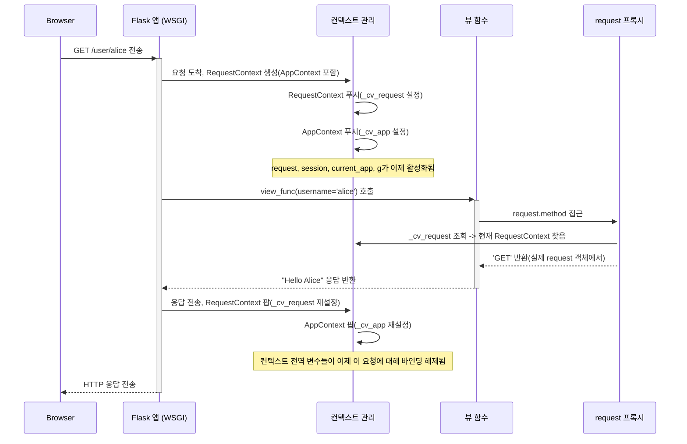

> 이 튜토리얼은 AI가 생성했습니다! 자세한 내용은 [AI 코드베이스 지식 빌더](https://github.com/The-Pocket/Tutorial-Codebase-Knowledge)를 참조하세요.

# 7장: 애플리케이션 컨텍스트와 요청 컨텍스트

*   6장: 설정(Config)에서는 `app.config` 객체를 사용해 Flask 애플리케이션의 설정을 관리하는 방법을 배웠습니다. 그리고 5장: 컨텍스트 전역 변수(`current_app`, `request`, `session`, `g`)에서는 `request`나 `current_app` 같은 특별한 변수들을 만났는데, 이 변수들은 마법처럼 현재 요청이나 애플리케이션에 대한 정보를 알고 있었죠.

*   하지만 Flask는 어떻게 여러 사용자가 동시에 웹 앱에 접근할 때 어떤 요청이 어떤 것인지 추적할까요? 사용자 A를 처리할 때는 `request`가 사용자 A의 요청을 가리키고, 사용자 B를 처리할 때는 사용자 B의 요청을 가리키도록 어떻게 보장할까요? 이 마법은 **애플리케이션 컨텍스트와 요청 컨텍스트**에 의해 관리됩니다.

### 7.1 어떤 문제를 해결하나요? 분리해서 관리하기

*   바쁜 서비스 데스크에서 일한다고 상상해보세요. 많은 사람들이 동시에 다른 요청을 하며 접근합니다. 각 사람의 요청과 관련 정보를 다른 사람들과 분리해서 관리할 방법이 필요합니다. 모든 사람을 위해 공유된 하나의 메모장을 사용할 수는 없죠 - 그건 혼란스러울 겁니다! 대신 각 사람을 도울 때 그 사람의 특정 문서와 세부 정보를 보관할 임시 폴더나 작업 공간을 만들 것입니다.

*   웹 애플리케이션에서 Flask 서버는 동시에 여러 다른 사용자의 요청을 처리할 수 있습니다. 각 요청은 자신만의 데이터(예: 폼 제출이나 URL 매개변수)와 사용자 세션을 가집니다. 이 정보를 Python 코드의 단순한 전역 변수에 저장하면 한 요청의 데이터가 다른 요청의 데이터를 덮어쓰거나 간섭할 수 있어 재앙적일 수 있습니다.

* Flask는 이 문제를 해결하기 위해 **컨텍스트**를 사용합니다. 컨텍스트는 임시적이고 격리된 작업 공간처럼 작동합니다. `request`, `session`, `current_app`, `g` 같은 변수들이 Flask가 현재 작업 중인 *특정 작업*(일반적으로 들어오는 하나의 웹 요청 처리)과 관련된 정보를 항상 가리키도록 보장합니다.

### 7.2 두 가지 주요 컨텍스트 유형
1.  **애플리케이션 컨텍스트(`AppContext`):**
    *   **비유:** 메인 오피스 건물이나 전체 프로젝트 작업 공간이라고 생각하세요.
    *   **목적:** 특정 웹 요청과 관계없이 애플리케이션 인스턴스 자체와 관련된 정보를 보관합니다. `current_app` 프록시(당신의 `Flask` 앱 인스턴스를 가리킴)와 `g` 프록시(임시 저장 공간)를 바인딩.
    *   **언제 활성화되나요?** 웹 요청 *동안* 자동으로 활성화됩니다. 웹 요청 *외부*에서도 애플리케이션에 접근해야 하는 작업(예: CLI 명령어 실행이나 백그라운드 작업)에도 필요합니다.

2.  **요청 컨텍스트(`RequestContext`):**
    *   **비유:** 하나의 클라이언트 요청(들어오는 하나의 웹 요청)을 처리하기 위해 설정된 특정 회의실.
    *   **목적:** *들어오는 하나의 웹 요청*과 관련된 특정 정보를 보관합니다. `request` 프록시(HTTP 요청의 세부 정보 포함)와 `session` 프록시(사용자별 세션 데이터용)를 바인딩합니다.
    *   **언제 활성화되나요?** 웹 요청이 들어오면 Flask가 자동으로 Request Context를 생성하고 활성화하며, 요청이 처리된 후 제거합니다.
    *   **관계:** Request Context는 항상 그 안에 Application Context를 포함합니다. 메인 오피스 건물(`AppContext`) 안에 있지 않고서는 회의실(`RequestContext`)을 가질 수 없습니다.

3. 간단한 요약:

    | 컨텍스트 유형      | 비유                  | 바인딩된 주요 전역 변수 | 일반적인 사용 사례                     | 수명                                        |
    | :---------------- | :------------------- | :---------------- | :----------------------------------- | :---------------------------------------------- |
    | 애플리케이션       | 메인 오피스 건물 | `current_app`, `g`  | CLI 명령어, 백그라운드 작업 | 요청 중에 활성화되거나 수동으로 활성화됨 |
    | 요청           | 임시 회의실 | `request`, `session` | 단일 웹 요청 처리      | 각 웹 요청마다 생성/제거됨        |

### 7.3 Flask가 자동으로 컨텍스트를 사용하는 방법 (요청 중)

*   대부분의 경우 컨텍스트를 수동으로 관리할 필요가 없습니다. 브라우저가 Flask 애플리케이션에 요청을 보낼 때:

1.  **요청 도착:** 
* WSGI 서버(Flask 개발 서버 같은)가 HTTP 요청을 받습니다.
2.  **컨텍스트 생성:** 
* Flask는 들어오는 요청 세부 사항(WSGI 환경)을 기반으로 `RequestContext` 객체를 생성합니다.
3.  **컨텍스트 푸시:** Flask는 이 `RequestContext`를 푸시합니다. 이는 두 가지 작업을 수행
    *   `request`와 `session` 프록시가 이 요청과 세션 객체를 가리키도록 합니다.
    *   또한 `AppContext`를 푸시합니다(이 스레드/태스크에 대해 이미 활성화된 것이 없다면), `current_app`과 `g`가 올바른 애플리케이션과 새로운 `g` 객체를 가리키도록 합니다. "푸시"는 임시 작업 공간을 활성화하는 것과 같습니다.
4.  **코드 실행:** 
    *   뷰 함수가 실행됩니다. 컨텍스트가 활성화되어 있기 때문에 함수 내에서 자유롭게 `request`, `session`, `current_app`, `g`를 사용할 수 있으며, 이들은 현재 요청에 대한 올바른 객체를 참조.
5.  **응답 전송:** 
    *   뷰 함수가 응답을 반환합니다.
6.  **컨텍스트 팝:** 
    *   응답이 전송된 후 Flask는 `RequestContext`(와 함께 푸시된 `AppContext`도)를 *팝*합니다. 이는 작업 공간을 정리하여 해당 요청에 대한 특정 `request`, `session`, `g` 객체를 비활성화합니다.

*   이 자동 푸시/팝 메커니즘은 각 요청이 자체적으로 격리된 컨텍스트에서 처리되도록 보장하여 동시 요청 간의 데이터 충돌을 방지합니다.

### 7.4 컨텍스트 수동으로 푸시하기 (요청 외부)

*   일반적인 웹 요청 외부에서 애플리케이션 설정이나 리소스에 접근해야 한다면 어떻게 해야 할까요? 
*   예를 들어 `app.config`에 저장된 구성을 사용해 데이터베이스를 초기화하는 별도의 Python 스크립트(`init_db.py`)가 있다고 가정해봅시다. 들어오는 웹 요청이 없기 때문에 Flask는 자동으로 컨텍스트를 생성하지 않습니다.

*   이런 경우에는 `app.app_context()`를 사용해 **애플리케이션 컨텍스트**를 수동으로 푸시해야 합니다.

```python
# init_db.py (명령줄에서 실행할 예제 스크립트)

from flask import Flask

# 메인 Flask 앱 객체가 hello.py에 정의되어 있다고 가정합니다.
# 여기서 가져와야 합니다.
# 실제 프로젝트에서는 팩토리 함수를 사용하는 등 더 나은 구조를 사용할 것입니다.
try:
    # hello.py에 app = Flask(__name__)이 있다고 가정합니다.
    from hello import app
except ImportError:
    print("hello.py에서 'app'을 가져올 수 없습니다.")
    print("hello.py가 존재하고 Flask 앱을 정의하는지 확인하세요.")
    exit(1)

# 앱 접근이 필요한 함수 정의
def setup_database():
    # current_app.config에 접근하려면 애플리케이션 컨텍스트가 필요합니다.
    # 'with' 블록 없으면 current_app을 여기서 사용할 수 없습니다.
    with app.app_context():
        # 이제 current_app을 통해 앱 설정에 안전하게 접근할 수 있습니다.
        db_uri = app.config.get('DATABASE_URI', 'DB URI가 설정되지 않았습니다!')
        print(f"앱 컨텍스트 내부: 설정에 접근 중...")
        print(f"데이터베이스 URI 발견: {db_uri}")
        # URI를 사용하는 데이터베이스 설정 코드를 상상해보세요.
        print("여기서 데이터베이스 초기화 로직이 실행됩니다.")

# ---- 스크립트의 메인 실행 부분 ----
if __name__ == "__main__":
    print("데이터베이스 설정 스크립트 실행 중...")
    setup_database()
    print("스크립트 완료.")

```

**설명:**
*   `from hello import app`: 실제 `Flask` 애플리케이션 인스턴스를 가져옵니다.
*   `with app.app_context():`: 핵심 부분입니다! `app` 인스턴스에 대한 애플리케이션 컨텍스트를 생성하고 푸시하여 `with` 블록 내에서 활성화합니다.
*   블록 내부에서 `current_app`은 사용 가능해지며 우리의 `app` 객체를 올바르게 가리킵니다. 이제 `current_app.config`에 안전하게 접근할 수 있습니다.
*   `with` 블록이 종료되면 애플리케이션 컨텍스트가 자동으로 팝됩니다.

**실행 방법(`hello.py`가 존재하고 `app`을 정의한다고 가정):**
1.  위 코드를 `hello.py`와 같은 디렉터리에 `init_db.py`로 저장합니다.
2.  선택적으로 `hello.py`에 `app.config['DATABASE_URI'] = 'sqlite:///mydatabase.db'`를 추가하여 인식되는지 확인합니다.
3.  터미널에서 실행: `python init_db.py`
4.  컨텍스트 내부에서 설정이 성공적으로 접근된 것을 보여주는 출력을 볼 수 있습니다.

*   마찬가지로 `request`에 의존하는 헬퍼 함수를 테스트하기 위해 요청 환경을 시뮬레이션해야 한다면 `app.test_request_context()`를 사용할 수 있습니다. 이는 요청 컨텍스트와 애플리케이션 컨텍스트를 모두 푸시합니다.

```python
# example_test_context.py
from hello import app # hello.py에 app = Flask(__name__)이 정의되어 있다고 가정합니다.

# 뷰 내부에서 사용될 수 있는 헬퍼 함수
def get_user_agent_info():
    # 이 함수는 'request' 컨텍스트 전역에 의존합니다.
    from flask import request
    user_agent = request.headers.get('User-Agent', '알 수 없음')
    return f"요청 출처: {user_agent}"

# --- 실제 요청 외부에서 함수 호출 시뮬레이션 ---
if __name__ == "__main__":
    # '/'에 대한 가짜 GET 요청을 위한 테스트 요청 컨텍스트 생성
    # 이는 요청 컨텍스트와 앱 컨텍스트를 모두 푸시합니다.
    with app.test_request_context('/', method='GET'):
        # 이제 이 블록 내부에서 'request'를 사용할 수 있습니다!
        print("테스트 요청 컨텍스트 내부...")
        agent_info = get_user_agent_info()
        print(agent_info)

    print("컨텍스트 외부.")
    # 여기서 get_user_agent_info()를 호출하면 요청 컨텍스트가 팝되었기 때문에 실패합니다.
```

### 7.5 내부 동작: 컨텍스트 로컬과 스택

*   Flask는 실제로 어떻게 이러한 컨텍스트를 관리하고 `request` 같은 전역 변수들이 올바른 객체를 가리키도록 할까요?

*   역사적으로 Flask는 스레드-로컬 저장소를 사용하고 각 스레드에 대한 컨텍스트 스택을 유지했습니다. `request`에 접근할 때 현재 스레드에 대한 요청 컨텍스트 스택의 상단을 확인했습니다.

*   최신 Flask(핵심 종속성인 Werkzeug의 업데이트 활용)는 Python의 내장 `contextvars` 모듈에 의존합니다. 이 모듈은 스레드와 현대적인 비동기 프로그래밍(예: `async`/`await`) 모두와 올바르게 작동하는 컨텍스트-특정 상태를 관리하는 더 강력한 방법을 제공합니다.

간단한 개념적 아이디어는 다음과 같습니다:

1.  **컨텍스트 변수:** 
    *   Flask는 애플리케이션 컨텍스트(`_cv_app`)와 요청 컨텍스트(`_cv_request`)에 대한 특별한 "컨텍스트 변수"(`contextvars.ContextVar` 사용)를 정의합니다. 이는 현재 실행 컨텍스트(처리 중인 특정 요청)에 따라 다른 값을 보유할 수 있는 특별한 슬롯과 같습니다.
2.  **푸시:** 
    *   Flask가 컨텍스트를 푸시할 때(예: `RequestContext.push()`), 실제 컨텍스트 객체(예: 현재 요청에 대한 `RequestContext` 인스턴스)를 해당 컨텍스트 변수(`_cv_request.set(the_request_context)`)에 저장합니다.
3.  **프록시:** 
    *   컨텍스트 전역 변수(`request`, `session`, `current_app`, `g`)는 Werkzeug의 특별한 `LocalProxy` 객체입니다. 직접 데이터를 보유하지 않습니다.
4.  **프록시 접근:** 
    *   `request.args` 같은 것에 접근할 때 `request` 프록시는 다음을 수행합니다:
        *   현재 활성화된 요청에 대한 *실제* `RequestContext` 객체를 제공하는 `_cv_request` 컨텍스트 변수의 *현재* 값을 조회합니다.
        *   해당 `RequestContext` 내부에 저장된 실제 `request` 객체를 검색합니다.
        *   마지막으로 실제 요청 객체의 `.args` 속성에 접근합니다.
5.  **팝:** 
    *   Flask가 컨텍스트를 팝할 때(예: `RequestContext.pop()`), 컨텍스트 변수(`_cv_request.reset(token)`)를 재설정하여 현재 컨텍스트에 대한 해당 슬롯을 효과적으로 지움.

*   이 `contextvars` 메커니즘은 서버가 동시에 많은 요청을 처리하더라도(다른 스레드나 비동기 작업에서) 각 작업이 `_cv_app`과 `_cv_request`에 대해 자신만의 격리된 값을 가지므로 프록시가 항상 현재 작업에 대한 올바른 객체를 확인하도록 보장합니다.

### 7.6 컨텍스트와 함께하는 요청 생명주기 시각화
<br>



*   이 다이어그램은 Flask가 뷰를 호출하기 전에 컨텍스트를 설정(푸시)하고 코드 실행 후 해제(팝)하여 `request` 같은 프록시가 코드 실행 중에 올바른 데이터를 찾을 수 있도록 하는 것을 보여줍니다.

### 7.7 결론
컨텍스트는 애플리케이션과 개별 요청의 생명주기 동안 Flask가 상태를 관리하는 방식의 기본입니다. 서로 다른 요청의 데이터가 간섭하지 않도록 격리된 작업 공간을 제공합니다.

*   **애플리케이션 컨텍스트(`AppContext`):** 
    * 애플리케이션(`current_app`)과 전역 저장소(`g`)에 대한 접근을 제공합니다. 요청 중에 암묵적으로 사용되며 CLI 명령어 같은 작업을 위해 `app.app_context()`를 통해 수동으로 사용됩니다.
*   **요청 컨텍스트(`RequestContext`):** 
    * 요청-특정 데이터(`request`)와 사용자 세션(`session`)에 대한 접근을 제공합니다. 웹 요청 주기 동안 Flask에 의해 자동으로 관리됩니다. `AppContext`를 포함합니다.
*   **컨텍스트 전역 변수:** 
    * `request`와 `current_app` 같은 프록시는 현재 활성화된 컨텍스트에 의존하여 올바른 객체를 찾습니다.
*   **관리:** 
    * Flask는 일반적으로 웹 요청에 대한 컨텍스트 푸시/팝을 자동으로 처리합니다. 스크립트, 백그라운드 작업, 테스트 같은 특정 시나리오에는 수동 푸시(`app.app_context()`, `app.test_request_context()`)가 필요합니다.

컨텍스트를 이해하면 Flask가 어떻게 전역 변수를 통해 요청과 애플리케이션 데이터에 편리하게 접근할 수 있도록 하면서도 동시 작업 간의 안전성과 격리를 유지하는지 설명하는 데 도움이 됩니다.

이제 Flask가 코어 애플리케이션을 위한 상태와 구성을 어떻게 관리하는지 이해했으니, 여러 섹션이나 기능을 가진 더 큰 애플리케이션을 어떻게 구성할까요? 그게 바로 Blueprints가 등장하는 때입니다.