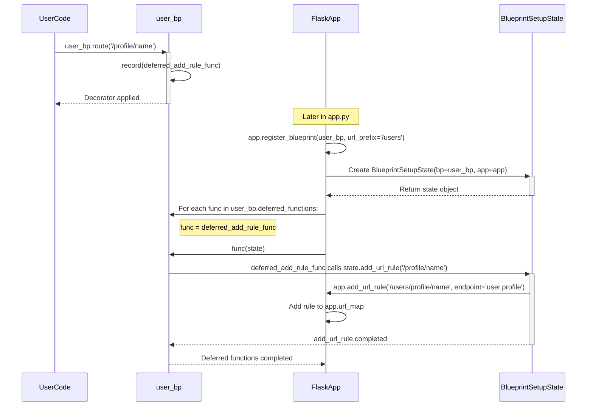

> 이 튜토리얼은 AI가 생성했습니다! 자세한 내용은 [AI 코드베이스 지식 빌더](https://github.com/The-Pocket/Tutorial-Codebase-Knowledge)를 참조하세요.

# 8장: 블루프린트(Blueprints)

*   7장: 애플리케이션과 요청 컨텍스트 에서는 Flask의 컨텍스트 시스템 뒤에 숨은 "마법"을 탐구하며, 여러 동시 요청이 있을 때도 `request`와 `current_app` 같은 변수들이 어떻게 안정적으로 작동하는지 이해.

*   이제 여러분의 간단한 "Hello, World!" 애플리케이션이 점점 커진다고 상상해보세요. 사용자 프로필, 관리자 섹션, 블로그 등을 추가하게 됩니다. 모든 라우트, 뷰 함수, 관련 로직을 하나의 파이썬 파일(예: `hello.py`)에 넣는 것은 금방 지저분해지고 관리하기 어려워집니다. 어떻게 하면 성장하는 Flask 애플리케이션을 더 작고 관리하기 쉬운 조각으로 조직할 수 있을까요?

바로 **블루프린트(Blueprints)**가 해결책입니다!

### 8.1 블루프린트가 해결하는 문제: 성장하는 집 정리하기

*   집을 짓는 것을 생각해보세요. 부엌, 화장실, 침실을 모두 한데 뒤섞어서 지으려 하지 않을 겁니다. 대신 각 섹션마다 별도의 계획이나 사전 제작된 모듈을 사용할 수 있습니다. 부엌 모듈은 특정 배관과 전기 배선이 필요하고, 화장실은 고정 장치가 필요하죠. 이 모듈들이 준비되면 집의 주요 구조에 조립합니다.

*   마찬가지로 Flask 애플리케이션이 커지면 관련 기능들을 함께 묶고 싶어질 것입니다. 예를 들어:

    *   사용자 인증과 관련된 모든 라우트(`/login`, `/logout`, `/register`)
    *   관리자 제어판을 위한 모든 라우트(`/admin/dashboard`, `/admin/users`)
    *   공개 블로그를 위한 모든 라우트(`/blog`, `/blog/<post_slug>`)

*   이 모든 것을 하나의 파일에서 관리하려고 하면 다음과 같은 문제가 발생합니다:
    *   **혼란스러움:** 주요 애플리케이션 파일이 너무 커져서 탐색하기 어려워집니다.
    *   **혼동:** 어떤 라우트가 어떤 기능에 속하는지 파악하기 어렵습니다.
    *   **재사용성 저하:** 다른 프로젝트에서 "블로그" 부분만 재사용하고 싶어도 해당 코드만 추출하기 어렵움.

*   **블루프린트**는 Flask가 제공하는 해결책입니다. 라우트, 뷰 함수, 템플릿, 정적 파일의 컬렉션을 별도의 모듈로 정의할 수 있게 해줍니다. 이 모듈들을 독립적으로 개발한 후 주요 Flask 애플리케이션에 "등록"할 수 있으며, 여러 번 또는 다른 URL 접두사 아래에 등록할 수도 있습니다.

블루프린트는 **집의 사전 제작된 섹션**과 같습니다. "사용자 인증 모듈"(블루프린트)을 별도로 구축한 다음 주요 애플리케이션 구조에 연결합니다.

### 8.2 간단한 블루프린트 생성 및 사용하기

이제 실제로 어떻게 작동하는지 살펴보겠습니다. 사용자 관련 페이지를 위한 별도의 섹션을 만들고 싶다고 가정.

1.  **블루프린트 객체 생성:** 
    -   `@app.route()` 대신 먼저 `Blueprint` 객체를 생성합니다.
2.  **블루프린트에 라우트 정의:** 
    -   `@bp.route()` 같은 데코레이터를 사용하여 블루프린트 내부에 라우트를 정의합니다(`bp`는 블루프린트 객체).
3.  **애플리케이션에 블루프린트 등록:** 
    -   주요 애플리케이션 파일에서 Flask `app` 객체에 `app.register_blueprint()`를 사용해 블루프린트를 알립니다.

*   프로젝트 구조를 다음과 같이 구성합니다. 주요 `app.py`와 사용자 라우트를 위한 별도의 파일(예: `blueprints` 폴더 내부)을 가집니다:

```
yourproject/
├── app.py              # 주요 Flask 애플리케이션 설정
├── blueprints/
│   └── __init__.py     # 'blueprints'를 파이썬 패키지로 만듦(비어 있을 수 있음)
│   └── user.py         # 사용자 블루프린트 라우트
└── templates/
    └── user/
        └── profile.html # 사용자 프로필을 위한 템플릿
```


**1 & 2단계: 블루프린트 정의(`blueprints/user.py`)**

```python
# blueprints/user.py
from flask import Blueprint, render_template, abort

# 1. 블루프린트 객체 생성
# 'user'는 블루프린트의 이름. Flask 내부적으로 사용됩니다.
# __name__은 블루프린트의 리소스(예: 템플릿) 위치를 찾는 데 도움을 줍니다.
# template_folder는 이 블루프린트의 템플릿을 찾을 위치를 지정합니다.
user_bp = Blueprint('user', __name__, template_folder='../templates/user')

# 샘플 사용자 데이터(실제 앱에서는 데이터베이스 로직으로 대체)
users = {
    "alice": {"name": "Alice", "email": "alice@example.com"},
    "bob": {"name": "Bob", "email": "bob@example.com"},
}

# 2. @user_bp.route()를 사용해 블루프린트에 라우트 정의
@user_bp.route('/profile/<username>')
def profile(username):
  user_info = users.get(username)
  if not user_info:
    abort(404) # 사용자를 찾을 수 없음
  # 참고: render_template은 이제 'templates/user/'를 먼저 찾습니다.
  # Blueprint()에서 template_folder='../templates/user'로 지정했기 때문
  return render_template('profile.html', user=user_info)

@user_bp.route('/')
def user_list():
    # 사용자 블루프린트 내의 간단한 뷰
    return f"사용자 목록: {', '.join(users.keys())}"
```

**설명:**
*   `from flask import Blueprint`: 
    *   `Blueprint` 클래스를 임포트합니다.
*   `user_bp = Blueprint('user', __name__, template_folder='../templates/user')`: 
    *   인스턴스를 생성합니다.
    *   `'user'`: 
        *   이 블루프린트의 이름. 나중에 URL 생성(`url_for`)에 사용됩니다.
    *   `__name__`: 
        *   주요 `Flask` 앱 객체와 유사하게 블루프린트의 루트 경로를 결정하는 데 도움을 줍니다([1장](01_application_object___flask__.md) 참조).
    *   `template_folder='../templates/user'`: 
        *   이 블루프린트의 특정 템플릿이 `user.py`에 상대적으로 어디에 위치하는지 알려줍니다.
*   `@user_bp.route(...)`: 
    *   주요 `app` 객체가 아닌 블루프린트 객체를 사용해 라우트를 정의합니다.

**3단계: 블루프린트 등록(`app.py`)**

*   이제 주요 Flask 애플리케이션에 이 블루프린트를 알려야 합니다.

```python
# app.py
from flask import Flask
from blueprints.user import user_bp # 블루프린트 객체 임포트

app = Flask(__name__)
# 여기에 6장에서 배운 SECRET_KEY 같은 다른 설정이 있을 수 있음
# app.config['SECRET_KEY'] = 'your secret key'

# 주요 애플리케이션에 블루프린트 등록
# 여기에 url_prefix를 추가할 수 있습니다!
app.register_blueprint(user_bp, url_prefix='/users')

# 앱에 직접 간단한 홈페이지 라우트 추가
@app.route('/')
def home():
  return '주요 애플리케이션에 오신 것을 환영합니다!'

if __name__ == '__main__':
  app.run(debug=True)
```

**설명:**

*   `from blueprints.user import user_bp`: 
    *   `user.py`에서 생성한 `Blueprint` 인스턴스를 임포트합니다.
*   `app.register_blueprint(user_bp, url_prefix='/users')`: 이게 핵심 단계입니다.
    *   `app` 객체에게 `user_bp`에 정의된 모든 라우트를 포함하라고 지시합니다.
    *   `url_prefix='/users'`: 매우 유용합니다! `user_bp` 내부에 정의된 모든 라우트가 자동으로 `/users` 접두사를 갖게 됩니다.
        *   `user.py`의 `/profile/<username>` 라우트는 `/users/profile/<username>`이 됩니다.
        *   `user.py`의 `/` 라우트는 `/users/`가 됩니다.

**템플릿(`templates/user/profile.html`)**

```html

<!-- templates/user/profile.html -->
<!doctype html>
<html>
<head><title>사용자 프로필</title></head>
<body>
  <h1>{{ user.name }}의 프로필</h1>
  <p>이메일: {{ user.email }}</p>
  <p><a href="{{ url_for('user.user_list') }}">사용자 목록으로 돌아가기</a></p>
  <p><a href="{{ url_for('home') }}">홈으로 돌아가기</a></p>
</body>
</html>

```

**실행 방법:**

1.  위와 같이 디렉토리 구조와 파일을 생성합니다.
2.  터미널에서 `python app.py`를 실행합니다.
3.  `http://127.0.0.1:5000/`을 방문합니다. "주요 애플리케이션에 오신 것을 환영합니다!"(`app.py`에서 처리)가 보일 겁니다.
4.  `http://127.0.0.1:5000/users/`를 방문합니다. "사용자 목록: alice, bob"(`user.py`에서 처리, `/` 라우트, `/users` 접두사)이 보일 겁니다.
5.  `http://127.0.0.1:5000/users/profile/alice`를 방문합니다. Alice의 프로필 페이지(`user.py`에서 처리, `/profile/<username>` 라우트, `/users` 접두사)가 보일 겁니다.
6.  `http://127.0.0.1:5000/users/profile/charlie`를 방문합니다. `user.py`의 `profile()`에서 처리한 대로 404 Not Found 오류가 발생할 겁니다.

블루프린트가 어떻게 사용자 관련 코드를 `blueprints/user.py`로 깔끔하게 분리하여 `app.py`를 깨끗하게 유지하는지 주목. `url_prefix`는 모든 사용자 라우트를 `/users/` 아래에 쉽게 그룹화.

### 8.3 `url_for`와 블루프린트로 URL 생성하기

라우트가 블루프린트에 정의되어 있을 때 `url_for`는 어떻게 작동할까요? 엔드포인트 이름 앞에 **블루프린트 이름**과 점(`.`)을 붙여야 합니다.

*   `profile.html` 템플릿을 다시 보세요:

    
    *   `{{ url_for('user.user_list') }}`: 
        *   `user` 블루프린트 내의 `user_list` 뷰 함수에 대한 URL을 생성합니다. `url_prefix='/users'` 때문에 `/users/`가 생성됩니다.
    *   `{{ url_for('user.profile', username='alice') }}`(파이썬에서 사용 시): 
        *   `/users/profile/alice`를 생성합니다.
    *   `{{ url_for('home') }}`: 
        *   블루프린트가 아닌 `app`에 직접 등록된 `home` 뷰 함수에 대한 URL을 생성합니다. `/`가 생성.

*   동일한 블루프린트 내의 엔드포인트에 대한 URL을 생성하는 경우 상대 링크를 위해 점 접두사를 사용:

```python
# blueprints/user.py 내부
from flask import url_for

@user_bp.route('/link-example')
def link_example():
    # 동일한 블루프린트('user') 내의 'profile' 엔드포인트에 대한 URL 생성
    alice_url = url_for('.profile', username='alice') # 점 접두사 주의!
    # alice_url은 '/users/profile/alice'가 됨

    # 주요 앱의 'home' 엔드포인트에 대한 URL 생성
    home_url = url_for('home') # 앱 라우트에는 점이 필요 없음
    # home_url은 '/'가 됨

    return f'Alice 프로필: {alice_url}<br>홈페이지: {home_url}'
```

*   블루프린트 이름(`user.profile`)이나 상대 점(`.profile`)을 사용하면 여러 블루프린트가 같은 뷰 함수 이름(예: `index`)을 사용하더라도 `url_for`가 올바른 엔드포인트를 찾을 수 있습니다.

### 8.4 블루프린트 리소스: 템플릿과 정적 파일

보셨듯이 `Blueprint`를 생성할 때 `template_folder`를 지정할 수 있습니다. `user_bp`의 `profile` 뷰 내에서 `render_template('profile.html')`이 호출되면 Flask(4장에서 배운 Jinja2의 `DispatchingJinjaLoader`를 통해)는 다음 순서로 `profile.html`을 찾습니다:

1.  애플리케이션의 템플릿 폴더(`templates/`).
2.  블루프린트의 템플릿 폴더(예제에서는 `templates/user/`).

*   이를 통해 블루프린트가 자체 템플릿을 가질 수 있으며, 필요한 경우 애플리케이션 전체 템플릿을 재정의할 수도 있지만 일반적으로는 조직적으로 유지합니다.

*   마찬가지로 블루프린트에 `static_folder`와 `static_url_path`를 지정할 수 있습니다. 이를 통해 블루프린트가 자체 CSS, JavaScript 또는 이미지 파일을 번들로 포함할 수 있습니다.

```python
# blueprints/admin.py
admin_bp = Blueprint('admin', __name__,
                     static_folder='static', # blueprints/admin/static/에서 찾음
                     static_url_path='/admin-static', # /admin-static/style.css 같은 URL
                     template_folder='templates') # blueprints/admin/templates/에서 찾음

# 그런 다음 앱에 등록:
# app.register_blueprint(admin_bp, url_prefix='/admin')
```

*   블루프린트 정적 파일에 접근하려면 블루프린트 이름이 접두사로 붙은 특별한 `static` 엔드포인트와 함께 `url_for`를 사용합니다:

```html

<!-- admin 블루프린트 템플릿 내부 -->
<link rel="stylesheet" href="{{ url_for('admin.static', filename='style.css') }}">
<!-- /admin-static/style.css 같은 URL 생성 -->

```

### 8.5 내부 동작: 등록 과정

`app.register_blueprint(bp)`를 호출하면 실제로 어떤 일이 일어날까요?

1.  **지연된 함수:** 
    *   `@bp.route`, `@bp.before_request`, `@bp.errorhandler` 등의 데코레이터를 `Blueprint` 객체에 사용하면 블루프린트는 즉시 애플리케이션에 알리지 않습니다. 
    *   대신 이러한 동작을 "지연된 함수" 목록(`bp.deferred_functions`)에 저장합니다. `Blueprint.route`가 `Blueprint.add_url_rule`을 호출하고, 이는 `Blueprint.record`를 호출하는 것을 참조하세요.
2.  **등록 호출:** 
    *   `app.register_blueprint(bp, url_prefix='/users')`가 호출됩니다.
3.  **상태 생성:** 
    *   애플리케이션은 `BlueprintSetupState` 객체를 생성합니다. 이 객체는 블루프린트(`bp`), 애플리케이션(`app`), 등록 시 전달된 옵션(예: `url_prefix='/users'`)에 대한 참조를 보유합니다.
4.  **블루프린트 기록:** 
    *   앱은 블루프린트를 `app.blueprints` 딕셔너리에 추가합니다. 이는 라우팅과 `url_for`에 중요
5.  **지연된 함수 실행:** 
    *   앱은 블루프린트에 저장된 `deferred_functions` 목록을 반복합니다. 
    *   각 지연된 함수에 대해 이를 호출하면서 `BlueprintSetupState` 객체를 전달합니다.
6.  **설정 적용:** 
    *   지연된 함수(예: `@bp.route`를 사용할 때 생성됨) 내부에서 함수는 이제 원래 인수(`'/'`, `view_func` 등)와 설정 상태(`state`) 모두에 접근할 수 있습니다.
    *   라우트의 경우 지연된 함수는 일반적으로 `state.add_url_rule(...)`을 호출합니다.
    *   `state.add_url_rule`은 그런 다음 `app.add_url_rule(...)`을 호출하지만 먼저 인수를 수정:
        *   `state`의 `url_prefix`(예: `/users`)를 라우트의 `rule` 앞에 추가합니다.
        *   블루프린트의 이름(`state.name`, 예: `user`)과 점을 라우트의 `endpoint` 앞에 추가합니다(예: `profile`은 `user.profile`이 됨).
        *   `subdomain` 같은 다른 옵션을 적용합니다.
    *   `@bp.before_request` 같은 다른 데코레이터의 경우 지연된 함수는 적절한 애플리케이션 딕셔너리(예: `app.before_request_funcs`)에 핸들러 함수를 등록하지만 블루프린트의 이름을 키로 사용합니다(또는 블루프린트를 통해 추가된 앱 전체 핸들러의 경우 `None`).
7.  **중첩 블루프린트:** 
    *   등록되는 블루프린트 자체에 중첩된 블루프린트가 포함된 경우 해당 중첩 블루프린트에 대해 접두사와 이름을 조정하면서 등록 프로세스가 재귀적으로 호출됩니다.

### 8.6 블루프린트를 통한 라우트 등록을 간단히 나타낸 다이어그램:




*   핵심 아이디어는 **지연**입니다. 블루프린트는 동작을 기록하지만 실제 애플리케이션에 등록될 때까지 적용하지 않으며, `BlueprintSetupState`를 사용하여 라우트와 엔드포인트를 올바르게 접두사로 지정합니다.

### 8.7 결론
*   블루프린트는 Flask의 강력한 기능으로 더 큰 애플리케이션을 조직하는 데 사용됩니다. 관련 라우트, 뷰, 템플릿, 정적 파일을 모듈화하고 재사용 가능한 구성 요소로 그룹화할 수 있게 해줍니다.
    *   `Blueprint` 객체를 **생성**하는 방법을 배웠습니다.
    *   블루프린트 데코레이터(`@bp.route`, `@bp.before_request` 등)를 사용해 **라우트**와 다른 핸들러를 정의하는 방법을 보았습니다.
    *   `app.register_blueprint()`를 사용해 주요 애플리케이션에 블루프린트를 **등록**하는 방법을 배웠으며, 선택적으로 `url_prefix`를 지정할 수 있습니다.
    *   `url_for`가 블루프린트 엔드포인트(블루프린트 이름과 엔드포인트 이름 사용)와 어떻게 작동하는지 이해했습니다.
    *   블루프린트는 코드베이스를 **체계적이고 유지보수 가능하며 모듈화**되게 유지하는 데 도움을 줍니다.

*   애플리케이션을 논리적인 블루프린트로 분해함으로써 프로젝트가 성장함에 따라 복잡성을 훨씬 더 효과적으로 관리할 수 있습니다. 이 구조는 팀이 동시에 애플리케이션의 다른 부분에서 작업하기도 쉽게 만듭니다.

*   이것으로 Flask의 기본 개념에 대한 핵심 튜토리얼을 마칩니다! 이제 애플리케이션 객체, 라우팅, 요청/응답, 템플릿, 컨텍스트 전역 변수, 구성, 컨텍스트, 블루프린트에 대한 확실한 이해를 갖추었습니다. 이러한 도구들을 활용하여 Flask로 자신만의 웹 애플리케이션을 구축할 준비가 되었습니다.

여기서 Flask-SQLAlchemy로 데이터베이스 통합, Flask-Login으로 사용자 인증, Flask-WTF로 폼 처리와 같은 일반적인 작업을 위한 Flask 확장을 탐색하거나, Flask 애플리케이션 테스트, 다양한 배포 전략에 대해 배울 수 있습니다. 즐거운 Flask 개발 되세요!